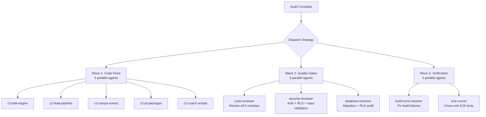

# Arsenal & ECC Framework Inventory

> **Date:** June 7, 2026  
> **Auditor:** Roo (Architect Mode)  
> **Location:** `Agentics/Arsenal/`  
> **Purpose:** Catalog available agents, skills, and frameworks for the proline-gym-platform audit engagement

---

## 1. Directory Structure

```
Agentics/
├── Arsenal/                              # 🏗️ Core framework repository
│   ├── ECC/                              # Everything Claude Code (v1.8.0)
│   │   ├── README.md                     # Full documentation (1317 lines)
│   │   ├── AGENTS.md                     # Agent instructions & orchestration
│   │   ├── agents/                       # 25 specialized subagents
│   │   │   ├── planner.md
│   │   │   ├── architect.md
│   │   │   ├── tdd-guide.md
│   │   │   ├── code-reviewer.md
│   │   │   ├── security-reviewer.md
│   │   │   ├── build-error-resolver.md
│   │   │   ├── e2e-runner.md
│   │   │   ├── refactor-cleaner.md
│   │   │   ├── doc-updater.md
│   │   │   ├── go-reviewer.md
│   │   │   ├── go-build-resolver.md
│   │   │   ├── kotlin-reviewer.md
│   │   │   ├── kotlin-build-resolver.md
│   │   │   ├── database-reviewer.md
│   │   │   ├── python-reviewer.md
│   │   │   ├── java-reviewer.md
│   │   │   ├── java-build-resolver.md
│   │   │   ├── chief-of-staff.md
│   │   │   ├── loop-operator.md
│   │   │   ├── harness-optimizer.md
│   │   │   ├── rust-reviewer.md
│   │   │   └── rust-build-resolver.md
│   │   ├── skills/                       # 108 workflow skills
│   │   │   ├── coding-standards/
│   │   │   ├── clickhouse-io/
│   │   │   ├── backend-patterns/
│   │   │   ├── frontend-patterns/
│   │   │   ├── frontend-slides/
│   │   │   ├── article-writing/
│   │   │   ├── content-engine/
│   │   │   ├── market-research/
│   │   │   ├── investor-materials/
│   │   │   ├── investor-outreach/
│   │   │   ├── continuous-learning/
│   │   │   ├── continuous-learning-v2/
│   │   │   ├── iterative-retrieval/
│   │   │   ├── strategic-compact/
│   │   │   ├── tdd-workflow/
│   │   │   ├── security-review/
│   │   │   ├── eval-harness/
│   │   │   ├── verification-loop/
│   │   │   ├── videodb/
│   │   │   ├── golang-patterns/
│   │   │   ├── golang-testing/
│   │   │   ├── cpp-coding-standards/
│   │   │   ├── cpp-testing/
│   │   │   ├── django-patterns/
│   │   │   ├── django-security/
│   │   │   ├── django-tdd/
│   │   │   ├── django-verification/
│   │   │   ├── laravel-patterns/
│   │   │   ├── laravel-security/
│   │   │   ├── laravel-tdd/
│   │   │   ├── laravel-verification/
│   │   │   ├── python-patterns/
│   │   │   ├── python-testing/
│   │   │   ├── springboot-patterns/
│   │   │   ├── springboot-security/
│   │   │   ├── springboot-tdd/
│   │   │   ├── springboot-verification/
│   │   │   ├── configure-ecc/
│   │   │   ├── security-scan/
│   │   │   ├── java-coding-standards/
│   │   │   ├── jpa-patterns/
│   │   │   ├── postgres-patterns/
│   │   │   ├── nutrient-document-processing/
│   │   │   ├── project-guidelines-example/
│   │   │   ├── database-migrations/
│   │   │   ├── api-design/
│   │   │   ├── deployment-patterns/
│   │   │   ├── docker-patterns/
│   │   │   ├── e2e-testing/
│   │   │   ├── content-hash-cache-pattern/
│   │   │   ├── cost-aware-llm-pipeline/
│   │   │   ├── regex-vs-llm-structured-text/
│   │   │   ├── swift-actor-persistence/
│   │   │   ├── swift-protocol-di-testing/
│   │   │   ├── search-first/
│   │   │   ├── skill-stocktake/
│   │   │   ├── liquid-glass-design/
│   │   │   ├── foundation-models-on-device/
│   │   │   ├── swift-concurrency-6-2/
│   │   │   ├── perl-patterns/
│   │   │   ├── perl-security/
│   │   │   ├── perl-testing/
│   │   │   ├── autonomous-loops/
│   │   │   └── plankton-code-quality/
│   │   ├── commands/                     # 57 slash commands
│   │   │   ├── plan.md                   # /plan
│   │   │   ├── tdd.md                    # /tdd
│   │   │   ├── e2e.md                    # /e2e
│   │   │   ├── code-review.md            # /code-review
│   │   │   ├── build-fix.md              # /build-fix
│   │   │   ├── refactor-clean.md         # /refactor-clean
│   │   │   ├── learn.md                  # /learn
│   │   │   ├── learn-eval.md             # /learn-eval
│   │   │   ├── checkpoint.md             # /checkpoint
│   │   │   ├── verify.md                 # /verify
│   │   │   ├── setup-pm.md               # /setup-pm
│   │   │   ├── go-review.md              # /go-review
│   │   │   ├── go-test.md                # /go-test
│   │   │   ├── go-build.md               # /go-build
│   │   │   ├── skill-create.md           # /skill-create
│   │   │   ├── instinct-status.md        # /instinct-status
│   │   │   ├── instinct-import.md        # /instinct-import
│   │   │   ├── instinct-export.md        # /instinct-export
│   │   │   ├── evolve.md                 # /evolve
│   │   │   ├── pm2.md                    # /pm2
│   │   │   ├── multi-plan.md             # /multi-plan
│   │   │   ├── multi-execute.md          # /multi-execute
│   │   │   ├── multi-backend.md          # /multi-backend
│   │   │   ├── multi-frontend.md         # /multi-frontend
│   │   │   ├── multi-workflow.md         # /multi-workflow
│   │   │   ├── orchestrate.md            # /orchestrate
│   │   │   ├── sessions.md               # /sessions
│   │   │   ├── eval.md                   # /eval
│   │   │   ├── test-coverage.md          # /test-coverage
│   │   │   ├── update-docs.md            # /update-docs
│   │   │   ├── update-codemaps.md        # /update-codemaps
│   │   │   ├── python-review.md          # /python-review
│   │   │   └── ... (additional commands)
│   │   ├── rules/                        # Always-follow guidelines
│   │   │   ├── README.md
│   │   │   ├── common/
│   │   │   │   ├── coding-style.md
│   │   │   │   ├── git-workflow.md
│   │   │   │   ├── testing.md
│   │   │   │   ├── performance.md
│   │   │   │   ├── patterns.md
│   │   │   │   ├── hooks.md
│   │   │   │   ├── agents.md
│   │   │   │   └── security.md
│   │   │   ├── typescript/
│   │   │   ├── python/
│   │   │   ├── golang/
│   │   │   ├── swift/
│   │   │   └── php/
│   │   ├── hooks/                        # Trigger-based automations
│   │   │   ├── README.md
│   │   │   ├── hooks.json
│   │   │   ├── memory-persistence/
│   │   │   └── strategic-compact/
│   │   ├── scripts/                      # Cross-platform Node.js utilities
│   │   │   ├── lib/
│   │   │   │   ├── utils.js
│   │   │   │   └── package-manager.js
│   │   │   └── hooks/
│   │   │       ├── session-start.js
│   │   │       ├── session-end.js
│   │   │       └── pre-compact.js
│   │   ├── mcp-configs/                  # 14 MCP server configurations
│   │   └── tests/                        # 997 internal tests
│   │
│   ├── Superpowers/                      # ⚡ Superpowers Framework (by Jesse Vincent / Prime Radiant)
│   │   ├── README.md                     # Full documentation (234 lines)
│   │   └── skills/
│   │       ├── brainstorming/SKILL.md    # Socratic design refinement
│   │       ├── writing-plans/            # Detailed implementation plans
│   │       ├── executing-plans/          # Batch execution with checkpoints
│   │       ├── dispatching-parallel-agents/  # Concurrent subagent workflows
│   │       ├── requesting-code-review/   # Pre-review checklist
│   │       ├── receiving-code-review/    # Responding to feedback
│   │       ├── using-git-worktrees/      # Parallel development branches
│   │       ├── finishing-a-development-branch/  # Merge/PR decision workflow
│   │       ├── subagent-driven-development/     # Fast iteration with two-stage review
│   │       ├── test-driven-development/  # RED-GREEN-REFACTOR cycle
│   │       ├── systematic-debugging/     # 4-phase root cause process
│   │       ├── verification-before-completion/  # Ensure it's actually fixed
│   │       ├── writing-skills/           # Create new skills
│   │       └── using-superpowers/        # Introduction to the skills system
│   │
│   ├── Karpathy/                         # 🧠 Karpathy Principles (referenced, not installed as separate dir)
│   │   (Referenced from MASTER_PLAN.md; principles embedded in workflow)
│   │
│   └── OpenDesign/                       # 🎨 Open Design Framework (referenced, not installed)
│       (DMG available at github.com/nexu-io/open-design/releases — not yet installed)
│
├── Config/                               # Configuration & templates
│   ├── templates/
│   │   ├── dispatch-spec.schema.json     # Schema for parallel agent dispatch missions
│   │   └── ... (other templates)
│   └── plans/
│       └── proline-gym-mvp-battle-plan.md  # Original 7-phase battle plan
│
├── Shared/                               # Shared resources & mission outputs
│   └── missions/
│       ├── proline-mvp-research/         # Phase 0: 9 parallel research agents
│       │   └── dispatch-spec.json        # 9-agent parallel dispatch
│       ├── proline-db-retry/             # DB schema recovery dispatch
│       ├── phase4-core-modules/          # Phase 4: 4 parallel code agents
│       └── phase-c-refinements/          # Phase C.2: 5 parallel refinement agents
│           └── dispatch-spec.json        # 5-agent parallel dispatch (active)
│
├── Clients/                              # Client-specific work
│   └── _active/
│       └── proline-gym/
│           └── docs/
│               └── proline-gym-proposal.md
│
└── Projects/                             # Active projects
    └── proline-gym-platform/             # The gym platform project
        └── ... (full Next.js project)
```

---

## 2. ECC Agents — Complete Catalog

ECC provides **25 specialized agents** organized by domain. Below is the full catalog with capabilities and recommended use cases for the audit engagement.

### 2.1 Core Development Agents

| # | Agent | Purpose | Model | When to Use |
|---|-------|---------|-------|-------------|
| 1 | **planner** | Implementation planning for complex features | opus | Before any multi-file change; breaking down audit findings into fix tasks |
| 2 | **architect** | System design, scalability, technical decisions | opus | Architectural decisions, route design, data flow analysis |
| 3 | **tdd-guide** | Test-driven development workflow | — | New features, bug fixes requiring test coverage |
| 4 | **code-reviewer** | Code quality, maintainability, security review | sonnet | After every module write/modification — **critical for audit** |
| 5 | **security-reviewer** | Vulnerability detection, OWASP Top 10 | sonnet | Auth code, API endpoints, user input, RLS policies |
| 6 | **build-error-resolver** | Fix build/type errors | — | When `npx next build` or `npx tsc --noEmit` fails |
| 7 | **e2e-runner** | End-to-end Playwright testing | — | Critical user flows, cross-role testing |
| 8 | **refactor-cleaner** | Dead code cleanup, code maintenance | — | Post-phase cleanup, removing stubs |
| 9 | **doc-updater** | Documentation and codemap updates | — | Updating docs after changes |
| 10 | **database-reviewer** | PostgreSQL/Supabase schema, queries, RLS | sonnet | Schema changes, migration audit, query optimization |
| 11 | **loop-operator** | Autonomous loop execution, stall monitoring | — | Iterative builds, long-running tasks |
| 12 | **harness-optimizer** | Harness config tuning, cost optimization | — | Performance tuning |
| 13 | **chief-of-staff** | Communication triage, multi-channel drafts | — | Client communication, email/Slack templates |

### 2.2 Language-Specific Review Agents

| # | Agent | Language | Purpose |
|---|--------|----------|---------|
| 14 | **go-reviewer** | Go | Go code review |
| 15 | **go-build-resolver** | Go | Go build error resolution |
| 16 | **kotlin-reviewer** | Kotlin | Kotlin/Android/KMP code review |
| 17 | **kotlin-build-resolver** | Kotlin | Kotlin/Gradle build errors |
| 18 | **python-reviewer** | Python | Python code review |
| 19 | **java-reviewer** | Java | Java/Spring Boot code review |
| 20 | **java-build-resolver** | Java | Java/Maven/Gradle build errors |
| 21 | **rust-reviewer** | Rust | Rust code review |
| 22 | **rust-build-resolver** | Rust | Rust build errors |

### 2.3 ECC Commands (Key Slash Commands)

| Command | Function | Audit Relevance |
|---------|----------|-----------------|
| `/plan` | Generate implementation spec per module | **HIGH** — Plan fixes before coding |
| `/code-review` | Quality review after code changes | **HIGH** — Gate for every module |
| `/quality-gate` | 10-point checklist (types, lint, build, RTL, i18n, RLS) | **HIGH** — Phase promotion gate |
| `/checkpoint` | Save verification state | **MEDIUM** — Phase boundaries |
| `/tdd` | Test-driven development workflow | **HIGH** — Testing gaps identified |
| `/e2e` | E2E test generation | **MEDIUM** — Cross-role flows |
| `/build-fix` | Fix build/type errors | **MEDIUM** — Build failures |
| `/orchestrate` | Multi-agent coordination | **HIGH** — Parallel dispatch |
| `/multi-plan` | Multi-agent task decomposition | **HIGH** — Complex audit tasks |
| `/multi-execute` | Orchestrated multi-agent workflows | **HIGH** — Parallel fix execution |
| `/security-scan` | AgentShield security auditor | **HIGH** — Security audit |
| `/test-coverage` | Test coverage analysis | **HIGH** — Coverage gap analysis |
| `/update-docs` | Documentation updates | **LOW** — Doc maintenance |

---

## 3. Superpowers Skills — Complete Catalog

Superpowers provides **14 core skills** organized by workflow phase.

### 3.1 Design & Planning Skills

| Skill | Purpose | Audit Relevance |
|-------|---------|-----------------|
| **brainstorming** | Socratic design refinement; explores user intent before implementation | **MEDIUM** — Requirements clarification |
| **writing-plans** | Detailed implementation plans with exact file paths and verification steps | **HIGH** — Fix planning |
| **executing-plans** | Batch execution with human checkpoints | **HIGH** — Batch fix execution |

### 3.2 Development Skills

| Skill | Purpose | Audit Relevance |
|-------|---------|-----------------|
| **subagent-driven-development** | Fast iteration with two-stage review (spec compliance → code quality) | **HIGH** — Parallel fix agents |
| **dispatching-parallel-agents** | Concurrent subagent workflows | **HIGH** — Parallel audit tasks |
| **test-driven-development** | RED-GREEN-REFACTOR cycle with testing anti-patterns reference | **HIGH** — Test gap remediation |
| **using-git-worktrees** | Parallel development branches | **MEDIUM** — Isolated fix branches |

### 3.3 Review & Quality Skills

| Skill | Purpose | Audit Relevance |
|-------|---------|-----------------|
| **requesting-code-review** | Pre-review checklist before submitting | **HIGH** — Quality gates |
| **receiving-code-review** | Responding to feedback constructively | **MEDIUM** — Review cycles |
| **systematic-debugging** | 4-phase root cause process with defense-in-depth | **HIGH** — Bug investigation |
| **verification-before-completion** | Ensure fixes actually work | **HIGH** — Fix verification |

### 3.4 Meta Skills

| Skill | Purpose | Audit Relevance |
|-------|---------|-----------------|
| **writing-skills** | Create new skills following best practices | **LOW** — Custom skill creation |
| **using-superpowers** | Introduction to the skills system | **LOW** — Onboarding |
| **finishing-a-development-branch** | Merge/PR decision workflow | **MEDIUM** — Branch cleanup |

---

## 4. Framework Comparison

| Dimension | ECC (Everything Claude Code) | Superpowers | Karpathy Principles | Open Design |
|-----------|------------------------------|-------------|---------------------|-------------|
| **Version** | v1.8.0 (Mar 2026) | Latest | Referenced | Not installed |
| **Agents** | 25 specialized agents | 14 skills (subagent-driven) | N/A (principles) | N/A (design tool) |
| **Skills** | 108 workflow skills | 14 core skills | 4 principles | 184 design skills |
| **Commands** | 57 slash commands | N/A (skill-triggered) | N/A | N/A |
| **Tests** | 997 internal tests | N/A | N/A | N/A |
| **Best For** | Code quality, security, review gates | Design-first workflow, planning | Simplicity, goal-driven dev | UI/UX mockups |
| **Install Status** | ✅ Installed at `Arsenal/ECC/` | ✅ Installed at `Arsenal/Superpowers/` | ⚠️ Referenced, no separate dir | ❌ DMG not yet downloaded |

### 4.1 Karpathy Principles (Embedded in Workflow)

From the MASTER_PLAN.md, the 4 Karpathy principles are:

1. **Think Before Coding** — Plan before implementation
2. **Simplicity First** — Prefer simple solutions over complex ones
3. **Surgical Changes** — Make minimal, targeted changes
4. **Goal-Driven Execution** — Clear success criteria for every phase

These are enforced as governance gates in the MASTER_PLAN.md workflow.

---

## 5. Recommended Agents for Audit Engagement

Based on the proline-gym-platform audit findings (from [`project-analysis.md`](../project-analysis.md)), the following agents should be dispatched:

### 5.1 Phase C.2 Refinement Agents (Already Active)

These 5 agents are currently dispatched via [`dispatch-spec.json`](../../../Shared/missions/phase-c-refinements/dispatch-spec.json):

| Agent ID | Module | Provider | Mode | Fixes |
|----------|--------|----------|------|-------|
| `c2-belt-engine` | Belt Engine | deepseek-v4-pro | code | C2-1 through C2-4 (navigation, workflow, seed data, auto-refresh) |
| `c2-lead-pipeline` | Lead Pipeline | deepseek-v4-pro | code | C2-5 through C2-7 (workflow, filter/search, stats) |
| `c2-camps-events` | Camps & Events | deepseek-v4-pro | code | C2-8 through C2-10 (create button, homepage integration, layout) |
| `c2-pt-packages` | PT Packages | deepseek-v4-pro | code | C2-11 through C2-12 (create button, purchase workflow) |
| `c2-coach-rentals` | Coach Rentals | deepseek-v4-pro | code | C2-13 through C2-15 (calendar, booking, waivers) |

### 5.2 Recommended ECC Agents for Audit Tasks

| Audit Task | Recommended Agent | Why |
|------------|-------------------|-----|
| **Code quality review** of all Phase C modules | `code-reviewer` | Systematic quality check after each module fix |
| **Security audit** of auth, RLS, input validation | `security-reviewer` | OWASP Top 10 scan, secret detection |
| **Database schema & migration audit** | `database-reviewer` | RLS policy verification, index analysis, migration review |
| **Build verification** after all fixes | `build-error-resolver` | Fix any `tsc` or `next build` errors |
| **Test coverage analysis** | `tdd-guide` + `/test-coverage` | Identify coverage gaps, generate tests |
| **E2E flow testing** | `e2e-runner` | Cross-role user journey testing |
| **Dead code & stub cleanup** | `refactor-cleaner` | Remove "Under Development" stubs |
| **Documentation sync** | `doc-updater` | Update docs after changes |

### 5.3 Recommended Superpowers Skills for Audit Workflow

| Workflow Step | Superpowers Skill | Purpose |
|---------------|-------------------|---------|
| 1. Analyze findings | `brainstorming` | Clarify audit requirements |
| 2. Plan fixes | `writing-plans` | Create detailed fix plans per module |
| 3. Execute fixes | `subagent-driven-development` | Dispatch fix agents with review gates |
| 4. Verify fixes | `verification-before-completion` | Ensure fixes actually resolve issues |
| 5. Review quality | `requesting-code-review` | Pre-merge quality check |

---

## 6. Dispatch Recommendations for Audit Tasks

### 6.1 Parallel Dispatch Strategy



### 6.2 Agent Dispatch Order

| Order | Agent | Task | Dependencies | Estimated Output |
|-------|-------|------|-------------|-----------------|
| 1 | **5 Phase C.2 agents** (parallel) | Fix all 15 issues across 5 modules | None | 5 fix reports |
| 2 | **code-reviewer** (×5, parallel) | Review each module after fix | Wave 1 complete | 5 review reports |
| 3 | **security-reviewer** | Full security audit | Wave 1 complete | Security report |
| 4 | **database-reviewer** | Migration + RLS audit | Wave 1 complete | DB audit report |
| 5 | **build-error-resolver** | Fix any build errors | Waves 2-4 complete | Build fix report |
| 6 | **e2e-runner** | Cross-role E2E tests | Build passes | E2E test report |
| 7 | **refactor-cleaner** | Remove stubs, dead code | All fixes merged | Cleanup report |

### 6.3 Quality Gate Checklist (per ECC `/quality-gate`)

| # | Check | Method | Responsible Agent |
|---|-------|--------|-------------------|
| 1 | TypeScript compiles | `npx tsc --noEmit` | build-error-resolver |
| 2 | Linter passes | `npx eslint . --ext .ts,.tsx` | code-reviewer |
| 3 | Build succeeds | `npx next build` | build-error-resolver |
| 4 | All 3 locales render | Manual: `/en`, `/ar`, `/fr` | e2e-runner |
| 5 | RTL layout correct | Manual: Arabic pages RTL | code-reviewer |
| 6 | i18n keys complete | No hardcoded strings | code-reviewer |
| 7 | RLS policies verified | Cross-role probe | security-reviewer |
| 8 | Mobile responsive | 375px viewport test | e2e-runner |
| 9 | No dead code/stubs | All stubs identified | refactor-cleaner |
| 10 | Build exit code 0 | CI-equivalent check | build-error-resolver |

---

## 7. Key Findings & Gaps

### 7.1 Installed Frameworks

| Framework | Status | Location |
|-----------|--------|----------|
| ECC v1.8.0 | ✅ Fully installed | `Arsenal/ECC/` |
| Superpowers | ✅ Fully installed | `Arsenal/Superpowers/` |
| Karpathy Principles | ⚠️ Referenced, no separate installation | Principles embedded in MASTER_PLAN.md |
| Open Design | ❌ Not installed | DMG at github.com/nexu-io/open-design/releases |

### 7.2 What's Available for This Audit

- **25 ECC agents** ready for dispatch — all accessible via the current Roo environment
- **14 Superpowers skills** for workflow orchestration
- **57 ECC commands** for quick operations
- **Parallel dispatch infrastructure** via `dispatch-spec.json` schema + `dispatch-mission.sh` script
- **5 Phase C.2 agents** already dispatched for module refinements

### 7.3 What's Missing

- **Open Design** — Not installed, so no high-fidelity mockup generation. Tier 1 wireframes only.
- **Karpathy Principles** — No dedicated directory; principles are manually referenced in plans.
- **No dedicated testing framework** — Tests referenced but not yet implemented (Phase C.2 is adding seed data for testing).
- **No CI/CD pipeline** — Referenced in battle plan but not yet configured.

---

## 8. Summary

The Arsenal at `Agentics/Arsenal/` contains two fully installed frameworks (ECC v1.8.0 and Superpowers) providing:

- **25 specialized agents** covering planning, architecture, code review, security, database, build resolution, and language-specific review
- **122+ skills** (108 ECC + 14 Superpowers) covering the full development lifecycle
- **57 slash commands** for quick operations
- **Parallel dispatch infrastructure** for multi-agent orchestration
- **5 agents already active** on Phase C.2 refinements for the proline-gym-platform

For this audit engagement, the recommended dispatch strategy is:
1. **Wave 1** — 5 parallel fix agents (already dispatched)
2. **Wave 2** — 3 parallel quality gate agents (code-reviewer, security-reviewer, database-reviewer)
3. **Wave 3** — 2 parallel verification agents (build-error-resolver, e2e-runner)

This ensures every module is fixed, reviewed, secured, and verified before phase promotion.
