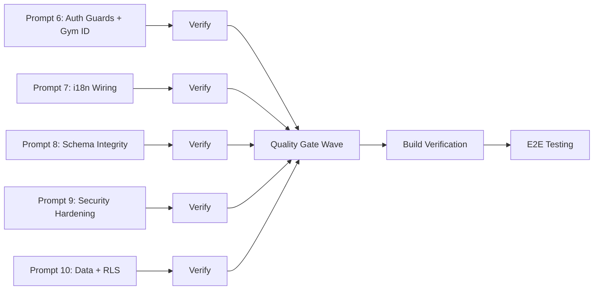

# Cycle 2 — Actionable Prompts for Coding Agent

**Generated:** June 8, 2026 03:18 AM +03:00
**Source Documents:**
- [`cycle-1-prompts.md`](./cycle-1-prompts.md) — Cycle 1 prompts (Leads, Belts, Zod infra, DB types)
- [`session-audit-plan.md`](./session-audit-plan.md) — Current audit state
- [`audit-cycle-update.md`](../../audit-cycle-update.md) — Cycle log
- Quality gate findings from Cycle 1 verification

---

## PROMPT 6: Auth Guards + Gym ID Isolation (B1 + B2)

**Mode:** code
**Priority:** P1
**Depends On:** None

### Context

Cycle 1 fixed Leads (gold standard with `getUser()` + `gym_id` isolation) and Belts (excellent). Quality gates found that **5 dashboard pages lack `getUser()` auth guards** and **4 of 5 Phase C server queries lack `.eq('gym_id', gymId)`** . This means:

- Unauthenticated users can access these pages (they return data but shouldn't)
- Multi-tenant isolation is broken — users from Gym A can see Gym B's data
- The `students` and `students/add` pages also lack auth guards

The reference implementation is [`leads/page.tsx`](../../src/app/%5Blocale%5D/(dashboard)/leads/page.tsx:20-31) which uses the exact pattern below.

### Reference Pattern (from leads/page.tsx)

```typescript
// ── Auth + gym_id for multi-tenant isolation ──────────
const { data: { user } } = await supabase.auth.getUser();
if (!user) return null;

const { data: profile } = await supabase
  .from('profiles')
  .select('gym_id')
  .eq('id', user.id)
  .single();

const gymId = profile?.gym_id;
if (!gymId) return null;
```

Then every query uses `.eq('gym_id', gymId)`:
```typescript
supabase.from('leads').select('*').eq('gym_id', gymId)
```

### Required Deliverables

1. **Add `getUser()` auth guard + `gym_id` extraction to ALL 6 files:**

   **File: [`belts/page.tsx`](../../src/app/%5Blocale%5D/(dashboard)/belts/page.tsx:9-38)**
   - Insert auth guard after line 12 (`const supabase = await createClient();`)
   - Add `.eq('gym_id', gymId)` to ALL 5 queries:
     - Line 14: `students` query
     - Line 20: `disciplines` query
     - Line 25: `coaches` query
     - Line 29: `belt_hierarchies` query
     - Line 34: `belt_promotions` query
   - Note: `disciplines` and `belt_hierarchies` don't have `gym_id` columns directly — use the pattern from RLS: scope via `disciplines.gym_id` and `belt_hierarchies` via `disciplines` join. For `belt_promotions`, scope via `students.gym_id`.

   **File: [`camps/page.tsx`](../../src/app/%5Blocale%5D/(dashboard)/camps/page.tsx:12-19)**
   - Insert auth guard after line 14 (`const supabase = await createClient();`)
   - Add `.eq('gym_id', gymId)` to the camps query on line 16
   - The `camps` table HAS a `gym_id` column (confirmed in database.ts line 422)

   **File: [`pt/page.tsx`](../../src/app/%5Blocale%5D/(dashboard)/pt/page.tsx:8-15)**
   - Insert auth guard after line 10 (`const supabase = await createClient();`)
   - Add `.eq('gym_id', gymId)` to `pt_packages` query on line 12
   - Add `.eq('gym_id', gymId)` to `students` query on line 13
   - The `pt_packages` table HAS a `gym_id` column (database.ts line 1676)
   - The `students` table HAS a `gym_id` column (database.ts line 1998)

   **File: [`rentals/page.tsx`](../../src/app/%5Blocale%5D/(dashboard)/rentals/page.tsx:8-13)**
   - Insert auth guard after line 10 (`const supabase = await createClient();`)
   - Add `.eq('gym_id', gymId)` to `rentals` query on line 12
   - Add `.eq('gym_id', gymId)` to `rental_bookings` query on line 13 (scope via `rentals.gym_id` join, or add a subquery)
   - The `rentals` table HAS a `gym_id` column (database.ts line 1880)
   - The `rental_bookings` table does NOT have `gym_id` — scope via `rental_id IN (SELECT id FROM rentals WHERE gym_id = ...)`

   **File: [`students/page.tsx`](../../src/app/%5Blocale%5D/(dashboard)/students/page.tsx:10-50)**
   - Insert auth guard after line 17 (`const supabase = await createClient();`)
   - Add `.eq('gym_id', gymId)` to the `students` query on line 22
   - Add `.eq('gym_id', gymId)` to `disciplines` query on line 53
   - Add `.eq('gym_id', gymId)` to `belt_hierarchies` query on line 59 (scope via disciplines join)
   - The `students` table HAS a `gym_id` column

   **File: [`students/add/page.tsx`](../../src/app/%5Blocale%5D/(dashboard)/students/add/page.tsx:5-30)**
   - Insert auth guard after line 10 (`const supabase = await createClient();`)
   - Add `.eq('gym_id', gymId)` to `disciplines` query on line 14
   - Add `.eq('gym_id', gymId)` to `belt_hierarchies` query on line 25 (scope via disciplines join)
   - Add `.eq('gym_id', gymId)` to `guardians` query on line 30

2. **Import `createClient` where missing** — All files already import it.

### Validation Checklist
- [ ] All 6 files have `getUser()` auth guard that returns `null` if no user
- [ ] All 6 files extract `gymId` from profile and return `null` if missing
- [ ] Every Supabase query in those 6 files has `.eq('gym_id', gymId)` or equivalent gym-scoping
- [ ] Junction tables without `gym_id` column use subquery scoping (e.g., `rental_bookings` via `rentals`)
- [ ] TypeScript compiles with `tsc --noEmit` (zero errors)
- [ ] Pages still render correctly with demo accounts

### References
- Reference implementation: [`leads/page.tsx`](../../src/app/%5Blocale%5D/(dashboard)/leads/page.tsx:20-31)
- Files to modify:
  - [`belts/page.tsx`](../../src/app/%5Blocale%5D/(dashboard)/belts/page.tsx)
  - [`camps/page.tsx`](../../src/app/%5Blocale%5D/(dashboard)/camps/page.tsx)
  - [`pt/page.tsx`](../../src/app/%5Blocale%5D/(dashboard)/pt/page.tsx)
  - [`rentals/page.tsx`](../../src/app/%5Blocale%5D/(dashboard)/rentals/page.tsx)
  - [`students/page.tsx`](../../src/app/%5Blocale%5D/(dashboard)/students/page.tsx)
  - [`students/add/page.tsx`](../../src/app/%5Blocale%5D/(dashboard)/students/add/page.tsx)
- DB schema: [`database.ts`](../../src/types/database.ts) — `camps` L422, `pt_packages` L1676, `rentals` L1880, `students` L1998, `rental_bookings` L1810

### MANDATORY: Update audit-cycle-update.md
After completing this prompt, append a Cycle 2 — Prompt 6 entry to `/Users/techstack/Desktop/Agentics/Projects/proline-gym-platform/audit-cycle-update.md`.

---

## PROMPT 7: i18n Wiring — Camps, PT, Rentals (B4)

**Mode:** code
**Priority:** P1
**Depends On:** None

### Context

55+ hardcoded locale ternaries (`locale === 'ar' ? ... : locale === 'fr' ? ... : ...`) exist across 6 files in Camps, PT, and Rentals modules. The i18n keys already exist in `en.json`, `ar.json`, `fr.json` — this is pure wiring work. The reference pattern is [`leads/page.tsx`](../../src/app/%5Blocale%5D/(dashboard)/leads/page.tsx:17-18) and [`leads/leads-client.tsx`](../../src/app/%5Blocale%5D/(dashboard)/leads/leads-client.tsx) which use `getTranslations()` / `useTranslations()`.

### Exact Hardcoded Strings to Replace

**File: [`camps/page.tsx`](../../src/app/%5Blocale%5D/(dashboard)/camps/page.tsx:25-30)**
- Line 26: `{locale === 'ar' ? 'المخيمات والفعاليات' : locale === 'fr' ? 'Camps & Événements' : 'Camps & Events'}` → `t('title')`
- Line 29: `{locale === 'ar' ? 'إدارة المخيمات الصيفية والفعاليات' : locale === 'fr' ? 'Gérer les camps et événements' : 'Manage summer camps and events'}` → `t('subtitle')`
- Add import: `import { getTranslations } from 'next-intl/server';`
- Add: `const t = await getTranslations('camps');` after line 14

**File: [`pt/page.tsx`](../../src/app/%5Blocale%5D/(dashboard)/pt/page.tsx:20-25)**
- Line 21: `{locale === 'ar' ? 'باقات التدريب الشخصي' : locale === 'fr' ? 'Forfaits PT' : 'Personal Training'}` → `t('title')`
- Line 24: `{locale === 'ar' ? 'إدارة باقات التدريب الشخصي' : 'Manage PT packages and sessions'}` → `t('subtitle')`
- Note: French is missing in the ternary for subtitle — i18n fixes this
- Add import: `import { getTranslations } from 'next-intl/server';`
- Add: `const t = await getTranslations('pt');` after line 10

**File: [`rentals/page.tsx`](../../src/app/%5Blocale%5D/(dashboard)/rentals/page.tsx:18-23)**
- Line 19: `{locale === 'ar' ? 'تأجير المساحات' : locale === 'fr' ? 'Location d\'Espaces' : 'Coach Rentals'}` → `t('title')`
- Line 22: `{locale === 'ar' ? 'إدارة حجوزات المساحات للمدربين' : 'Manage space bookings and external coaches'}` → `t('subtitle')`
- Note: French is missing in the ternary for subtitle
- Add import: `import { getTranslations } from 'next-intl/server';`
- Add: `const t = await getTranslations('rentals');` after line 10

**File: [`camps-client.tsx`](../../src/app/%5Blocale%5D/(dashboard)/camps/camps-client.tsx)**
- Search for ALL `locale === 'ar'` ternaries and replace with `t('key')` calls
- Add `import { useTranslations } from 'next-intl/client';` (or `next-intl` depending on existing pattern)
- Add `const t = useTranslations('camps');` at top of component

**File: [`pt-client.tsx`](../../src/app/%5Blocale%5D/(dashboard)/pt/pt-client.tsx)**
- Same pattern as camps-client.tsx — replace all locale ternaries with `useTranslations('pt')`

**File: [`rentals-client.tsx`](../../src/app/%5Blocale%5D/(dashboard)/rentals/rentals-client.tsx)**
- Same pattern as camps-client.tsx — replace all locale ternaries with `useTranslations('rentals')`

### i18n Keys Already Exist

The following namespaces are already defined in locale files:
- `camps`: `title`, `subtitle`, `create_camp`, `edit_camp`, `delete_camp`, `start_date`, `end_date`, `max_participants`, `price`, `status`, `no_camps`, `search_placeholder`, etc.
- `pt`: `title`, `subtitle`, `create_package`, `edit_package`, `session_count`, `price`, `validity_days`, `no_packages`, `assign_student`, etc.
- `rentals`: `title`, `subtitle`, `book_space`, `hourly_rate`, `capacity`, `no_rentals`, `booking_date`, `start_time`, `end_time`, etc.

**If any keys are missing, add them to all 3 locale files** (`en.json`, `ar.json`, `fr.json`).

### Validation Checklist
- [ ] Zero `locale === 'ar' ? ...` ternaries remain in any of the 6 files
- [ ] Server components use `getTranslations('namespace')` from `next-intl/server`
- [ ] Client components use `useTranslations('namespace')` from `next-intl`
- [ ] All 3 locale files have complete `camps`, `pt`, `rentals` namespaces
- [ ] TypeScript compiles with `tsc --noEmit` (zero errors)
- [ ] Pages render correctly in all 3 locales (en, ar, fr)

### References
- Reference implementation: [`leads/page.tsx`](../../src/app/%5Blocale%5D/(dashboard)/leads/page.tsx:17-18) — server component pattern
- Reference implementation: [`leads/leads-client.tsx`](../../src/app/%5Blocale%5D/(dashboard)/leads/leads-client.tsx) — client component pattern
- Files to modify:
  - [`camps/page.tsx`](../../src/app/%5Blocale%5D/(dashboard)/camps/page.tsx)
  - [`camps/camps-client.tsx`](../../src/app/%5Blocale%5D/(dashboard)/camps/camps-client.tsx)
  - [`pt/page.tsx`](../../src/app/%5Blocale%5D/(dashboard)/pt/page.tsx)
  - [`pt/pt-client.tsx`](../../src/app/%5Blocale%5D/(dashboard)/pt/pt-client.tsx)
  - [`rentals/page.tsx`](../../src/app/%5Blocale%5D/(dashboard)/rentals/page.tsx)
  - [`rentals/rentals-client.tsx`](../../src/app/%5Blocale%5D/(dashboard)/rentals/rentals-client.tsx)
- Locale files: [`en.json`](../../src/i18n/messages/en.json), [`ar.json`](../../src/i18n/messages/ar.json), [`fr.json`](../../src/i18n/messages/fr.json)

### MANDATORY: Update audit-cycle-update.md
After completing this prompt, append a Cycle 2 — Prompt 7 entry to `/Users/techstack/Desktop/Agentics/Projects/proline-gym-platform/audit-cycle-update.md`.

---

## PROMPT 8: Schema Integrity Fixes (B3 + B5 + B7)

**Mode:** code
**Priority:** P1
**Depends On:** None

### Context

Three schema integrity issues were found during quality gates:

1. **B3 — rentals/page.tsx queries non-existent `booking_date` column**: Line 13 uses `.order('booking_date', { ascending: true })` but the `rental_bookings` table has `start_time` and `end_time` columns, NOT `booking_date`. This will throw a PostgreSQL error at runtime.

2. **B5 — Zod schemas reference phantom columns**: Three schema files declare fields that don't exist in the actual database tables.

3. **B7 — Migration 000007 missing**: There's a gap in migration numbering (000006 → 000008). Need to either create a placeholder or document the gap.

### Exact Phantom Column Mismatches

**File: [`camps.schema.ts`](../../src/lib/validators/camps.schema.ts:4-18)**
- Has `discipline_id: z.string().uuid()` — **PHANTOM**: The `camps` table in DB has NO `discipline_id` column (database.ts L412-494)
- Has `name: z.string().min(1)` — **MISMATCH**: DB has `name_ar`, `name_en`, `name_fr` (tri-lingual), not a single `name`
- Has `description: z.string().optional()` — **MISMATCH**: DB has `description_ar`, `description_en`, `description_fr`
- Has `max_participants: z.number().int().positive()` — **MISMATCH**: DB column is `max_capacity` (not `max_participants`)
- Has `price: z.number().positive()` — **MISMATCH**: DB has `price_usd` and `price_lbp` (dual currency)
- Missing `gym_id: z.string().uuid()` — **REQUIRED**: DB has `gym_id` as NOT NULL
- Missing `status: z.enum([...])` — DB has `status` as `camp_status_enum`
- Missing `early_bird_deadline`, `early_bird_price_usd`, `max_age`, `min_age`, `sibling_discount_percent`

**Correct camps schema should be:**
```typescript
export const campInsertSchema = z.object({
  name_ar: z.string().min(1, 'Arabic name is required'),
  name_en: z.string().min(1, 'English name is required'),
  name_fr: z.string().min(1, 'French name is required'),
  description_ar: z.string().optional(),
  description_en: z.string().optional(),
  description_fr: z.string().optional(),
  start_date: z.string().regex(/^\d{4}-\d{2}-\d{2}$/),
  end_date: z.string().regex(/^\d{4}-\d{2}-\d{2}$/),
  max_capacity: z.number().int().positive(),
  price_usd: z.number().nonnegative(),
  price_lbp: z.number().nonnegative().optional(),
  gym_id: z.string().uuid(),
  status: z.enum(['draft', 'open', 'full', 'in_progress', 'completed', 'cancelled']).optional(),
  early_bird_deadline: z.string().optional(),
  early_bird_price_usd: z.number().nonnegative().optional(),
  max_age: z.number().int().positive().optional(),
  min_age: z.number().int().nonnegative().optional(),
  sibling_discount_percent: z.number().min(0).max(100).optional(),
}).refine((data) => data.end_date >= data.start_date, {
  message: 'End date must be after start date',
  path: ['end_date'],
});
```

**File: [`pt.schema.ts`](../../src/lib/validators/pt.schema.ts:4-11)**
- Has `duration_minutes: z.number().int().positive()` — **PHANTOM**: The `pt_packages` table has NO `duration_minutes` column (database.ts L1668-1742). This field exists on `pt_sessions`, not `pt_packages`.
- Has `discipline_id: z.string().uuid()` — **PHANTOM**: The `pt_packages` table has NO `discipline_id` column
- Has `name: z.string().min(1)` — **MISMATCH**: DB has `name_ar`, `name_en`, `name_fr`
- Has `description: z.string().optional()` — **MISMATCH**: DB has `description_ar`, `description_en`, `description_fr`
- Has `session_count: z.number().int().positive()` — **CORRECT** (matches DB)
- Has `price: z.number().positive()` — **MISMATCH**: DB has `price_usd` and `price_lbp`
- Missing `validity_days: z.number().int().positive().optional()` — DB has this
- Missing `coach_id: z.string().uuid().optional()` — DB has this
- Missing `gym_id: z.string().uuid()` — DB has this as NOT NULL

**Correct pt schema should be:**
```typescript
export const ptPackageInsertSchema = z.object({
  name_ar: z.string().min(1, 'Arabic name is required'),
  name_en: z.string().min(1, 'English name is required'),
  name_fr: z.string().min(1, 'French name is required'),
  description_ar: z.string().optional(),
  description_en: z.string().optional(),
  description_fr: z.string().optional(),
  session_count: z.number().int().positive(),
  price_usd: z.number().nonnegative(),
  price_lbp: z.number().nonnegative().optional(),
  validity_days: z.number().int().positive().optional(),
  coach_id: z.string().uuid().optional(),
  gym_id: z.string().uuid(),
});
```

**File: [`rentals.schema.ts`](../../src/lib/validators/rentals.schema.ts:4-11)**
- Has `daily_rate: z.number().positive()` — **PHANTOM**: The `rentals` table has NO `daily_rate` column (database.ts L1873-1934). Only `hourly_rate_usd` and `hourly_rate_lbp`.
- Has `location: z.string().min(1)` — **PHANTOM**: The `rentals` table has NO `location` column
- Has `capacity: z.number().int().positive()` — **MISMATCH**: DB column is `max_capacity` (not `capacity`)
- Has `name: z.string().min(1)` — **MISMATCH**: DB has `name_ar`, `name_en`, `name_fr`
- Has `description: z.string().optional()` — **MISMATCH**: DB has `description_ar`, `description_en`, `description_fr`
- Has `hourly_rate: z.number().positive()` — **MISMATCH**: DB has `hourly_rate_usd` and `hourly_rate_lbp`
- Missing `gym_id: z.string().uuid()` — DB has this as NOT NULL
- Missing `status: z.enum([...])` — DB has `rental_status_enum`

**Rental booking schema also has issues:**
- Has `renter_name: z.string().min(1)` — **PHANTOM**: `rental_bookings` table has NO `renter_name` column (database.ts L1810-1872)
- Has `renter_phone: z.string().min(1)` — **PHANTOM**: No `renter_phone` column
- Has `start_datetime: z.string().datetime()` — **MISMATCH**: DB has `start_time` (string, time format) and `rental_date` is not a column — bookings use `start_time`/`end_time` as timestamps
- Has `end_datetime: z.string().datetime()` — **MISMATCH**: DB has `end_time`
- Missing `external_coach_id: z.string().uuid()` — DB has this as NOT NULL
- Missing `rental_id: z.string().uuid()` — **CORRECT** (matches DB)
- Missing `total_amount_usd: z.number().nonnegative()` — DB has this

**Correct rentals schema should be:**
```typescript
export const rentalInsertSchema = z.object({
  name_ar: z.string().min(1, 'Arabic name is required'),
  name_en: z.string().min(1, 'English name is required'),
  name_fr: z.string().min(1, 'French name is required'),
  description_ar: z.string().optional(),
  description_en: z.string().optional(),
  description_fr: z.string().optional(),
  hourly_rate_usd: z.number().nonnegative(),
  hourly_rate_lbp: z.number().nonnegative().optional(),
  max_capacity: z.number().int().positive().optional(),
  gym_id: z.string().uuid(),
  status: z.enum(['available', 'booked', 'maintenance']).optional(),
});

export const rentalBookingSchema = z.object({
  rental_id: z.string().uuid(),
  external_coach_id: z.string().uuid(),
  start_time: z.string(), // ISO datetime string
  end_time: z.string(),   // ISO datetime string
  notes_ar: z.string().optional(),
  notes_en: z.string().optional(),
  notes_fr: z.string().optional(),
  total_amount_usd: z.number().nonnegative(),
}).refine((data) => data.end_time > data.start_time, {
  message: 'End time must be after start time',
  path: ['end_time'],
});
```

### Required Deliverables

1. **Fix rentals/page.tsx B3** — [`rentals/page.tsx`](../../src/app/%5Blocale%5D/(dashboard)/rentals/page.tsx:13)
   - Change `.order('booking_date', { ascending: true })` → `.order('start_time', { ascending: true })`
   - The `rental_bookings` table has `start_time` and `end_time` columns, not `booking_date`

2. **Fix camps.schema.ts** — [`camps.schema.ts`](../../src/lib/validators/camps.schema.ts)
   - Remove phantom `discipline_id`
   - Replace single `name` with `name_ar`, `name_en`, `name_fr`
   - Replace single `description` with `description_ar`, `description_en`, `description_fr`
   - Rename `max_participants` → `max_capacity`
   - Replace `price` with `price_usd` + `price_lbp`
   - Add `gym_id`, `status`, `early_bird_deadline`, `early_bird_price_usd`, `max_age`, `min_age`, `sibling_discount_percent`

3. **Fix pt.schema.ts** — [`pt.schema.ts`](../../src/lib/validators/pt.schema.ts)
   - Remove phantom `duration_minutes` and `discipline_id`
   - Replace single `name` with `name_ar`, `name_en`, `name_fr`
   - Replace single `description` with `description_ar`, `description_en`, `description_fr`
   - Replace `price` with `price_usd` + `price_lbp`
   - Add `validity_days`, `coach_id`, `gym_id`

4. **Fix rentals.schema.ts** — [`rentals.schema.ts`](../../src/lib/validators/rentals.schema.ts)
   - Remove phantom `daily_rate`, `location`
   - Rename `capacity` → `max_capacity`
   - Replace single `name` with `name_ar`, `name_en`, `name_fr`
   - Replace single `description` with `description_ar`, `description_en`, `description_fr`
   - Replace `hourly_rate` with `hourly_rate_usd` + `hourly_rate_lbp`
   - Add `gym_id`, `status`
   - Fix `rentalBookingSchema`: remove phantom `renter_name`, `renter_phone`; replace `start_datetime`/`end_datetime` with `start_time`/`end_time`; add `external_coach_id`, `total_amount_usd`

5. **Create 000007 migration placeholder** — Create `supabase/migrations/000007_schema_gap_placeholder.sql`
   - Add a comment explaining the gap: `-- Migration 000007 was intentionally skipped. See audit docs/audit/cycle-2-prompts.md Prompt 8 for details.`
   - This ensures migration numbering is sequential for future migrations

### Validation Checklist
- [ ] `rentals/page.tsx` uses `.order('start_time')` instead of `.order('booking_date')`
- [ ] `camps.schema.ts` has zero phantom columns — all fields match DB `camps` table
- [ ] `pt.schema.ts` has zero phantom columns — all fields match DB `pt_packages` table
- [ ] `rentals.schema.ts` has zero phantom columns — all fields match DB `rentals` and `rental_bookings` tables
- [ ] All schemas use tri-lingual field pattern (`_ar`, `_en`, `_fr`) where DB has it
- [ ] `000007_schema_gap_placeholder.sql` exists with explanatory comment
- [ ] TypeScript compiles with `tsc --noEmit` (zero errors)
- [ ] Barrel export in `src/lib/validators/index.ts` is updated if type names changed

### References
- DB schema: [`database.ts`](../../src/types/database.ts) — `camps` L412-494, `pt_packages` L1668-1742, `rentals` L1873-1934, `rental_bookings` L1810-1872
- Files to modify:
  - [`rentals/page.tsx`](../../src/app/%5Blocale%5D/(dashboard)/rentals/page.tsx:13)
  - [`camps.schema.ts`](../../src/lib/validators/camps.schema.ts)
  - [`pt.schema.ts`](../../src/lib/validators/pt.schema.ts)
  - [`rentals.schema.ts`](../../src/lib/validators/rentals.schema.ts)
- New file: `supabase/migrations/000007_schema_gap_placeholder.sql`

### MANDATORY: Update audit-cycle-update.md
After completing this prompt, append a Cycle 2 — Prompt 8 entry to `/Users/techstack/Desktop/Agentics/Projects/proline-gym-platform/audit-cycle-update.md`.

---

## PROMPT 9: Security Hardening (B6)

**Mode:** code
**Priority:** HIGH
**Depends On:** None

### Context

The demo accounts migration at [`000008_demo_accounts.sql`](../../supabase/migrations/000008_demo_accounts.sql) contains a **plaintext password** in two locations:

1. **Line 4**: `-- Password for all: ProlineDemo2024!` — exposed in a SQL comment
2. **Lines 22, 36, 50, 64**: `extensions.crypt('ProlineDemo2024!', ...)` — plaintext in function call

This is a security vulnerability — anyone with access to the repository (including contractors, future developers) can see the demo account password. While these are demo accounts, the password could be used to access the production system if the demo accounts exist there.

Additionally, the application lacks HTTP security headers (CSP, X-Frame-Options) which should be configured.

### Required Deliverables

1. **Redact plaintext password from 000008_demo_accounts.sql**
   - Replace line 4 comment with: `-- Password: REDACTED_USE_ENV — set via environment variable or Supabase dashboard`
   - Replace all 4 instances of `extensions.crypt('ProlineDemo2024!', ...)` with `extensions.crypt(current_setting('app.demo_password'), ...)` — using a database setting
   - OR, simpler approach: Replace the plaintext string with a placeholder and add a comment explaining that the actual password should be set via Supabase dashboard or a separate secure mechanism
   - **Recommended approach**: Replace the inline password with a SQL variable pattern:
     ```sql
     -- Password set via Supabase dashboard or environment variable
     -- DO NOT hardcode passwords in migration files
     ```
   - Keep the hashed password approach but reference it from a secure source

2. **Add CSP headers configuration** — Modify [`next.config.mjs`](../../next.config.mjs)
   - Add Content-Security-Policy header via `headers()` in `next.config.mjs`
   - Allow: `'self'`, `https://*.supabase.co`, `https://fonts.googleapis.com`, `https://fonts.gstatic.com`
   - Block: `'unsafe-inline'` for scripts (use nonce or hash approach)

3. **Add X-Frame-Options header** — Same `next.config.mjs` modification
   - Add `X-Frame-Options: DENY` to prevent clickjacking

### Example next.config.mjs headers configuration

```javascript
async headers() {
  return [
    {
      source: '/(.*)',
      headers: [
        {
          key: 'Content-Security-Policy',
          value: "default-src 'self'; script-src 'self' 'unsafe-inline' 'unsafe-eval'; style-src 'self' 'unsafe-inline' https://fonts.googleapis.com; font-src 'self' https://fonts.gstatic.com; img-src 'self' data: blob:; connect-src 'self' https://*.supabase.co wss://*.supabase.co; frame-ancestors 'none';",
        },
        {
          key: 'X-Frame-Options',
          value: 'DENY',
        },
        {
          key: 'X-Content-Type-Options',
          value: 'nosniff',
        },
        {
          key: 'Referrer-Policy',
          value: 'strict-origin-when-cross-origin',
        },
      ],
    },
  ];
},
```

### Validation Checklist
- [ ] `000008_demo_accounts.sql` contains zero plaintext passwords
- [ ] The password `ProlineDemo2024!` does not appear anywhere in the file
- [ ] `next.config.mjs` has CSP headers configured
- [ ] `next.config.mjs` has `X-Frame-Options: DENY`
- [ ] `next.config.mjs` has `X-Content-Type-Options: nosniff`
- [ ] `next build` succeeds (headers don't affect build)
- [ ] Security headers are present in browser dev tools on page load

### References
- File to modify: [`000008_demo_accounts.sql`](../../supabase/migrations/000008_demo_accounts.sql)
- File to modify: [`next.config.mjs`](../../next.config.mjs)
- Security best practices: [Next.js Security Headers](https://nextjs.org/docs/app/api-reference/next-config-js/headers)

### MANDATORY: Update audit-cycle-update.md
After completing this prompt, append a Cycle 2 — Prompt 9 entry to `/Users/techstack/Desktop/Agentics/Projects/proline-gym-platform/audit-cycle-update.md`.

---

## PROMPT 10: Data & RLS Completion (B8 + B9 + B10)

**Mode:** code
**Priority:** MEDIUM
**Depends On:** None

### Context

Three data-integrity issues were found:

1. **B8 — Only 6/20 belt ranks seeded**: The seed data at [`000006_seed_data.sql`](../../supabase/migrations/000006_seed_data.sql:58-73) only seeds `white`, `blue`, `brown` for Muay Thai and Boxing (6 total). The `belt_rank_enum` has 20 values. Additionally, **no coach records** are seeded — the `coaches` table is empty, which means the belt promotion workflow (which requires a coach) cannot be tested.

2. **B9 — belts/page.tsx sequential awaits**: [`belts/page.tsx`](../../src/app/%5Blocale%5D/(dashboard)/belts/page.tsx:14-38) has 5 sequential `await` calls that could be parallelized with `Promise.all`.

3. **B10 — 8 junction tables need gym-scoping in RLS policies**: The following junction table policies use bare `is_staff()` without gym-scoping:
   - `belt_promotions_staff` (L118): `USING (is_staff())` — should scope via `students.gym_id`
   - `class_enrollments_staff` (L136): `USING (is_staff())` — should scope via `classes.gym_id`
   - `attendance_staff` (L142): `USING (is_staff())` — should scope via `classes.gym_id`
   - `student_memberships_staff` (L166): `USING (is_staff())` — should scope via `students.gym_id`
   - `payments_staff` (L184): `USING (is_staff())` — should scope via `invoices.gym_id`
   - `exchange_rates_staff` (L190): `USING (is_staff())` — no gym_id column, scope via gym context
   - `pt_sessions_staff` (L202): `USING (is_staff())` — should scope via `pt_packages.gym_id`
   - `camp_registrations_staff` (L234): `USING (is_staff())` — should scope via `camps.gym_id`
   - `camp_attendance_staff` (L240): `USING (is_staff())` — should scope via `camps.gym_id`
   - `trial_classes_staff` (L250): `USING (is_staff())` — should scope via `leads.gym_id`
   - `rental_bookings_staff` (L222): `USING (is_staff())` — should scope via `rentals.gym_id`

### Required Deliverables

1. **Complete belt rank seed data** — Modify [`000006_seed_data.sql`](../../supabase/migrations/000006_seed_data.sql:58-73)
   - Add ALL 20 belt ranks for Muay Thai: `white`, `white_yellow`, `yellow`, `yellow_orange`, `orange`, `orange_green`, `green`, `green_blue`, `blue`, `blue_purple`, `purple`, `purple_brown`, `brown`, `brown_black`, `black_1`, `black_2`, `black_3`, `black_4`, `black_5`, `red`
   - Add ALL 20 belt ranks for Boxing (same list)
   - Use correct `sort_order` values (1-20) and `is_black_belt` flags (true for `black_1` through `black_5` and `red`)
   - Add `stripe_count` values where applicable (e.g., `black_1`=1, `black_2`=2, etc.)

2. **Add coach records to seed data** — Modify [`000006_seed_data.sql`](../../supabase/migrations/000006_seed_data.sql)
   - Add at least 2 coach records linked to the demo profiles
   - Use the `coaches` table with `profile_id`, `gym_id`, `specialization_ar/en/fr`, `is_active`
   - Ensure the coach profiles exist (create if needed via profiles table)

3. **Add demo classes to seed data** — Modify [`000006_seed_data.sql`](../../supabase/migrations/000006_seed_data.sql)
   - Add at least 2-3 demo classes linked to disciplines and coaches
   - Use the `classes` table with proper `gym_id`, `discipline_id`, `coach_id`, tri-lingual names

4. **Optimize belts/page.tsx with Promise.all** — Modify [`belts/page.tsx`](../../src/app/%5Blocale%5D/(dashboard)/belts/page.tsx:14-38)
   - Convert 5 sequential awaits to a single `Promise.all()`:
   ```typescript
   const [studentsResult, disciplinesResult, coachesResult, beltHierarchiesResult, promotionsResult] = await Promise.all([
     supabase.from('students').select('...').eq('gym_id', gymId)...,
     supabase.from('disciplines').select('...').eq('gym_id', gymId)...,
     supabase.from('coaches').select('...').eq('gym_id', gymId)...,
     supabase.from('belt_hierarchies').select('...')...,
     supabase.from('belt_promotions').select('...')...,
   ]);
   ```
   - Destructure `.data` from each result
   - This reduces page load time from 5 sequential network round-trips to 1 parallel batch

5. **Add gym-scoping to RLS policies for junction tables** — Modify [`000004_create_rls_policies.sql`](../../supabase/migrations/000004_create_rls_policies.sql)
   - Update `belt_promotions_staff` (L118): Change `USING (is_staff())` to `USING (EXISTS (SELECT 1 FROM students s WHERE s.id = student_id AND s.gym_id = get_user_gym_id()) AND is_staff())`
   - Update `class_enrollments_staff` (L136): Change to `USING (EXISTS (SELECT 1 FROM classes c WHERE c.id = class_id AND c.gym_id = get_user_gym_id()) AND is_staff())`
   - Update `attendance_staff` (L142): Change to `USING (EXISTS (SELECT 1 FROM classes c WHERE c.id = class_id AND c.gym_id = get_user_gym_id()) AND is_staff())`
   - Update `student_memberships_staff` (L166): Change to `USING (EXISTS (SELECT 1 FROM students s WHERE s.id = student_id AND s.gym_id = get_user_gym_id()) AND is_staff())`
   - Update `payments_staff` (L184): Change to `USING (EXISTS (SELECT 1 FROM invoices i WHERE i.id = invoice_id AND i.gym_id = get_user_gym_id()) AND is_staff())`
   - Update `exchange_rates_staff` (L190): Keep as-is (exchange rates are global, not gym-specific) — or add a comment explaining why
   - Update `pt_sessions_staff` (L202): Change to `USING (EXISTS (SELECT 1 FROM pt_packages p WHERE p.id = package_id AND p.gym_id = get_user_gym_id()) AND is_staff())`
   - Update `camp_registrations_staff` (L234): Change to `USING (EXISTS (SELECT 1 FROM camps c WHERE c.id = camp_id AND c.gym_id = get_user_gym_id()) AND is_staff())`
   - Update `camp_attendance_staff` (L240): Change to `USING (EXISTS (SELECT 1 FROM camps c WHERE c.id = camp_id AND c.gym_id = get_user_gym_id()) AND is_staff())`
   - Update `trial_classes_staff` (L250): Change to `USING (EXISTS (SELECT 1 FROM leads l WHERE l.id = lead_id AND l.gym_id = get_user_gym_id()) AND is_staff())`
   - Update `rental_bookings_staff` (L222): Change to `USING (EXISTS (SELECT 1 FROM rentals r WHERE r.id = rental_id AND r.gym_id = get_user_gym_id()) AND is_staff())`

### Validation Checklist
- [ ] `000006_seed_data.sql` has all 20 belt ranks for both Muay Thai and Boxing
- [ ] `000006_seed_data.sql` has at least 2 coach records with profile links
- [ ] `000006_seed_data.sql` has at least 2 demo classes with proper foreign keys
- [ ] `belts/page.tsx` uses `Promise.all` for parallel query execution (not 5 sequential awaits)
- [ ] All 10 junction table RLS policies have gym-scoping via subquery
- [ ] `exchange_rates_staff` has a comment explaining why it's not gym-scoped (if kept as-is)
- [ ] SQL migrations are idempotent (use `WHERE NOT EXISTS` or `DO $$` blocks)
- [ ] Seed data can be applied to a fresh database without errors

### References
- Seed file: [`000006_seed_data.sql`](../../supabase/migrations/000006_seed_data.sql)
- RLS file: [`000004_create_rls_policies.sql`](../../supabase/migrations/000004_create_rls_policies.sql)
- Belts page: [`belts/page.tsx`](../../src/app/%5Blocale%5D/(dashboard)/belts/page.tsx:14-38)
- DB schema: [`database.ts`](../../src/types/database.ts) — `belt_rank_enum` L2164-2184, `coaches` L682-753, `classes` L584-681
- Reference pattern for Promise.all: [`leads/page.tsx`](../../src/app/%5Blocale%5D/(dashboard)/leads/page.tsx:34-46)

### MANDATORY: Update audit-cycle-update.md
After completing this prompt, append a Cycle 2 — Prompt 10 entry to `/Users/techstack/Desktop/Agentics/Projects/proline-gym-platform/audit-cycle-update.md`.

---

## Execution Order



All 5 prompts can run in parallel — they touch different files with no dependency chain.

## Summary of Issues Addressed

| # | Severity | Issue | Prompt |
|---|----------|-------|--------|
| B1 | CRITICAL | 5 dashboard pages lack `getUser()` auth guards | Prompt 6 |
| B2 | CRITICAL | 4/5 Phase C server queries lack `.eq('gym_id', gymId)` | Prompt 6 |
| B3 | CRITICAL | rentals/page.tsx queries non-existent `booking_date` column | Prompt 8 |
| B4 | HIGH | 55+ hardcoded locale ternaries in Camps/PT/Rentals | Prompt 7 |
| B5 | HIGH | Zod schemas reference phantom columns | Prompt 8 |
| B6 | HIGH | Plaintext demo password in source-controlled migration | Prompt 9 |
| B7 | MEDIUM | Migration 000007 missing — gap in numbering | Prompt 8 |
| B8 | MEDIUM | Only 6/20 belt ranks seeded; no coach records | Prompt 10 |
| B9 | MEDIUM | belts/page.tsx sequential awaits (should be Promise.all) | Prompt 10 |
| B10 | MEDIUM | 8 junction tables need gym-scoping in RLS policies | Prompt 10 |