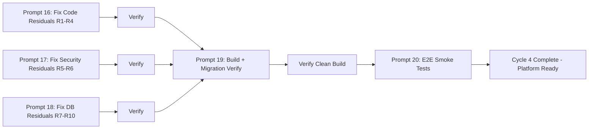

# Cycle 4 — Actionable Prompts for Coding Agent

**Generated:** June 8, 2026 14:52+03:00 (Beirut)
**Source Documents:**
- [`quality-gate-c3-code-review.md`](./quality-gate-c3-code-review.md) — Residuals R1-R4 (code review findings)
- [`quality-gate-c3-security-review.md`](./quality-gate-c3-security-review.md) — Residuals R5-R6 (security findings)
- [`quality-gate-c3-database-review.md`](./quality-gate-c3-database-review.md) — Residuals R7-R10 (database findings)
- [`session-audit-plan.md`](./session-audit-plan.md) — Cycle 3 Residual Issues table (R1-R10)

**Cycle 4 Scope:** Fix all 10 residual issues from Cycle 3 quality gates + run final production readiness checks. This is the FINAL cleanup cycle — no new features, only surgical fixes.

---

## PROMPT 16: Fix Code Review Residuals (R1-R4)

**Mode:** code
**Priority:** HIGH
**Depends On:** None

### Context

The Cycle 3 code reviewer found 4 residual issues across 3 files. These are display-string regressions introduced during Cycle 3 work — hardcoded placeholders, a locale ternary that escaped earlier i18n passes, and an `alert()` call that breaks the sonner toast UX pattern used everywhere else.

The reference i18n pattern is [`leads/leads-client.tsx`](../../src/app/%5Blocale%5D/(dashboard)/leads/leads-client.tsx) which uses `useTranslations()` exclusively with zero hardcoded locale ternaries.

### Required Deliverables

1. **Replace hardcoded `"Name (EN)"` / `"Name (FR)"` placeholders in [`pt-client.tsx`](../../src/app/%5Blocale%5D/(dashboard)/pt/pt-client.tsx:361)**
   - Line 361: `placeholder="Name (EN)"` → `placeholder={t('student_name')}`
   - Line 369: `placeholder="Name (FR)"` → `placeholder={t('student_name_fr')}` or a single key like `t('student_name')` used for both
   - These are user-visible display strings — must use the `pt` namespace translator
   - Use `const t = useTranslations('pt')` (already imported in this file)

2. **Replace hardcoded role label ternary in [`coach/profile/page.tsx`](../../src/app/%5Blocale%5D/coach/profile/page.tsx:97)**
   - Line 97: `{isRTL ? 'مدرب' : locale === 'fr' ? 'Entraîneur' : 'Coach'}`
   - Replace with the dynamic i18n import pattern used elsewhere in coach portal pages:
     ```typescript
     const { role_label } = await import(`@/i18n/messages/${locale}.json`).then(m => m.default.coach);
     ```
   - Or if this is a client component, use `useTranslations('coach')` and `t('role_label')`
   - The `coach` namespace should already have a `role_label` key — verify and add if missing across en/ar/fr

3. **Replace `alert()` with `toast.error()` (sonner) in [`rentals-client.tsx`](../../src/app/%5Blocale%5D/(dashboard)/rentals/rentals-client.tsx:124)**
   - Line 124: `alert(firstIssue?.message || 'Validation error')` → `toast.error(firstIssue?.message || t('validation_error'))`
   - Line 136: Same pattern — replace any remaining `alert()` calls
   - Ensure `import { toast } from 'sonner'` is present at the top of the file
   - This is both an i18n and UX fix — browser `alert()` dialogs are blocking and inconsistent with the rest of the platform

4. **Replace zero UUID `external_coach_id` placeholder in [`rentals-client.tsx`](../../src/app/%5Blocale%5D/(dashboard)/rentals/rentals-client.tsx:115)**
   - Line 115: `external_coach_id: '00000000-0000-0000-0000-000000000000'` — used in canonical payload for schema validation
   - Line 143: Same zero UUID used in actual Supabase insert payload
   - Two acceptable approaches (choose the simpler one):
     - **Option A (preferred):** Remove `external_coach_id` from the insert payload entirely if the column is nullable in the DB. Make the Zod schema treat it as optional.
     - **Option B:** If the column is NOT NULL, fetch external coaches from `supabase.from('external_coaches').select('id').eq('gym_id', gymId).limit(1)` and use the first result, or show a dropdown.
   - The comment already acknowledges this is a placeholder — implement the actual fix

### Validation Checklist
- [ ] [`pt-client.tsx`](../../src/app/%5Blocale%5D/(dashboard)/pt/pt-client.tsx:361) — No hardcoded `"Name (EN)"` or `"Name (FR)"` strings
- [ ] [`coach/profile/page.tsx`](../../src/app/%5Blocale%5D/coach/profile/page.tsx:97) — Role label uses i18n, no locale ternary
- [ ] [`rentals-client.tsx`](../../src/app/%5Blocale%5D/(dashboard)/rentals/rentals-client.tsx:124) — Zero `alert()` calls; all replaced with `toast.error()` / `toast.success()`
- [ ] [`rentals-client.tsx`](../../src/app/%5Blocale%5D/(dashboard)/rentals/rentals-client.tsx:115) — Zero UUID placeholder either removed or replaced with real lookup
- [ ] No regressions — all 3 files still build and function correctly

### References
- [`quality-gate-c3-code-review.md`](./quality-gate-c3-code-review.md) — Sections 2 (i18n Compliance), 4 (Zero UUID/Gym ID), 7 (Error Handling)
- [`pt-client.tsx`](../../src/app/%5Blocale%5D/(dashboard)/pt/pt-client.tsx:361) — Hardcoded `"Name (EN)"` / `"Name (FR)"` placeholders
- [`coach/profile/page.tsx`](../../src/app/%5Blocale%5D/coach/profile/page.tsx:97) — Hardcoded role label ternary
- [`rentals-client.tsx`](../../src/app/%5Blocale%5D/(dashboard)/rentals/rentals-client.tsx:115) — Zero UUID `external_coach_id`
- [`rentals-client.tsx`](../../src/app/%5Blocale%5D/(dashboard)/rentals/rentals-client.tsx:124) — `alert()` call for validation errors
- [`leads/leads-client.tsx`](../../src/app/%5Blocale%5D/(dashboard)/leads/leads-client.tsx) — Gold standard i18n reference (zero hardcoded ternaries)

### Audit Cycle Gate
You MUST append your completion entry to `/Users/techstack/Desktop/Agentics/Projects/proline-gym-platform/audit-cycle-update.md` BEFORE calling `attempt_completion`. This is a GATE REQUIREMENT. If you skip this step, the audit cycle cannot progress.

---

## PROMPT 17: Fix Security Residuals (R5-R6)

**Mode:** code
**Priority:** MEDIUM
**Depends On:** None (can run parallel with Prompt 16 and Prompt 18)

### Context

The Cycle 3 security reviewer found 2 MEDIUM-severity residual issues. The coach attendance page at [`coach/attendance/page.tsx`](../../src/app/%5Blocale%5D/coach/attendance/page.tsx) submits attendance records directly to Supabase without any Zod validation — no runtime guard exists between the client state and the database insert. Additionally, two Phase C tables (`pt_sessions` and `pt_assignments`) still have bare `is_staff()` RLS policies without gym scoping, meaning a staff user from Gym A could potentially access records from Gym B.

The reference pattern for gym-scoped RLS policies is migration [`000011_fix_rls_gym_scoping.sql`](../../supabase/migrations/000011_fix_rls_gym_scoping.sql) and [`000013_fix_rental_bookings_rls.sql`](../../supabase/migrations/000013_fix_rental_bookings_rls.sql).

### Required Deliverables

1. **Add Zod validation schema for attendance upsert**
   - Create a Zod schema `attendanceRecordSchema` for the attendance record payload
   - Define the `status` field as `z.enum(['present', 'absent', 'late', 'excused'])`
   - Include `class_schedule_id` (UUID), `student_id` (UUID), and `date` (string or date)
   - Add the schema to [`src/lib/validators/attendance.schema.ts`](../../src/lib/validators/attendance.schema.ts) or create the file if it doesn't exist
   - Export from the validators barrel [`src/lib/validators/index.ts`](../../src/lib/validators/index.ts)

2. **Wire Zod validation into [`coach/attendance/page.tsx`](../../src/app/%5Blocale%5D/coach/attendance/page.tsx)**
   - In the `handleSubmit` function (around line 222), add `attendanceRecordSchema.safeParse(payload)` before the upsert call
   - On validation failure, show a sonner `toast.error()` with the first validation issue
   - On validation success, proceed with the existing `supabase.from('attendance_records').upsert()` call
   - Add `import { attendanceRecordSchema } from '@/lib/validators'`
   - Ensure the existing `try/catch` around the upsert is preserved

3. **Create migration `000014_fix_pt_rls_gym_scoping.sql`**
   - Drop the existing bare `is_staff()` policies on `pt_sessions` and `pt_assignments`
   - Re-create `pt_sessions_staff` with gym scoping via FK chain: `pt_sessions → pt_packages (package_id) → gyms (gym_id)`
   - Re-create `pt_assignments_staff` with gym scoping via FK chain: `pt_assignments → pt_packages (package_id) → gyms (gym_id)`
   - Follow the exact pattern from `000013_fix_rental_bookings_rls.sql`:
     ```sql
     -- Fix pt_sessions staff policy
     DROP POLICY IF EXISTS pt_sessions_staff ON pt_sessions;

     CREATE POLICY pt_sessions_staff_gym ON pt_sessions
       FOR ALL
       USING (
         is_staff()
         AND EXISTS (
           SELECT 1 FROM pt_packages
           WHERE pt_packages.id = pt_sessions.package_id
           AND pt_packages.gym_id = get_user_gym_id()
         )
       );

     -- Fix pt_assignments staff policy
     DROP POLICY IF EXISTS pt_assignments_staff ON pt_assignments;

     CREATE POLICY pt_assignments_staff_gym ON pt_assignments
       FOR ALL
       USING (
         is_staff()
         AND EXISTS (
           SELECT 1 FROM pt_packages
           WHERE pt_packages.id = pt_assignments.package_id
           AND pt_packages.gym_id = get_user_gym_id()
         )
       );
     ```
   - Place the file at [`supabase/migrations/000014_fix_pt_rls_gym_scoping.sql`](../../supabase/migrations/000014_fix_pt_rls_gym_scoping.sql)

### Validation Checklist
- [ ] `attendanceRecordSchema` exists with `status` enum constraint (`present` | `absent` | `late` | `excused`)
- [ ] `safeParse()` is called before every `supabase.from('attendance_records').upsert()` in the attendance page
- [ ] Invalid payloads are rejected with sonner toast — no malformed data reaches the DB
- [ ] Migration `000014_fix_pt_rls_gym_scoping.sql` applies cleanly without errors
- [ ] `pt_sessions_staff_gym` policy enforces gym scoping via `pt_packages.gym_id` FK chain
- [ ] `pt_assignments_staff_gym` policy enforces gym scoping via `pt_packages.gym_id` FK chain
- [ ] Existing coach and student policies on both tables are NOT affected
- [ ] No regressions — attendance still submits correctly, PT data still accessible

### References
- [`quality-gate-c3-security-review.md`](./quality-gate-c3-security-review.md) — Sections 1 (Input Validation), 6 (RLS Coverage)
- [`coach/attendance/page.tsx`](../../src/app/%5Blocale%5D/coach/attendance/page.tsx) — Lines 222-245 (handleSubmit, upsert call)
- [`000004_create_rls_policies.sql`](../../supabase/migrations/000004_create_rls_policies.sql:201-202) — Current bare `pt_sessions_staff` policy
- [`000012_create_pt_assignments.sql`](../../supabase/migrations/000012_create_pt_assignments.sql) — Current `pt_assignments_staff` policy (RLS section)
- [`000011_fix_rls_gym_scoping.sql`](../../supabase/migrations/000011_fix_rls_gym_scoping.sql) — Reference pattern for gym-scoped RLS fix
- [`000013_fix_rental_bookings_rls.sql`](../../supabase/migrations/000013_fix_rental_bookings_rls.sql) — Reference pattern for re-creating scoped policies
- [`src/lib/validators/index.ts`](../../src/lib/validators/index.ts) — Validator barrel export

### Audit Cycle Gate
You MUST append your completion entry to `/Users/techstack/Desktop/Agentics/Projects/proline-gym-platform/audit-cycle-update.md` BEFORE calling `attempt_completion`. This is a GATE REQUIREMENT. If you skip this step, the audit cycle cannot progress.

---

## PROMPT 18: Fix Database Residuals (R7-R10)

**Mode:** code
**Priority:** MEDIUM
**Depends On:** None (can run parallel with Prompt 16 and Prompt 17)

### Context

The Cycle 3 database reviewer found 4 residual issues in the PT module. The `pt_assignments` query in [`pt/page.tsx`](../../src/app/%5Blocale%5D/(dashboard)/pt/page.tsx:46) lacks an explicit `gym_id` filter (R7). The `pt_assignments` table is missing from the generated types in [`src/types/database.ts`](../../src/types/database.ts) (R8) — this means TypeScript can't type-check any code referencing the table. There is no seed data for `pt_assignments` in [`000006_seed_data.sql`](../../supabase/migrations/000006_seed_data.sql) (R9), making it impossible to demo the credit tracking feature. Finally, the queries in [`pt/page.tsx`](../../src/app/%5Blocale%5D/(dashboard)/pt/page.tsx:26) use sequential `await` calls instead of `Promise.all` (R10), causing unnecessary latency.

### Required Deliverables

1. **Add `.eq('gym_id', gymId)` filter to `pt_assignments` query in [`pt/page.tsx`](../../src/app/%5Blocale%5D/(dashboard)/pt/page.tsx:46)**
   - The current query (lines 46-51) filters only by `package_id` IN-list, `is_active`, and `sessions_remaining > 0`
   - Since `pt_assignments` doesn't have a direct `gym_id` column, use a subquery filter:
     ```typescript
     const { data: assignments } = await supabase
       .from('pt_assignments')
       .select('*')
       .eq('is_active', true)
       .in('package_id', (packages || []).map(p => p.id))
       .gt('sessions_remaining', 0);
     // Already scoped implicitly via packages being gym-scoped above
     ```
   - The existing `package_id` IN-filter already limits to packages scoped by `gym_id` (fetched on line 30 with `.eq('gym_id', gymId)`)
   - Verify this is sufficient — if RLS migration 000014 is applied, RLS also enforces gym scoping server-side
   - Add a comment documenting the implicit scoping through the `package_id` chain

2. **Regenerate [`src/types/database.ts`](../../src/types/database.ts)**
   - Run the command:
     ```bash
     cd /Users/techstack/Desktop/Agentics/Projects/proline-gym-platform && npx supabase gen types typescript --local > src/types/database.ts
     ```
   - Verify that `pt_assignments` appears in the `Tables` section of the generated file
   - Verify that all 14 migration tables are present (33+ tables total expected)
   - If the `--local` flag fails because the local Supabase instance is not running, use `--linked` instead
   - After regeneration, run `npx tsc --noEmit` to confirm no type errors introduced

3. **Add `pt_assignments` seed data to [`000006_seed_data.sql`](../../supabase/migrations/000006_seed_data.sql)**
   - Add 3-4 demo pt_assignments records at the end of the existing seed file
   - Each record should reference existing `pt_packages`, `students`, and `coaches` from the seed data
   - Use `WHERE NOT EXISTS` guards to prevent duplicate inserts on re-run
   - Example pattern:
     ```sql
     -- PT Assignments seed data
     INSERT INTO pt_assignments (student_id, package_id, coach_id, sessions_total, sessions_used, purchased_at, expires_at, is_active)
     SELECT
       s.id AS student_id,
       p.id AS package_id,
       c.id AS coach_id,
       p.session_count AS sessions_total,
       FLOOR(RANDOM() * p.session_count) AS sessions_used,
       NOW() - INTERVAL '7 days' AS purchased_at,
       NOW() + INTERVAL '30 days' AS expires_at,
       TRUE AS is_active
     FROM students s
     CROSS JOIN pt_packages p
     JOIN coaches c ON c.gym_id = s.gym_id
     WHERE p.gym_id = s.gym_id
       AND NOT EXISTS (SELECT 1 FROM pt_assignments a WHERE a.student_id = s.id AND a.package_id = p.id)
     LIMIT 4;
     ```
   - Ensure the seed data creates realistic credit tracking scenarios (e.g., 5 sessions total with 2 used → 3 remaining)

4. **Convert sequential awaits to `Promise.all` in [`pt/page.tsx`](../../src/app/%5Blocale%5D/(dashboard)/pt/page.tsx:26)**
   - Current pattern (sequential — 4 separate awaits):
     ```typescript
     const { data: packages } = await supabase.from('pt_packages')...   // await 1
     const { data: students } = await supabase.from('students')...       // await 2
     const { data: coaches } = await supabase.from('coaches')...         // await 3
     const { data: assignments } = await supabase.from('pt_assignments')... // await 4 (depends on packages)
     ```
   - Proposed pattern (parallel where possible):
     ```typescript
     const [{ data: packages }, { data: students }, { data: coaches }] = await Promise.all([
       supabase.from('pt_packages').select('*').eq('gym_id', gymId).order('session_count'),
       supabase.from('students').select('id, first_name_ar, first_name_en, last_name_ar, last_name_en').eq('is_active', true).eq('gym_id', gymId),
       supabase.from('coaches').select('id, profiles(first_name_ar, first_name_en, last_name_ar, last_name_en)').eq('gym_id', gymId).eq('is_active', true),
     ]);
     // Then fetch assignments (depends on packages IDs)
     const { data: assignments } = await supabase.from('pt_assignments')...
     ```
   - `packages`, `students`, and `coaches` are independent — they can all run in parallel
   - `assignments` depends on `packages` for the `package_id` IN-filter, so it must run after
   - This reduces latency from 4 sequential round-trips to 2 (one parallel batch + one follow-up)

### Validation Checklist
- [ ] `pt_assignments` query has implicit gym scoping via `package_id` IN-filter (documented with comment)
- [ ] `npx supabase gen types typescript --local` completes successfully
- [ ] `src/types/database.ts` contains `pt_assignments` table definition
- [ ] `npx tsc --noEmit` passes with zero errors after type regeneration
- [ ] `000006_seed_data.sql` contains 3-4 `pt_assignments` seed records with `WHERE NOT EXISTS` guards
- [ ] Seed data creates realistic credit scenarios (sessions_used < sessions_total)
- [ ] `pt/page.tsx` uses `Promise.all` for packages + students + coaches queries (parallel)
- [ ] `assignments` query runs after `packages` are fetched (correct dependency order)
- [ ] No regressions — PT page loads correctly with all data

### References
- [`quality-gate-c3-database-review.md`](./quality-gate-c3-database-review.md) — Sections 2 (Multi-Tenant), 3 (Schema Integrity), 4 (Seed Data), 5 (Query Optimization)
- [`pt/page.tsx`](../../src/app/%5Blocale%5D/(dashboard)/pt/page.tsx:26) — Sequential awaits (R7, R10)
- [`pt/page.tsx`](../../src/app/%5Blocale%5D/(dashboard)/pt/page.tsx:46) — Unscoped pt_assignments query (R7)
- [`src/types/database.ts`](../../src/types/database.ts) — Missing pt_assignments table type (R8)
- [`000006_seed_data.sql`](../../supabase/migrations/000006_seed_data.sql) — No pt_assignments seed data (R9)
- [`belts/page.tsx`](../../src/app/%5Blocale%5D/(dashboard)/belts/page.tsx:28) — Reference pattern for `Promise.all` parallel queries

### Audit Cycle Gate
You MUST append your completion entry to `/Users/techstack/Desktop/Agentics/Projects/proline-gym-platform/audit-cycle-update.md` BEFORE calling `attempt_completion`. This is a GATE REQUIREMENT. If you skip this step, the audit cycle cannot progress.

---

## PROMPT 19: Full Build & Migration Verification

**Mode:** code
**Priority:** HIGH
**Depends On:** Prompts 16, 17, 18 (must run AFTER all three are complete)

### Context

After all 10 residual issues are fixed, the entire platform must be verified to pass a clean build with zero errors. This prompt is the integration gate — it ensures all fixes from Prompts 16, 17, and 18 compose correctly without regressions. The migration chain must be verified end-to-end (000001 through 000014 all applied in order with no gaps), `next build` must pass, and `tsc --noEmit` must have zero type errors.

### Required Deliverables

1. **Run `npx supabase db reset` to apply all migrations cleanly**
   - Command: `cd /Users/techstack/Desktop/Agentics/Projects/proline-gym-platform && npx supabase db reset`
   - This drops and recreates the local database, applying migrations 000001 through 000014 in sequence
   - Verify the output shows all 14 migrations applied without errors
   - If any migration fails, stop and report the error — do not proceed

2. **Verify migration chain integrity**
   - Confirm all 14 migrations exist and are sequentially numbered (000001-000014)
   - Check for no gaps in the sequence
   - Verify migration 000014 (`000014_fix_pt_rls_gym_scoping.sql`) was applied last
   - Run: `cd /Users/techstack/Desktop/Agentics/Projects/proline-gym-platform && ls -1 supabase/migrations/ | sort`
   - Expected output:
     ```
     000001_create_enums.sql
     000002_create_core_tables.sql
     000003_create_operational_tables.sql
     000004_create_rls_policies.sql
     000005_create_triggers.sql
     000006_seed_data.sql
     000007_fix_currency_preference.sql
     000008_demo_accounts.sql
     000009_public_lead_submissions.sql
     000010_add_belt_columns.sql
     000011_fix_rls_gym_scoping.sql
     000012_create_pt_assignments.sql
     000013_fix_rental_bookings_rls.sql
     000014_fix_pt_rls_gym_scoping.sql
     ```

3. **Run `npx next build` — must pass with zero errors**
   - Command: `cd /Users/techstack/Desktop/Agentics/Projects/proline-gym-platform && npx next build 2>&1`
   - The build must complete with exit code 0
   - Expected output: "✓ Compiled successfully" or "✓ Generating static pages"
   - There should be NO:
     - Type errors
     - Build errors
     - Unhandled promise rejections
     - Missing module errors
   - Warnings are acceptable (e.g., "Fast Refresh had to perform a full reload") but must be documented

4. **Run `npx tsc --noEmit` — must pass**
   - Command: `cd /Users/techstack/Desktop/Agentics/Projects/proline-gym-platform && npx tsc --noEmit 2>&1`
   - Must exit with code 0 and produce zero error output
   - If any type errors exist, document them and fix before proceeding

5. **Verify regenerated types are in sync**
   - After `db reset` above, regenerate types fresh:
     ```bash
     cd /Users/techstack/Desktop/Agentics/Projects/proline-gym-platform && npx supabase gen types typescript --local > src/types/database.ts
     ```
   - Run `npx tsc --noEmit` again after regeneration
   - Confirm `pt_assignments` is present in the generated types

### Validation Checklist
- [ ] `npx supabase db reset` completes with all 14 migrations applied, zero errors
- [ ] Migration chain: 000001-000014 all present, sequentially numbered, no gaps
- [ ] Migration 000014 is the last migration applied
- [ ] `npx next build` completes with exit code 0, zero errors
- [ ] `npx tsc --noEmit` completes with exit code 0, zero errors
- [ ] `src/types/database.ts` is up-to-date with `pt_assignments` table definition
- [ ] No regressions from Prompts 16-18 fixes

### References
- [`session-audit-plan.md`](./session-audit-plan.md) — Section 5 (Cycle Execution Status), Migration chain listing
- [`supabase/migrations/`](../../supabase/migrations/) — All 14 migration files
- [`src/types/database.ts`](../../src/types/database.ts) — Generated Supabase types
- [`next.config.mjs`](../../next.config.mjs) — Next.js build configuration

### Audit Cycle Gate
You MUST append your completion entry to `/Users/techstack/Desktop/Agentics/Projects/proline-gym-platform/audit-cycle-update.md` BEFORE calling `attempt_completion`. This is a GATE REQUIREMENT. If you skip this step, the audit cycle cannot progress.

---

## PROMPT 20: E2E Smoke Tests

**Mode:** code
**Priority:** MEDIUM
**Depends On:** Prompt 19 (needs clean build first)

### Context

After all 10 residual issues are fixed and the build passes cleanly, the platform must be manually smoke-tested with a structured checklist. This prompt does NOT create automated tests — it creates a checklist document and verifies the 9 most critical user journeys end-to-end. This is the final quality gate before declaring Cycle 4 complete.

### Required Deliverables

1. **Create smoke test checklist document at [`docs/testing/smoke-test-checklist.md`](../../docs/testing/smoke-test-checklist.md)**
   - The document should be a simple markdown checklist with test cases, steps, and pass/fail columns
   - Each test case includes: ID, description, steps to execute, expected result, and a checkbox for pass/fail
   - Format:
     ```markdown
     # Smoke Test Checklist — PRO LINE Gym Platform
     
     **Date:** YYYY-MM-DD
     **Tester:** [Name]
     **Build:** Cycle 4 (Post-Residual-Fix)
     
     | # | Test Case | Steps | Expected Result | Pass? |
     |---|-----------|-------|-----------------|-------|
     | 1 | ... | ... | ... | [ ] |
     ```

2. **Define 9 smoke test cases**
   - **Test 1: Login as owner → verify dashboard loads**
     - Navigate to `/login`
     - Enter demo owner credentials
     - Verify redirect to staff dashboard
     - Verify dashboard widgets render (stats, recent activity)
     - Verify no console errors
   
   - **Test 2: Login as coach → verify coach portal loads**
     - Navigate to `/login`
     - Enter demo coach credentials
     - Verify redirect to coach portal
     - Verify today's classes are displayed
     - Verify profile, attendance, students pages are accessible
     - Verify no console errors
   
   - **Test 3: Create a lead → verify appears in list**
     - Login as owner
     - Navigate to Leads page
     - Click "New Lead" or equivalent
     - Fill in name, phone, source fields
     - Submit the form
     - Verify the new lead appears in the leads list
     - Verify success toast appears
   
   - **Test 4: Change lead status → verify persists**
     - On the Leads page
     - Click the status dropdown on a lead
     - Change status (e.g., New → Contacted)
     - Refresh the page
     - Verify the status change was persisted
   
   - **Test 5: Create a camp → verify appears (CRITICAL bug fix verification!)**
     - Navigate to Camps page
     - Click "New Camp" or equivalent
     - Fill in all required fields (name_en, start_date, end_date, etc.)
     - Submit the form
     - Verify the new camp appears in the camps list
     - Verify NO `gym_id NOT NULL` constraint violation
     - Verify success toast appears
   
   - **Test 6: Create a PT package → verify credit tracking shows**
     - Navigate to PT Packages page
     - Click "New Package"
     - Fill in name, session_count, price
     - Submit the form
     - Verify the package appears
     - Assign the package to a student
     - Verify the assignment shows credit tracking (sessions remaining)
     - Verify NO fake UUID errors on coach_id
   
   - **Test 7: Promote a student belt → verify stepper works**
     - Navigate to Belts page
     - Select a student from the list
     - Select a discipline
     - Select a belt rank
     - Click promote
     - Verify the 3-step stepper guided the flow
     - Verify the student's belt updated
     - Verify success toast
   
   - **Test 8: Switch language to Arabic → verify no English strings**
     - Click the language switcher
     - Select Arabic (العربية)
     - Navigate through all 5 Phase C dashboard modules: Leads, Belts, Camps, PT, Rentals
     - Navigate through Settings, Reports, Notifications
     - Navigate through Coach Portal pages
     - Verify ALL UI text is in Arabic (no English fallback strings visible)
     - Verify RTL layout is applied correctly (text right-aligned, layout mirrored)
   
   - **Test 9: Switch to French → verify no English strings**
     - Click the language switcher
     - Select French (Français)
     - Navigate through all 5 Phase C dashboard modules
     - Navigate through Settings, Reports, Notifications
     - Navigate through Coach Portal pages
     - Verify ALL UI text is in French (no English fallback strings visible)
     - Verify LTR layout is applied correctly

3. **Execute smoke tests manually and record results**
   - Start the dev server: `cd /Users/techstack/Desktop/Agentics/Projects/proline-gym-platform && npm run dev`
   - Execute each test case in order
   - Mark each test case as PASS ✅ or FAIL ❌ in the checklist
   - For any FAIL results, document the exact error/issue observed
   - If critical tests fail (Test 5: Camps create, Test 1: Login), report immediately

### Validation Checklist
- [ ] `docs/testing/smoke-test-checklist.md` created with 9 test cases
- [ ] Test 1: Login as owner — dashboard loads ✅
- [ ] Test 2: Login as coach — coach portal loads ✅
- [ ] Test 3: Create a lead — appears in list ✅
- [ ] Test 4: Change lead status — persists after refresh ✅
- [ ] Test 5: Create a camp — appears, no gym_id error ✅
- [ ] Test 6: Create a PT package — credit tracking shows ✅
- [ ] Test 7: Promote a student belt — stepper works ✅
- [ ] Test 8: Arabic language — no English strings visible ✅
- [ ] Test 9: French language — no English strings visible ✅
- [ ] All test results documented in the checklist with pass/fail marks

### References
- [`session-audit-plan.md`](./session-audit-plan.md) — Section 4 (Discovered Issues), Section 5 (Cycle 3 Residual Issues R1-R10)
- [`docs/testing/PHASE_C_TEST_REGISTER.md`](../../docs/testing/PHASE_C_TEST_REGISTER.md) — Existing test register (reference pattern)
- [`(dashboard)/leads/page.tsx`](../../src/app/%5Blocale%5D/(dashboard)/leads/page.tsx) — Leads module
- [`(dashboard)/belts/page.tsx`](../../src/app/%5Blocale%5D/(dashboard)/belts/page.tsx) — Belts module
- [`(dashboard)/camps/page.tsx`](../../src/app/%5Blocale%5D/(dashboard)/camps/page.tsx) — Camps module
- [`(dashboard)/pt/page.tsx`](../../src/app/%5Blocale%5D/(dashboard)/pt/page.tsx) — PT module
- [`(dashboard)/rentals/page.tsx`](../../src/app/%5Blocale%5D/(dashboard)/rentals/page.tsx) — Rentals module
- [`coach/page.tsx`](../../src/app/%5Blocale%5D/coach/page.tsx) — Coach portal home
- [`coach/attendance/page.tsx`](../../src/app/%5Blocale%5D/coach/attendance/page.tsx) — Coach attendance
- [`coach/profile/page.tsx`](../../src/app/%5Blocale%5D/coach/profile/page.tsx) — Coach profile

### Audit Cycle Gate
You MUST append your completion entry to `/Users/techstack/Desktop/Agentics/Projects/proline-gym-platform/audit-cycle-update.md` BEFORE calling `attempt_completion`. This is a GATE REQUIREMENT. If you skip this step, the audit cycle cannot progress.

---

## Cycle 4 Execution Order



Prompts 16, 17, and 18 are independent — they modify different files and can run in parallel. Prompt 19 must run after all three are complete. Prompt 20 is the final gate after a clean build.

## Cycle 4 Summary Table

| # | Prompt | Issues | Priority | Depends On | Modified Files |
|---|--------|--------|----------|------------|----------------|
| 16 | Fix Code Review Residuals | R1, R2, R3, R4 | HIGH | None | pt-client.tsx, coach/profile/page.tsx, rentals-client.tsx |
| 17 | Fix Security Residuals | R5, R6 | MEDIUM | None | coach/attendance/page.tsx, 000014 migration (new) |
| 18 | Fix Database Residuals | R7, R8, R9, R10 | MEDIUM | None | pt/page.tsx, database.ts, 000006_seed_data.sql |
| 19 | Full Build & Migration Verification | Integration gate | HIGH | 16, 17, 18 | Verification only |
| 20 | E2E Smoke Tests | Final quality gate | MEDIUM | 19 | smoke-test-checklist.md (new) |
