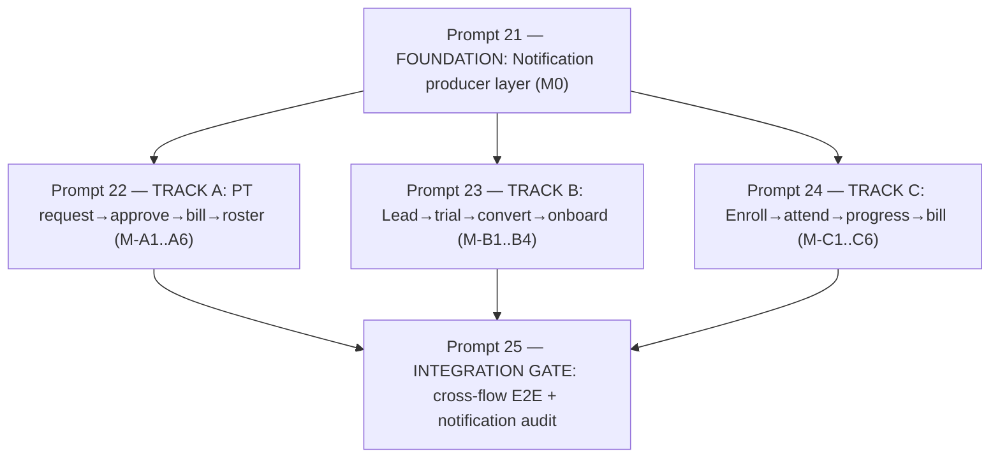

# Cycle 5 Prompts — Workflow Maturity (Managed Bar)

> **Created:** 2026-06-08 · **Auditor:** Project Auditor (read-only — these prompts are for the coding agent)
> **Goal:** Raise the three cross-user flows from **L1 Ad-hoc → L3 Managed**: every handoff fires a notification + surfaces state to all parties; billing side-effects fire automatically.
> **Inputs:** [`workflow-maturity-matrix.md`](./workflow-maturity-matrix.md), [`gap-log.md`](./gap-log.md).
> **Structure:** 1 orchestrator + 1 foundation prompt (blocking) + 3 parallel flow tracks + 1 integration gate.
> **Every prompt must:** (a) act as the named **ECC role** (`/Arsenal/ecc/agents/<role>.md`), (b) apply the named **superpower** (`/Arsenal/superpowers/skills/<skill>/`), (c) honor the **maturity lens** (CMMI L3 Managed), and (d) **append a verification section to [`audit-cycle-update.md`](../../audit-cycle-update.md)** with file:line evidence that the handoff/notification/billing actually fires.

---

## Execution Graph

**Orchestration:** Run **Prompt 21 alone first** (all tracks depend on the notification helper + table contract). Then dispatch **22, 23, 24 in parallel** (disjoint files — A=pt/portal+coach, B=leads, C=attendance/belts/billing). Finally run **Prompt 25**.

---

## Prompt 21 — FOUNDATION: Notification Producer Layer (M0) 🚦 BLOCKING

> **Act as:** `architect` (`/Arsenal/ecc/agents/architect.md`), handing the RLS/trigger review to `database-reviewer`.
> **Apply superpower:** `test-driven-development` (`/Arsenal/superpowers/skills/test-driven-development/`) — write the failing test "a domain event creates a notification row the recipient can read" **before** building.
> **Maturity lens:** Build the **feedback-loop substrate** that lifts every flow from L1→L3.

**Context:** The `notifications` table has 6 consumers but **zero producers** — no code ever inserts a notification. Verify: `grep -rn "from('notifications')" src` shows only `.select()`/`.update()`.

**Build:**
1. A reusable server helper `src/lib/notifications/create.ts` → `createNotification({ recipientProfileId, type, titleKey, bodyKey, params, entityType, entityId, gymId })`. Insert into `notifications` with i18n **keys** (not rendered strings — render client-side via the existing namespaces). Support fan-out to a role (e.g. all `owner`/`receptionist` of a gym) via a `createNotificationForRole(...)` variant.
2. RLS: ensure authenticated users can `INSERT` notifications addressed to others within their gym (staff → student/coach), and can only `SELECT`/`UPDATE` their own. New migration `000015_notifications_producer_rls.sql`. **Hand to `database-reviewer` to confirm no cross-gym leak.**
3. Realtime: confirm the bell/dropdown subscribe to inserts (Supabase Realtime). If not, wire it so a new notification appears without refresh (state visibility = Managed).
4. Define the canonical `notification.type` enum values the three tracks will emit: `pt_requested, pt_approved, pt_assigned, lead_new, trial_scheduled, lead_converted, attendance_absent, belt_promoted, membership_expiring, invoice_overdue, enrollment_confirmed`.

**Done = Managed when:** a unit/integration test inserts via the helper and the recipient (and only the recipient, same gym) can read it; the bell increments live.

**On completion:** append to `audit-cycle-update.md` → "Cycle 5 / P21" with the helper signature, migration name, and the test proving recipient-scoped delivery.

---

## Prompt 22 — TRACK A: PT Request → Approve → Bill → Roster (M-A1…M-A6)

> **Act as:** `architect` (model the state machine) with `tdd-guide` driving the credit/billing logic.
> **Apply superpower:** `brainstorming` (`/Arsenal/superpowers/skills/brainstorming/`) to model the `requested→approved→assigned` machine, then `systematic-debugging` (`/Arsenal/superpowers/skills/systematic-debugging/`) to fix the dead credit-decrement path.
> **Maturity lens:** L1→L3 — open the request, add approval state, auto-bill, notify both parties, surface on coach roster, consume credits.

**Build (each step must persist + hand off):**
1. **M-A1 Request (hybrid self-service):** Add a PT-request entry to the member portal (`portal/`). Student/parent picks a package + preferred coach → INSERT `pt_assignments` with a new `status='requested'` (add column/enum via migration). Fire `pt_requested` notification to staff.
2. **M-A2 Approve:** In `(dashboard)/pt`, staff sees pending requests; Approve → `status='approved'`/`'assigned'`; Reject → `status='rejected'` + reason. Each transition notifies the student (`pt_approved`).
3. **M-A3 Bill:** On approval, auto-create an invoice for the package price (dual-currency `amount_usd`/`amount_lbp`/`exchange_rate`). Link invoice ↔ assignment. Skip if already paid.
4. **M-A4 Notify:** Student gets `pt_assigned`; the assigned coach gets a notification too.
5. **M-A5 Roster:** Coach portal must surface PT-assigned students — add a "My PT Students" view in `coach/` reading `pt_assignments` (this coach, active) with remaining credits.
6. **M-A6 Consume credit:** Add a "Log session" action (coach or staff) that calls the existing `increment_sessions_used()` RPC. Show credits decrement live. Block at 0.

**Files:** `portal/` (new request page), `(dashboard)/pt/pt-client.tsx` + `pt/page.tsx`, `coach/` (new roster view), migration for `pt_assignments.status`, invoice creation helper.

**Done = Managed when:** a portal request reaches staff as a notification, approval bills + notifies, the coach sees the student and can log a session that decrements credits.

**On completion:** append to `audit-cycle-update.md` → "Cycle 5 / P22 / Track A" with file:line proof for each of M-A1…M-A6.

---

## Prompt 23 — TRACK B: Lead → Trial → Convert → Onboard (M-B1…M-B4)

> **Act as:** `architect` for the onboarding transaction, `database-reviewer` to verify the convert txn is atomic and gym-scoped.
> **Apply superpower:** `test-driven-development` — write "convert ⇒ a `students` row + `student_membership` + first `invoice` exist and `leads.converted_student_id` is set" as a failing test first.
> **Maturity lens:** L1→L3 — persist trials, make convert a real onboarding handoff, notify at each step.

**Build:**
1. **M-B1 Trial:** Wire the date + time inputs ([leads-client.tsx:320-342](src/app/[locale]/(dashboard)/leads/leads-client.tsx#L320-L342)) to actually persist — INSERT `trial_classes` (date, time, optional assigned coach) and set lead status. Notify staff/coach (`trial_scheduled`).
2. **M-B2 Convert (CRITICAL):** Replace the cosmetic status flip with an **atomic onboarding** (server action or RPC): create `profiles`+`students` row from lead data, create a `student_membership` (chosen plan), generate the **first invoice**, set `leads.converted_student_id` + `status='converted'`. All-or-nothing. Notify the new member (`lead_converted`).
3. **M-B3 Notify:** New public lead → notify staff (`lead_new`). Trial scheduled / converted → notify the lead/member.
4. **M-B4 Trial lifecycle:** Capture trial outcome (`trial_completed` + result) and surface a follow-up reminder; feed outcome into the convert step.

**Files:** `(dashboard)/leads/leads-client.tsx` + `page.tsx`, new convert server action / RPC migration, `trial_classes` writes.

**Done = Managed when:** scheduling a trial persists a `trial_classes` row + notifies; convert produces a real student+membership+invoice and notifies the member; `converted_student_id` is populated.

**On completion:** append to `audit-cycle-update.md` → "Cycle 5 / P23 / Track B" with proof the student/membership/invoice rows are created on convert.

---

## Prompt 24 — TRACK C: Enroll → Attend → Progress → Bill (M-C1…M-C6)

> **Act as:** `tdd-guide` for the notification/decrement wiring, `database-reviewer` for the renewal/overdue trigger.
> **Apply superpower:** `test-driven-development` for the notification side-effects; `brainstorming` for the attendance→eligibility feedback loop.
> **Maturity lens:** the mechanics are already L2 — close every missing handoff arrow to reach L3 (and L4 for eligibility).

**Build:**
1. **M-C1 Absence notify:** On attendance save, for each `absent`/`late`, notify the student/parent (`attendance_absent`).
2. **M-C2 Attendance→PT credit:** If an attended class corresponds to a PT session, call `increment_sessions_used()` (shared with M-A6).
3. **M-C4 Promotion notify:** On belt promotion ([belt-engine-client.tsx:225](src/app/[locale]/(dashboard)/belts/belt-engine-client.tsx#L225)), notify student/parent (`belt_promoted`).
4. **M-C5 Renewal/overdue billing (HIGH):** Add a scheduled/triggered job (Supabase scheduled function or `pg_cron`) that flags memberships nearing `end_date` → `membership_expiring` notification + renewal invoice when `auto_renew`; flags overdue invoices → `invoice_overdue` notification. Verify `auto_renew` column is actually consumed.
5. **M-C6 Enrollment confirmation:** On enroll, notify the student (`enrollment_confirmed`).
6. **M-C3 Eligibility (L4, stretch):** Surface an "eligible for promotion" hint in belts/coach based on attendance count since last promotion.

**Files:** `coach/attendance/page.tsx`, `(dashboard)/belts/belt-engine-client.tsx`, `(dashboard)/classes` enroll path, new migration for renewal/overdue function.

**Done = Managed when:** an absence, a promotion, and an enrollment each produce a recipient-scoped notification; expiring memberships and overdue invoices generate reminders + (if auto-renew) invoices.

**On completion:** append to `audit-cycle-update.md` → "Cycle 5 / P24 / Track C" with proof for each handoff.

---

## Prompt 25 — INTEGRATION GATE: Cross-Flow E2E + Notification Audit

> **Act as:** `e2e-runner` (`/Arsenal/ecc/agents/e2e-runner.md`).
> **Apply superpower:** `verification-before-completion` (`/Arsenal/superpowers/skills/verification-before-completion/`) — do not declare Managed without observing each notification land.
> **Maturity lens:** confirm all three flows reach L3 end-to-end.

**Verify (extend [`smoke-test-checklist.md`](../testing/smoke-test-checklist.md)):**
- Flow A: portal PT request → staff notification → approve → invoice created → student + coach notified → coach roster shows student → log session decrements credit.
- Flow B: schedule trial persists + notifies → convert creates student+membership+invoice → member notified → `converted_student_id` set.
- Flow C: mark absent → parent notified; promote → student notified; expiring membership → reminder.
- Notification audit: re-run `grep -rn "createNotification" src` — every `notification.type` from P21 has at least one producer.
- `tsc --noEmit` + `next build` clean; migration chain `000015`+ applies in order.

**On completion:** append to `audit-cycle-update.md` → "Cycle 5 / P25 / Integration Gate" with the final maturity scorecard (target: all three flows L3).

---

## Role / Superpower / Lens Coverage Matrix

| Prompt | ECC Role(s) | Superpower | Maturity lens |
|--------|-------------|-----------|----------------|
| 21 Foundation | architect → database-reviewer | test-driven-development | substrate L1→L3 |
| 22 Track A | architect + tdd-guide | brainstorming + systematic-debugging | L1→L3 |
| 23 Track B | architect + database-reviewer | test-driven-development | L1→L3 |
| 24 Track C | tdd-guide + database-reviewer | test-driven-development + brainstorming | L2→L3 (L4 stretch) |
| 25 Gate | e2e-runner | verification-before-completion | confirm L3 |
