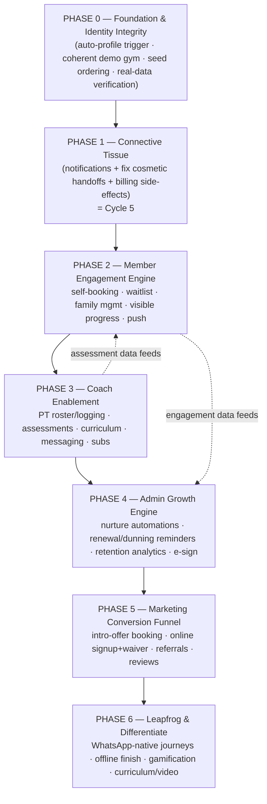

# Platform Elevation Roadmap — PRO LINE → Best-in-Class

> **Created:** 2026-06-08 · **Auditor:** Project Auditor (read-only — plan, not code)
> **Objective:** Bring the four portals to **match best-in-class** boutique/martial-arts platforms on table-stakes, and **exceed** them on the three leapfrog lanes (Arabic-first, dual-currency, offline + WhatsApp-native).
> **Inputs:** [`industry-benchmark.md`](./industry-benchmark.md), [`workflow-maturity-matrix.md`](./workflow-maturity-matrix.md), [`gap-log.md`](./gap-log.md).
> **Sequencing principle:** Foundation before features; **connective tissue (notifications/handoffs) before engagement surfaces**; retention/growth before acquisition polish; leapfrog last (compounding differentiators on a working base).

---

## Roadmap at a Glance

> **⚠️ AMENDED 2026-06-08 after live testing:** A **Phase 0 (Foundation & Identity Integrity)** is inserted before everything. Live testing showed all portals render empty because demo logins have no `profiles` row (broken auth→profile→gym chain + seed ordering). Until identities are coherent across portals, no feature can render. Delivery model also changed to **vertical slices** verified on real data, not `tsc`/`build`. See [cross-portal-workflow-map.md](./cross-portal-workflow-map.md).

Phases are **sequential at the seam** (each depends on the prior foundation) but **internally parallelizable** — within a phase, multiple coder agents run concurrently on disjoint surfaces. Phase 1 = the already-defined Cycle 5.

---

## PHASE 0 — Foundation & Identity Integrity · *NEW, blocking all*

**Why this is now first:** Live testing showed every authenticated portal renders empty. Root cause = the identity foundation never existed: the auto-profile trigger is commented out ([000005:163](../../supabase/migrations/000005_create_triggers.sql#L163)), seed `000006` references demo users created later in `000008` (ordering bug → silent skip), and `000008` creates no `profiles`. Result: demo logins have null gym → all gym-scoped queries return nothing; writes fail. No feature above can work until this is fixed.

**Delivers:**
- Auto-create a `profiles` row on every `auth.users` insert (enable `handle_new_user()` for signups AND demo).
- A **coherent demo gym**: `owner@`/`reception@` see the seeded roster; `student@` **is** an enrolled student (classes + belt + billing); `coach@` **is** a coach with a real roster. Linked `students`/`coaches` rows.
- Fix seed/migration ordering (or make idempotent + re-runnable) so identities exist before they're referenced.
- **Real-data verification protocol**: log into each portal and confirm data renders — the new definition of "done."

**Status:** Specified — Prompt **F1** in [cycle-5/prompt-F1-foundation-identity.md](./cycle-5/prompt-F1-foundation-identity.md). **Execution restarts here** (before re-validating the PT slice from Prompt 22).

**Exit criteria:** all four demo logins land on a populated portal; `owner@` can add a student and see it; `student@` sees their classes/belt/billing; `coach@` sees their roster. Verified by actual login, screenshot-or-it-didn't-happen.

---

## PHASE 1 — Connective Tissue · *= Cycle 5*

**Why first:** Every best-in-class behavior (booking confirmations, waitlist alerts, renewal nudges, nurture) rides on notifications + working handoffs. Today notifications are write-never and key handoffs (lead-convert, trial, PT) are cosmetic. Nothing above this layer can reach the "Managed" bar until it exists.

**Delivers:** notification producer layer + realtime; fix lead-convert (real student+membership+invoice), trial persistence, PT request→approve→bill→roster + credit decrement, attendance/promotion/renewal notifications.

**Status:** Fully specified — Prompts 21–25 in [`cycle-5-prompts.md`](./cycle-5-prompts.md). **This is where execution begins.**

**Exit criteria:** all 3 flows reach L3 Managed; every `notification.type` has a producer; clean build + migration chain.

---

## PHASE 2 — Member Engagement Engine (Portal B)

**Why second:** The member portal is the platform's largest competitive gap (benchmark avg ~1.2/5) and the #1 retention lever in boutique fitness. With notifications live (Phase 1), self-service becomes safe (booking → confirmation, waitlist → auto-promote alert).

**Workstreams (parallelizable):**
- **2A Self-service booking + waitlist** — member books/cancels classes within policy; capacity + waitlist with **auto-promotion + notify-next** (boutique table-stake). Builds on hybrid-portal decision.
- **2B Family / household management** — one parent account managing multiple children's schedules, attendance, billing, belts (martial-arts must-have; Kicksite/Gymdesk parity).
- **2C Member-visible progress** — surface belt rank, promotion history, attendance streak, and PT credits to the student (today belts are admin-only).
- **2D Push + reminders** — wire PWA push; class reminders, booking confirmations, cancellation alerts.

**Exit criteria:** a member can book/cancel, join a waitlist and get auto-promoted, a parent can manage ≥2 children, and a student can see their own rank + credits + streak; reminders fire via push/WhatsApp.

**Industry target:** Gymdesk/Glofox member-app parity.

---

## PHASE 3 — Coach Enablement (Portal C)

**Why third:** Coaches generate the engagement data (assessments, PT logging) that Phase 2 surfaces and Phase 4 analyzes. The attendance core is already at-par; extend the coach from attendance-taker to instructor.

**Workstreams:**
- **3A PT roster + session logging** — coach sees assigned PT students (fixes M-A5) and logs sessions that decrement credits (fixes M-A6/M-C2). (Some overlaps Phase 1; Phase 3 completes the coach-facing surface.)
- **3B Skill assessments + progress notes** — per-student curriculum checkpoints feeding promotion eligibility (M-C3) and member-visible progress (2C).
- **3C Curriculum / lesson plans** — assignable curriculum + (later) video library.
- **3D Coach↔member/parent messaging** — in-app threads (rides notification layer).
- **3E Sub / cover management** — request and fill class covers.

**Exit criteria:** coach can run a PT session end-to-end, record a skill assessment that flags promotion-eligibility, message a parent, and request a sub.

**Industry target:** Zen Planner / Gymdesk coach tooling.

---

## PHASE 4 — Admin Growth Engine (Portal D)

**Why fourth:** With handoffs, member activity, and coach data flowing, the admin can now *automate retention and growth* — the gap between PRO LINE's strong operational core and best-in-class.

**Workstreams:**
- **4A Communication automations / nurture** — segmented WhatsApp/SMS/email journeys: lead nurture, intro-offer follow-up, win-back, birthday/milestone, post-promotion. (WhatsApp-first for Lebanon.)
- **4B Renewal + payment reminders (cash-model dunning)** — expiring-membership nudges, renewal invoices (consume `auto_renew`), overdue-invoice reminders, cash reconciliation view (M-C5).
- **4C Retention analytics** — MRR, LTV, churn risk, retention cohorts, expiring members, no-shows, late cancels, attendance heatmaps, trainer performance (today: 3 basic reports).
- **4D E-sign waivers / agreements** — replace the waiver placeholder with real e-sign at signup + on file.
- **4E (optional) Commissions & pro-shop/POS** — staff payroll/commission visibility; retail tracking.

**Exit criteria:** admin can launch a segmented nurture journey, expiring/overdue members are auto-nudged, and a churn/retention dashboard is live.

**Industry target:** Mariana Tek / ABC Glofox CRM + analytics.

---

## PHASE 5 — Marketing Conversion Funnel (Portal A)

**Why fifth:** Acquisition polish pays off only once the member experience (Phase 2) and onboarding (Phase 1 convert) can actually receive and retain self-serve signups. Closing the loop from "stranger" → "booked trial" → "member" without staff entry.

**Workstreams:**
- **5A Intro-offer / trial booking** — landing-page calendar to book a trial directly (writes `trial_classes`, notifies staff) — replaces "call/WhatsApp us."
- **5B Online signup + e-sign + first purchase** — self-serve account creation feeding the Phase-1 onboarding transaction.
- **5C Referrals + promo codes** — growth levers.
- **5D Social proof + live schedule embed + SEO.**

**Exit criteria:** a visitor can book a trial and self-onboard end-to-end with zero staff data entry; referral and promo codes work.

**Industry target:** Spark Membership / Glofox acquisition funnel.

---

## PHASE 6 — Leapfrog & Differentiate

**Why last:** These compound on a complete base and are where PRO LINE *beats* the incumbents in its market rather than matching them.

**Workstreams:**
- **6A WhatsApp-native engagement** — finish the WhatsApp Cloud API integration as the primary channel for bookings, reminders, nurture, payment refs (most incumbents are email/SMS-centric; WhatsApp dominates Lebanon).
- **6B Offline-first finish** — wire the Dexie schema + sync engine + service worker so attendance/payments/registrations work with zero internet (architected, never completed).
- **6C Gamification** — attendance streaks, leaderboards, challenges, digital belt certificates.
- **6D Curriculum / video library** — on-demand technique library tied to rank.
- **6E Arabic-first / dual-currency polish** — finish `native` i18n namespace, RTL edge cases, currency UX — make the leapfrog lanes flawless and demo-ready.

**Exit criteria:** WhatsApp-native flows live; offline attendance proven; gamification shipped; the three differentiators are polished and marketable.

---

## Phasing Rationale (sequence trade-offs)

| Decision | Rationale |
|----------|-----------|
| Phase 1 before all | Notifications/handoffs are a hard dependency for every downstream confirmation/alert/nurture. |
| Member (2) before Coach (3) before Admin (4) | Member self-service is the biggest gap + retention driver; coach data feeds member progress + admin analytics; admin automation needs that data to be meaningful. |
| Marketing (5) after member experience | Driving self-serve signups before the member side can retain them wastes acquisition spend. |
| Leapfrog (6) last | Differentiators compound on a complete, working base; doing them early risks polishing a broken flow. |

**Alternative if acquisition is the urgent business pain:** Phases 4 and 5 can swap (run the marketing funnel earlier) — but only *after* Phase 1, since self-serve signup depends on the working onboarding transaction. Flag for the user at the Phase-1 exit review.

---

## Execution Model (when we reach the prompt-generation phase)

- **One phase at a time.** Within a phase, dispatch **multiple coder agents in parallel** on disjoint workstreams (e.g., 2A/2B/2C/2D), then a **per-phase integration gate** agent.
- **Shared progress file:** every coder prompt instructs the agent to append progress + file:line evidence to a **mutually accessible `audit-cycle-update.md`** (root). I review it after each prompt, verify against the gap/benchmark, and generate the next prompt.
- **Each prompt carries:** ECC role (`/Arsenal/ecc/agents/`) + superpower (`/Arsenal/superpowers/skills/`) + maturity lens, per the Cycle-5 pattern.
- **Cadence:** prompt → coder executes → coder updates `audit-cycle-update.md` → I review → next prompt. Phase ends at its integration gate; I re-score the portal against [`industry-benchmark.md`](./industry-benchmark.md) before advancing.

---

## Next Decision for the User

Phase 1 (Cycle 5) is fully specified and ready to execute. Confirm:
1. **Start Phase 1 now** (I begin issuing Prompts 21→25 in sequence), or first **adjust the phase order** (e.g., pull Marketing earlier)?
2. **Parallelism:** OK to dispatch multiple coder agents per phase (with an integration-gate agent), reporting to a shared `audit-cycle-update.md`?
3. **Leapfrog priority:** keep WhatsApp-native/offline/gamification in Phase 6, or pull WhatsApp-native (6A) forward into Phase 4's comms work given its outsized value in Lebanon?
