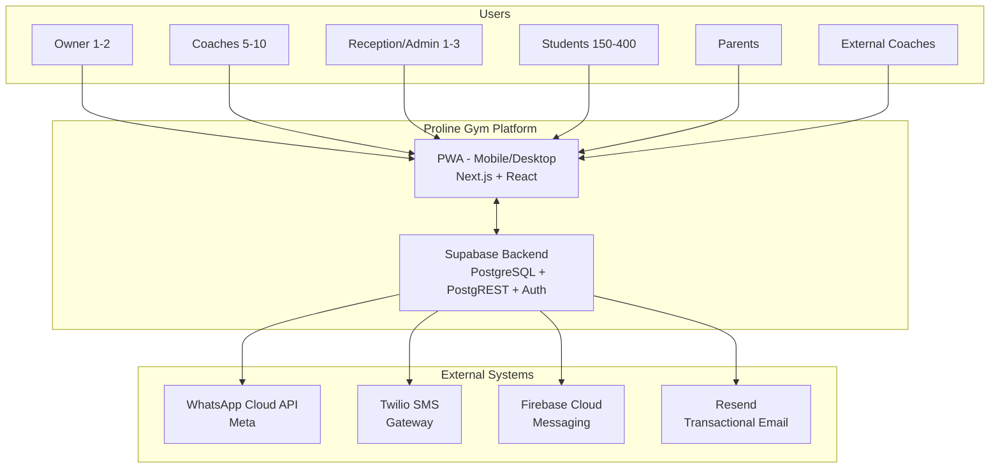
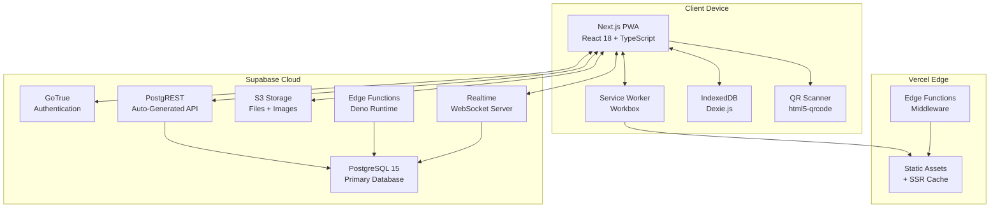
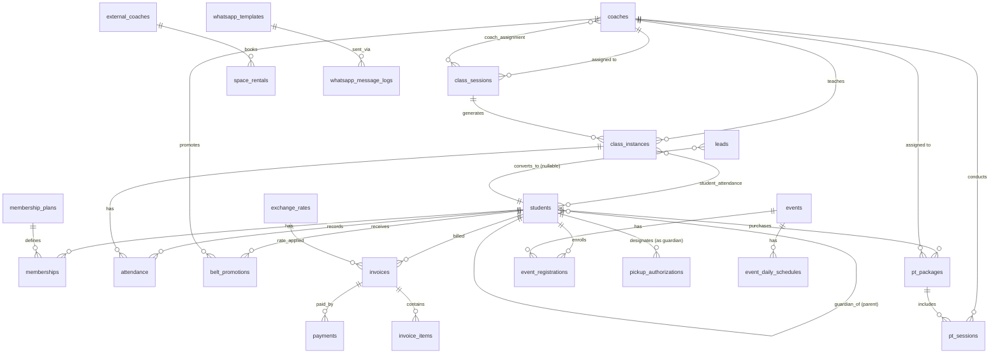

# Proline Gym — Technical Architecture & Infrastructure Design

> **Version:** 1.0  
> **Agent:** #6 — Technical Architecture & Infrastructure  
> **Status:** Draft for Review  
> **Context:** Martial arts gym management platform for Proline Gym, Hadath, Lebanon  
> **Scale:** 150–400 students, 5–10 coaches, 20–40 classes/week  
> **Input Document:** [`proline-gym-platform-blueprint.md`](plans/proline-gym-platform-blueprint.md)

---

## Table of Contents

1. [Executive Summary](#1-executive-summary)
2. [System Architecture Overview](#2-system-architecture-overview)
3. [Frontend Architecture](#3-frontend-architecture)
4. [Backend Architecture](#4-backend-architecture)
5. [Database Schema Design](#5-database-schema-design)
6. [Offline-First Sync Architecture](#6-offline-first-sync-architecture)
7. [Security Architecture](#7-security-architecture)
8. [Infrastructure & DevOps](#8-infrastructure--devops)
9. [Cost Estimates & Technology Justification](#9-cost-estimates--technology-justification)
10. [Migration & Deployment Strategy](#10-migration--deployment-strategy)

---

## 1. Executive Summary

### 1.1 Architecture Philosophy

The Proline Gym platform is architected around three non-negotiable constraints derived from the blueprint:

| Constraint | Architectural Implication |
|---|---|
| **Offline-first** | Every write operation must succeed with zero internet. Sync is a background concern. |
| **Arabic RTL primary** | Layout engine must be RTL-native. CSS logical properties throughout. No LTR-first hacks. |
| **Mobile-first (PWA)** | Desktop is secondary. All screens designed for 375px width. Touch targets ≥ 44×44px. |

These constraints eliminate many traditional web architectures and push us toward a **local-first PWA with server-side reconciliation**.

### 1.2 Key Architectural Decisions (ADRs)

| ADR # | Decision | Rationale |
|---|---|---|
| ADR-1 | **PWA over native apps** | Single codebase for iOS + Android + Web. Service Worker enables offline. Avoids App Store overhead. Instant updates. |
| ADR-2 | **Supabase over custom backend** | Managed PostgreSQL + built-in auth + real-time subscriptions + row-level security + REST/GraphQL auto-generation. Reduces backend code by ~60%. |
| ADR-3 | **Next.js over Vue/Nuxt** | Larger ecosystem for PWA. Better TypeScript support. [next-pwa](https://github.com/shadowwalker/next-pwa) plugin is mature. React's ecosystem has more RTL/i18n libraries. |
| ADR-4 | **Dexie.js (IndexedDB) over SQLite/WASM** | IndexedDB is universally available in browsers and PWA contexts. Dexie.js provides a clean promise-based API. SQLite/WASM adds ~1.5MB to bundle size. |
| ADR-5 | **Custom sync engine over off-the-shelf** | No existing sync solution handles: dual-currency integrity, offline QR attendance, Arabic field encoding, Supabase RLS conflict resolution. Custom but thin (~500 LOC). |
| ADR-6 | **Monorepo with Turborepo** | Shared types between frontend/backend. Single CI/CD pipeline. Consistent linting/formatting. |
| ADR-7 | **WhatsApp Cloud API (direct) over third-party** | Official Meta API. No middleware dependency. Template management built-in. Lower per-message cost. |

### 1.3 Technology Stack Summary

```
┌─────────────────────────────────────────────────────────────────┐
│                     PROLINE GYM — TECH STACK                      │
├───────────────┬─────────────────────────────────────────────────┤
│ LAYER         │ TECHNOLOGY                                       │
├───────────────┼─────────────────────────────────────────────────┤
│ Frontend      │ Next.js 14 (App Router) + React 18 + TypeScript  │
│ Styling       │ Tailwind CSS 3 + tailwindcss-rtl + CSS Logical   │
│ State Mgmt    │ Zustand (client) + React Query (server)          │
│ Offline DB    │ Dexie.js (IndexedDB wrapper)                     │
│ PWA           │ next-pwa + Workbox (Service Worker)              │
│ i18n          │ next-intl (Arabic primary, English secondary)    │
│ QR Scanner    │ html5-qrcode (works offline, no server call)     │
├───────────────┼─────────────────────────────────────────────────┤
│ Backend       │ Supabase (PostgreSQL 15 + PostgREST + GoTrue)    │
│ Auth          │ Supabase Auth (Phone OTP + Magic Link)           │
│ API           │ PostgREST (auto-generated REST) + Edge Functions │
│ Real-time     │ Supabase Realtime (WebSocket)                    │
│ File Storage  │ Supabase Storage (S3-compatible)                 │
│ Search        │ PostgreSQL full-text search + pg_trgm            │
├───────────────┼─────────────────────────────────────────────────┤
│ Messaging     │ WhatsApp Cloud API v19+ (Meta)                   │
│ SMS Fallback  │ Twilio (Lebanon carrier support)                 │
│ Payments      │ Manual reference tracking + future API           │
│ Push Notifs   │ Firebase Cloud Messaging + Web Push API          │
│ Email         │ Resend (transactional)                           │
├───────────────┼─────────────────────────────────────────────────┤
│ DevOps        │ GitHub Actions (CI/CD) + Supabase CLI            │
│ Hosting       │ Vercel (frontend) + Supabase Cloud (backend)     │
│ Monitoring    │ Sentry (errors) + Supabase Logs + Vercel Analytics│
│ Domain        │ prolinegym.com (Lebanese .com.lb TLD optional)   │
└───────────────┴─────────────────────────────────────────────────┘
```

---

## 2. System Architecture Overview

### 2.1 C4 — Context Diagram



### 2.2 C4 — Container Diagram



### 2.3 Network Topology & Data Flow

```
┌──────────────────────────────────────────────────────────────────────┐
│                        NETWORK ARCHITECTURE                            │
│                                                                        │
│  ┌─────────────────────┐          ┌──────────────────────────────┐   │
│  │   Client (PWA)       │          │   Vercel Edge Network         │   │
│  │                      │   HTTPS  │                               │   │
│  │  • Service Worker   │◄────────▶│  • Static Assets (CDN)       │   │
│  │  • IndexedDB        │          │  • SSR Pages                  │   │
│  │  • App Shell        │          │  • Middleware (redirects)     │   │
│  │  • QR Scanner       │          └──────────────┬───────────────┘   │
│  └─────────┬───────────┘                         │                    │
│            │                                     │                    │
│            │  HTTPS (REST + WS)                  │                    │
│            │                                     │                    │
│  ┌─────────▼───────────┐          ┌──────────────▼───────────────┐   │
│  │   Supabase Cloud     │          │   External APIs              │   │
│  │                      │          │                               │   │
│  │  • PostgreSQL 15    │─────────▶│  • WhatsApp Cloud API        │   │
│  │  • PostgREST        │─────────▶│  • Twilio SMS                │   │
│  │  • GoTrue Auth      │─────────▶│  • FCM Push                  │   │
│  │  • Realtime (WS)    │◄────────▶│  • Resend Email              │   │
│  │  • Storage (S3)     │          │                               │   │
│  │  • Edge Functions   │          └──────────────────────────────┘   │
│  └──────────────────────┘                                             │
│                                                                        │
│  ALL client-to-Supabase communication is direct (not proxied).        │
│  Row-Level Security enforces data access at the database level.        │
│  Edge Functions handle integrations with external APIs.                │
└──────────────────────────────────────────────────────────────────────┘
```

### 2.4 Request Flow — Example: Offline Attendance Check-in

```
STEP 1: Coach taps "Take Attendance" 
  → App reads class roster from IndexedDB (cached)
  → No network check required

STEP 2: Coach scans student QR or taps name
  → App writes attendance record to IndexedDB: { id: uuid, status: 'present', synced: false }
  → UI updates immediately (optimistic)
  → Record queued in sync-outbox table

STEP 3: Background sync triggers (Service Worker 'sync' event or periodic)
  → App reads all records where synced = false from IndexedDB
  → Sends POST /attendance/batch to PostgREST
  → Server validates → writes to PostgreSQL → returns success
  → App marks records as synced = true

STEP 4: If sync fails (no network, server error)
  → Records stay in outbox with retry_count incremented
  → Exponential backoff: 1s, 5s, 25s, 125s, 625s
  → After 10 retries: flag for manual review, notify user
```

---

## 3. Frontend Architecture

### 3.1 Monorepo Structure

```
proline-gym/
├── apps/
│   └── web/                          # Next.js PWA (main application)
│       ├── public/
│       │   ├── manifest.json         # PWA manifest (Arabic + English)
│       │   ├── sw.js                 # Service Worker (generated by next-pwa)
│       │   ├── icons/                # PWA icons (192x192, 512x512)
│       │   └── offline.html          # Custom offline fallback page
│       ├── src/
│       │   ├── app/                  # Next.js App Router pages
│       │   │   ├── (auth)/           # Auth routes (login, register, reset)
│       │   │   ├── (dashboard)/      # Protected dashboard routes
│       │   │   │   ├── classes/      # Class schedule & management
│       │   │   │   ├── students/     # Student profiles
│       │   │   │   ├── billing/      # Invoices & payments
│       │   │   │   ├── coaches/      # Coach management
│       │   │   │   ├── attendance/   # Attendance tracking
│       │   │   │   ├── belts/        # Belt progression
│       │   │   │   ├── leads/        # Social inquiry pipeline
│       │   │   │   ├── events/       # Summer camps & events
│       │   │   │   ├── rentals/      # External coach rentals
│       │   │   │   ├── pt/           # Personal training
│       │   │   │   └── settings/     # Gym settings
│       │   │   └── api/              # API routes (Next.js API handlers)
│       │   ├── components/           # Shared React components
│       │   │   ├── ui/               # Base UI kit (Button, Input, Modal, etc.)
│       │   │   ├── forms/            # Form components (StudentForm, InvoiceForm)
│       │   │   ├── layouts/          # Shell, Sidebar, BottomNav
│       │   │   ├── qr/               # QR scanner & generator components
│       │   │   └── offline/          # Offline status indicators, sync badges
│       │   ├── hooks/                # Custom React hooks
│       │   │   ├── useAuth.ts        # Authentication hook
│       │   │   ├── useOffline.ts     # Offline detection hook
│       │   │   ├── useSync.ts        # Sync status hook
│       │   │   ├── useQR.ts          # QR scanning hook
│       │   │   └── useRTL.ts         # RTL direction hook
│       │   ├── stores/               # Zustand state stores
│       │   │   ├── auth-store.ts     # Auth state
│       │   │   ├── class-store.ts    # Class schedule state
│       │   │   ├── attendance-store.ts # Attendance queue
│       │   │   ├── sync-store.ts     # Sync queue & status
│       │   │   └── ui-store.ts       # UI preferences (language, theme)
│       │   ├── db/                   # Dexie.js IndexedDB layer
│       │   │   ├── database.ts       # Database initialization & schema
│       │   │   ├── tables/           # Table definitions
│       │   │   │   ├── students.ts
│       │   │   │   ├── classes.ts
│       │   │   │   ├── attendance.ts
│       │   │   │   ├── invoices.ts
│       │   │   │   ├── sync-outbox.ts
│       │   │   │   └── cache.ts
│       │   │   └── migrations.ts     # IndexedDB schema migrations
│       │   ├── sync/                 # Sync engine
│       │   │   ├── engine.ts         # Main sync orchestrator
│       │   │   ├── outbox.ts         # Outbox queue manager
│       │   │   ├── conflict.ts       # Conflict resolution
│       │   │   ├── retry.ts          # Retry with backoff
│       │   │   └── delta.ts          # Delta/pull sync
│       │   ├── lib/                  # Utility libraries
│       │   │   ├── supabase/         # Supabase client config
│       │   │   │   ├── client.ts     # Browser client
│       │   │   │   └── server.ts     # Server component client
│       │   │   ├── i18n/             # Internationalization
│       │   │   │   ├── request.ts    # next-intl request config
│       │   │   │   ├── ar.json       # Arabic translations
│       │   │   │   └── en.json       # English translations
│       │   │   ├── currency.ts       # Dual-currency helpers
│       │   │   ├── date.ts           # Date formatting (Hijri optional)
│       │   │   └── wa.ts             # WhatsApp Cloud API helpers
│       │   ├── types/                # TypeScript type definitions
│       │   │   ├── database.ts       # Generated Supabase types
│       │   │   ├── models.ts         # Domain model types
│       │   │   └── api.ts            # API request/response types
│       │   └── middleware.ts         # Next.js middleware (auth, i18n)
│       ├── next.config.js            # Next.js + PWA config
│       ├── tailwind.config.ts        # Tailwind + RTL config
│       └── tsconfig.json
├── packages/
│   ├── shared-types/                 # Shared TypeScript types
│   │   └── src/
│   │       ├── models.ts
│   │       ├── api.ts
│   │       └── enums.ts
│   ├── eslint-config/                # Shared ESLint config
│   └── tsconfig/                     # Shared TS config base
├── supabase/
│   ├── migrations/                   # Database migrations
│   ├── functions/                    # Edge Functions (Deno)
│   ├── seed.sql                      # Seed data for development
│   └── config.toml                   # Supabase project config
├── .github/
│   └── workflows/
│       ├── ci.yml                    # CI pipeline
│       └── deploy.yml                # Deployment pipeline
├── turbo.json                        # Turborepo config
└── package.json
```

### 3.2 Component Architecture & Route Design

```
ROUTE MAP (App Router):
────────────────────────────────────────────────────────────
/                               → Landing / Login redirect
/ar/*                           → Arabic routes (default)
/en/*                           → English routes

AUTH ROUTES (unauthenticated):
/ar/auth/login                  → Phone OTP login
/ar/auth/register               → Self-registration (student/parent)
/ar/auth/reset-password         → Password reset via phone

DASHBOARD (authenticated — role-based):
/ar/dashboard                    → Role-specific home screen
/ar/dashboard/classes            → Class schedule (weekly/monthly calendar)
/ar/dashboard/classes/[id]       → Class detail + attendance roster
/ar/dashboard/classes/[id]/attendance → Take attendance screen
/ar/dashboard/students           → Student list (search, filter, sort)
/ar/dashboard/students/[id]      → Student profile (full detail)
/ar/dashboard/students/[id]/belt → Belt progression history
/ar/dashboard/students/[id]/billing → Student billing history
/ar/dashboard/coaches            → Coach list & management
/ar/dashboard/coaches/[id]       → Coach profile + schedule
/ar/dashboard/attendance         → Attendance reports & history
/ar/dashboard/billing            → Invoice list
/ar/dashboard/billing/invoices   → All invoices
/ar/dashboard/billing/invoices/[id] → Invoice detail + payment
/ar/dashboard/billing/plans      → Membership plan management
/ar/dashboard/billing/payments   → Payment records
/ar/dashboard/belts              → Belt/rank management
/ar/dashboard/belts/[discipline] → Discipline-specific ranks
/ar/dashboard/leads              → Lead pipeline (kanban/list)
/ar/dashboard/leads/[id]        → Lead detail + trial scheduling
/ar/dashboard/events             → Camp & event management
/ar/dashboard/events/[id]        → Event detail + registrations
/ar/dashboard/rentals            → External coach rental calendar
/ar/dashboard/rentals/[id]       → Rental detail
/ar/dashboard/pt                 → PT package management
/ar/dashboard/pt/[id]            → PT package detail + sessions
/ar/dashboard/settings           → Gym settings
/ar/dashboard/settings/profile   → User profile

MEMBER PORTAL (student/parent):
/ar/portal                       → Member home
/ar/portal/schedule              → View schedule + book classes
/ar/portal/attendance            → My attendance history
/ar/portal/billing               → My invoices + payments
/ar/portal/belt                  → My belt progress
/ar/portal/profile               → Edit my profile
```

### 3.3 State Management Strategy

```
┌─────────────────────────────────────────────────────────────┐
│                    STATE MANAGEMENT MAP                       │
│                                                               │
│  ┌─────────────────────┐  ┌─────────────────────────────┐   │
│  │  ZUSTAND STORES      │  │  REACT QUERY (TanStack)      │   │
│  │  (Client State)      │  │  (Server State)              │   │
│  ├─────────────────────┤  ├─────────────────────────────┤   │
│  │ auth-store           │  │ useStudents()                │   │
│  │  • user, session     │  │ useClasses()                 │   │
│  │  • role, permissions │  │ useAttendance()              │   │
│  │  • language pref     │  │ useInvoices()                │   │
│  ├─────────────────────┤  │ usePayments()                │   │
│  │ sync-store           │  │ useBelts()                   │   │
│  │  • queue status      │  │ useLeads()                   │   │
│  │  • pending count     │  │ useEvents()                  │   │
│  │  • last sync time    │  │ useRentals()                 │   │
│  │  • errors            │  │ usePTPackages()              │   │
│  ├─────────────────────┤  └─────────────────────────────┘   │
│  │ attendance-store     │                                     │
│  │  • current roster    │  ┌─────────────────────────────┐   │
│  │  • marked students   │  │  DEXIE.JS (Offline)          │   │
│  │  • pending sync      │  ├─────────────────────────────┤   │
│  ├─────────────────────┤  │  • Full copy of cached data  │   │
│  │ ui-store             │  │  • Sync outbox queue         │   │
│  │  • sidebar open      │  │  • Last synced timestamps    │   │
│  │  • current route     │  │  • Conflict records          │   │
│  │  • modals, toasts    │  └─────────────────────────────┘   │
│  └─────────────────────┘                                      │
│                                                               │
│  DATA FLOW:                                                   │
│  1. Component reads from React Query cache                    │
│  2. React Query fetches from Supabase (online) OR IndexedDB  │
│     (offline) depending on network status                     │
│  3. Mutations write to both IndexedDB AND attempt Supabase   │
│  4. Failed Supabase writes go to sync outbox                  │
│  5. Zustand stores hold transient UI state only               │
└─────────────────────────────────────────────────────────────┘
```

### 3.4 Offline-First UI Components

```
OFFLINE UI INDICATORS:
┌─────────────────────────────────────────────────────────┐
│  Status Bar (persistent, top of app shell)               │
│                                                          │
│  🟢 Online — All changes synced                          │
│  🟡 Online — Syncing... (3 pending)                      │
│  🔴 Offline — Changes saved locally (12 pending)         │
│  ⚠️  Sync Error — 2 changes failed (tap to retry)        │
└─────────────────────────────────────────────────────────┘

OFFLINE-AWARE COMPONENTS:
• QRScanner: Works entirely offline (camera → decode → local save)
• AttendanceRoster: Loads from IndexedDB, saves to IndexedDB
• ClassSchedule: Cached 30-day view, read-only offline
• InvoiceGenerator: Queues for sync, shows pending badge
• StudentSearch: Full offline search via IndexedDB indexes
```

### 3.5 PWA Configuration

```typescript
// next.config.js — PWA Configuration
const withPWA = require('next-pwa')({
  dest: 'public',
  register: true,
  skipWaiting: true,
  disable: process.env.NODE_ENV === 'development',
  runtimeCaching: [
    // App shell — cache first
    { urlPattern: /^https?.*\/_next\/static\/.*$/i, handler: 'CacheFirst' },
    // API calls — network first, fallback to cache
    { urlPattern: /^https?.*\/rest\/v1\/.*$/i, handler: 'NetworkFirst' },
    // Images — stale while revalidate
    { urlPattern: /^https?.*\/storage\/v1\/.*$/i, handler: 'StaleWhileRevalidate' },
    // WhatsApp avatar images
    { urlPattern: /^https?.*\.(?:png|jpg|jpeg|svg|gif|webp)$/i, handler: 'StaleWhileRevalidate' },
  ],
  // Offline fallback
  fallbackRoutes: {
    document: '/offline.html',
    image: '/icons/offline-icon.png',
  },
});

module.exports = withPWA({
  reactStrictMode: true,
  i18n: {
    locales: ['ar', 'en'],
    defaultLocale: 'ar',
    localeDetection: false,
  },
});
```

### 3.6 RTL Architecture

The RTL strategy uses CSS logical properties exclusively, ensuring that the same CSS works for both LTR and RTL without duplicating styles.

```css
/* RTL-First CSS Pattern — NO direction-specific overrides */
.sidebar {
  inset-inline-start: 0;          /* instead of left: 0 */
  padding-inline-start: 1rem;     /* instead of padding-left */
  margin-inline-end: 0.5rem;      /* instead of margin-right */
  border-inline-end: 1px solid;   /* instead of border-right */
  text-align: start;              /* instead of text-align: left */
}

/* Tailwind RTL Plugin auto-generates these equivalents:
   ms-* = margin-inline-start
   me-* = margin-inline-end
   ps-* = padding-inline-start
   pe-* = padding-inline-end
   start-* = inset-inline-start
   end-* = inset-inline-end
*/
```

Direction toggle stores preference in `localStorage` and applies the `dir` attribute on `<html>`. All components use logical properties; no CSS is direction-specific.

---

## 4. Backend Architecture

### 4.1 Supabase Services Map

```
┌──────────────────────────────────────────────────────────────┐
│                    SUPABASE BACKEND SERVICES                   │
│                                                                │
│  ┌──────────────────┐  ┌──────────────────┐                  │
│  │  PostgreSQL 15    │  │  GoTrue Auth      │                  │
│  │                   │  │                   │                  │
│  │  • All app data   │  │  • Phone OTP      │                  │
│  │  • Row-Level Sec  │  │  • Magic Link     │                  │
│  │  • Full-text      │  │  • Role in JWT    │                  │
│  │    Search (Arabic)│  │  • 3rd party? No  │                  │
│  │  • pg_trgm (fuzzy)│  │  • Session mgmt   │                  │
│  │  • Functions/trig │  └────────┬─────────┘                  │
│  └────────┬─────────┘           │                             │
│           │                      │                             │
│  ┌────────┴─────────┐  ┌────────┴─────────┐                  │
│  │  PostgREST        │  │  Realtime         │                  │
│  │                   │  │                   │                  │
│  │  • Auto REST API  │  │  • WebSocket      │                  │
│  │  • From DB schema │  │  • Attendance live│                  │
│  │  • Respects RLS   │  │  • Class updates  │                  │
│  │  • No custom code │  │  • Notification   │                  │
│  └──────────────────┘  │  • Broadcast       │                  │
│                         └──────────────────┘                  │
│  ┌──────────────────┐  ┌──────────────────┐                  │
│  │  Storage (S3)     │  │  Edge Functions   │                  │
│  │                   │  │  (Deno Runtime)   │                  │
│  │  • Student photos │  │                   │                  │
│  │  • Waiver PDFs    │  │  • WA message send│                  │
│  │  • ID documents   │  │  • SMS send       │                  │
│  │  • Receipts       │  │  • Payment verify │                  │
│  │  • Camp photos    │  │  • Exchange rate  │                  │
│  └──────────────────┘  │  • Webhook handlers│                  │
│                         └──────────────────┘                  │
└──────────────────────────────────────────────────────────────┘
```

### 4.2 API Design (PostgREST Auto-Generated)

PostgREST auto-generates RESTful endpoints from the PostgreSQL schema. Below is the logical API surface area:

```
API ENDPOINTS (auto-generated by PostgREST from schema):
─────────────────────────────────────────────────────────────

AUTH (/auth/v1/)
  POST   /signup                    Phone + OTP registration
  POST   /token?grant_type=password Login with phone + OTP
  POST   /token?grant_type=refresh  Refresh JWT
  POST   /logout                    Invalidate session
  GET    /user                      Current user profile

STUDENTS (/rest/v1/)
  GET    /students                  List (RLS: own only OR all if staff)
  GET    /students?id=eq.{id}       Single student profile
  POST   /students                  Create student (Reception/Admin)
  PATCH  /students?id=eq.{id}       Update student
  DELETE /students?id=eq.{id}       Soft-delete (archive)

  GET    /students?select=*,belt_promotions(*)  Nested belt history
  GET    /students?select=*,invoices(*)         Nested billing
  GET    /students?select=*,attendance(*)       Nested attendance

  # Full-text search (Arabic + English)
  GET    /students?name=wfts.{query}            PostgreSQL full-text search

  # Fuzzy search (handles Arabic typos)
  GET    /students?name=ilike.*{query}*         pg_trgm similarity

CLASSES (/rest/v1/)
  GET    /class_sessions              All class templates
  GET    /class_sessions?id=eq.{id}   Single class
  POST   /class_sessions              Create class template
  PATCH  /class_sessions?id=eq.{id}   Update
  DELETE /class_sessions?id=eq.{id}   Archive

  GET    /class_instances             Actual scheduled classes
  GET    /class_instances?date=gte.{date}&date=lte.{date}  Date range

ATTENDANCE (/rest/v1/)
  GET    /attendance                  Filter by class, student, date
  POST   /attendance                  Single check-in
  POST   /attendance/batch            Bulk check-in (via RPC function)

BILLING (/rest/v1/)
  GET    /invoices                    List (RLS scoped)
  POST   /invoices                    Create invoice (via RPC for TVA calc)
  GET    /invoices?id=eq.{id}         Invoice detail with line items
  PATCH  /invoices?id=eq.{id}         Update status (paid/void)

  GET    /payments                    Payment list
  POST   /payments                    Record payment

  GET    /membership_plans            Active plans config
  POST   /rpc/generate_invoice        Server function: create invoice

BELTS (/rest/v1/)
  GET    /belt_promotions             Promotion history
  POST   /belt_promotions             Record promotion (Head Coach only)
  GET    /belt_hierarchies            Discipline belt config

  GET    /rpc/check_belt_eligibility  Server function: eligibility check

LEADS (/rest/v1/)
  GET    /leads                       Lead pipeline
  POST   /leads                       Create lead
  PATCH  /leads?id=eq.{id}           Update status
  POST   /rpc/convert_lead_to_student Server function: convert

EVENTS (/rest/v1/)
  GET    /events                      Camp/event list
  POST   /events                      Create event
  GET    /event_registrations         Registrations per event
  POST   /event_registrations         Register student

RENTALS (/rest/v1/)
  GET    /space_rentals               Rental bookings
  POST   /space_rentals               Book space
  PATCH  /space_rentals?id=eq.{id}   Confirm/cancel

MESSAGING (Edge Functions)
  POST   /functions/v1/send-wa-message     Send WhatsApp message
  POST   /functions/v1/send-wa-template    Send templated message
  POST   /functions/v1/send-sms            Send SMS via Twilio
  POST   /functions/v1/verify-payment-ref  Verify OMT/Whish reference

SYNC (Edge Functions)
  POST   /functions/v1/sync-push           Push sync (client → server)
  POST   /functions/v1/sync-pull           Pull sync (server → client)
  POST   /functions/v1/sync-conflict       Resolve sync conflict
```

### 4.3 Edge Functions (Deno Runtime)

```
EDGE FUNCTIONS:

1. send-wa-message
   Input: { to: string, template_name: string, variables: {} }
   Action: Calls WhatsApp Cloud API
   Rate limit: 20 msg/sec (WA business tier)
   Error: Falls back to manual copy-paste URL

2. send-wa-template
   Input: { to: string, template: string, language: 'ar'|'en' }
   Action: Sends pre-approved template message
   Templates stored in Supabase table (editable by admin)

3. send-sms
   Input: { to: string, body: string }
   Action: Twilio SMS send
   Fallback: Lebanon carrier direct API if Twilio unavailable

4. verify-payment-ref
   Input: { method: 'omt'|'whish', reference: string, amount: number }
   Action: Returns verification status
   Note: Initially manual verification; API integration when available

5. sync-push
   Input: { changes: ChangeRecord[], client_id: string }
   Action: Validates changes, applies to PostgreSQL, returns server_timestamps
   Conflict detection: server_version > client_version → reject with server data

6. sync-pull
   Input: { tables: string[], last_synced_at: timestamp, client_id: string }
   Action: Returns all records modified since last_synced_at
   Delta optimization: only changed rows, not full tables

7. get-exchange-rate
   Input: { date?: string }
   Action: Returns USD/LBP rate for given date (or latest)
   Source: Manual entry in exchange_rates table (v1), scraper (v2)

8. generate-invoice
   Input: { student_id, items[], due_date? }
   Action: Creates invoice with TVA calc, sequential numbering, dual-currency
```

### 4.4 Database Functions & Triggers (PostgreSQL)

```sql
-- Key PostgreSQL Functions (PL/pgSQL)

-- FUNCTION: generate_invoice_number()
-- Returns: PRO-YYYY-NNNNN sequential invoice number
-- Uses: Sequence + year prefix + zero-padded

-- FUNCTION: calculate_tva(amount_usd numeric)
-- Returns: TVA amount (11% of taxable amount)
-- Configurable: checks taxable flag on item type

-- FUNCTION: convert_currency(amount_usd numeric, rate_date date)
-- Returns: amount_lbp using exchange rate from specified date

-- FUNCTION: check_belt_eligibility(student_id uuid, target_rank_id uuid)
-- Returns: { eligible: boolean, requirements_met: jsonb, requirements_missing: jsonb }
-- Logic: attendance_count >= required_classes AND time_in_grade >= required_days

-- FUNCTION: promote_student(student_id uuid, new_rank_id uuid, promoted_by uuid)
-- Returns: new belt_promotion record
-- Validates: promoted_by has belt_authority_level >= new_rank level

-- FUNCTION: convert_lead_to_student(lead_id uuid)
-- Returns: new student_id
-- Action: Creates student record, copies lead data, marks lead as converted

-- TRIGGER: after_attendance_insert
-- Fires: On INSERT to attendance
-- Action: Updates student.attendance_count, checks belt eligibility
--         If eligible, creates notification for coach

-- TRIGGER: before_invoice_insert
-- Fires: Before INSERT to invoices
-- Action: Auto-calculates total_usd, total_lbp, tva_amount
--         Generates sequential invoice_number

-- TRIGGER: after_payment_insert
-- Fires: After INSERT to payments
-- Action: Updates invoice.status (Paid/Partially Paid)
--         Updates student membership status if payment is for renewal
```

### 4.5 WhatsApp Cloud API Integration

```
┌──────────────────────────────────────────────────────────────┐
│                 WHATSAPP CLOUD API ARCHITECTURE                │
│                                                                │
│  ┌──────────────────┐     ┌──────────────────────────────┐   │
│  │  Proline Gym      │     │  Meta WhatsApp Cloud API      │   │
│  │  Supabase         │     │                               │   │
│  │                   │     │  POST /{phone_number_id}/     │   │
│  │  Edge Function ───┼────▶│       messages                │   │
│  │  send-wa-message  │     │                               │   │
│  │                   │     │  Body:                         │   │
│  │  Templates Table  │     │  {                             │   │
│  │  (managed in app) │     │    messaging_product: "whatsapp│   │
│  │                   │     │    to: "961xxxxxxx",           │   │
│  │  Message Log      │◀────│    type: "template",           │   │
│  │  (status tracking)│     │    template: {                 │   │
│  └──────────────────┘     │      name: "trial_reminder",    │   │
│                            │      language: { code: "ar" }, │   │
│  TEMPLATES (pre-approved):│      components: [...]          │   │
│  • welcome_new_lead        │    }                           │   │
│  • trial_confirmation      │  }                             │   │
│  • trial_reminder_24h      └──────────────────────────────┘   │
│  • trial_reminder_1h                                          │
│  • trial_followup_d0      WEBHOOK CALLBACK:                   │
│  • trial_followup_d3      POST /functions/v1/wa-webhook       │
│  • trial_followup_d7      • Message status (sent/delivered/  │
│  • payment_reminder_7d      read/failed)                       │
│  • payment_reminder_3d    • Incoming messages (future v3)     │
│  • payment_reminder_1d                                       │
│  • payment_receipt        RATE LIMITS:                        │
│  • class_cancelled        • 20 messages/second (business)    │
│  • belt_promotion         • 1000 conversations/day (starts)  │
│  • membership_expiring    • Scaling: request increase with   │
│  • membership_expired       verified business                 │
│  • camp_confirmation                                         │
│  • camp_reminder          COST (as of 2025):                  │
│  • broadcast_announcement • Marketing: ~$0.005/msg in MENA   │
│                            • Utility: ~$0.002/msg in MENA     │
└──────────────────────────────────────────────────────────────┘
```

---

## 5. Database Schema Design

### 5.1 Entity Relationship Diagram (Physical)



### 5.2 Complete PostgreSQL Schema (DDL)

```sql
-- ============================================================
-- SCHEMA: public (main application schema)
-- PostgreSQL 15+ on Supabase
-- ============================================================

-- Enable extensions
CREATE EXTENSION IF NOT EXISTS "uuid-ossp";
CREATE EXTENSION IF NOT EXISTS "pg_trgm";       -- Fuzzy text search for Arabic
CREATE EXTENSION IF NOT EXISTS "pgcrypto";       -- Encryption helpers
CREATE EXTENSION IF NOT EXISTS "unaccent";        -- Accent-insensitive search

-- ============================================================
-- ENUM TYPES
-- ============================================================
CREATE TYPE student_status AS ENUM ('active', 'frozen', 'suspended', 'expired', 'trial', 'lead');
CREATE TYPE attendance_status AS ENUM ('present', 'late', 'absent', 'no_show', 'excused');
CREATE TYPE check_in_method AS ENUM ('qr', 'manual', 'offline_sync');
CREATE TYPE invoice_status AS ENUM ('draft', 'sent', 'paid', 'partially_paid', 'overdue', 'void');
CREATE TYPE payment_method AS ENUM ('cash_usd', 'cash_lbp', 'omt', 'whish', 'bob_finance', 'bank_transfer', 'other');
CREATE TYPE class_status AS ENUM ('scheduled', 'in_progress', 'completed', 'cancelled');
CREATE TYPE lead_status AS ENUM ('new', 'contacted', 'trial_scheduled', 'trial_attended', 'converted', 'lost');
CREATE TYPE lead_source AS ENUM ('instagram', 'whatsapp', 'walk_in', 'referral', 'facebook', 'other');
CREATE TYPE event_type AS ENUM ('summer_camp', 'seminar', 'competition', 'belt_testing', 'workshop', 'other');
CREATE TYPE message_channel AS ENUM ('whatsapp', 'sms', 'email');
CREATE TYPE message_status AS ENUM ('pending', 'sent', 'delivered', 'read', 'failed');
CREATE TYPE pt_session_status AS ENUM ('scheduled', 'confirmed', 'completed', 'no_show', 'cancelled');
CREATE TYPE freeze_status AS ENUM ('active', 'frozen');
CREATE TYPE discipline_type AS ENUM (
    'bjj', 'muay_thai', 'karate', 'taekwondo', 'judo',
    'boxing', 'kickboxing', 'wrestling', 'mma', 'kung_fu', 'other'
);

-- ============================================================
-- CORE TABLES
-- ============================================================

-- Gym/tenant configuration (single tenant: Proline Gym)
CREATE TABLE gym_settings (
    id                uuid PRIMARY KEY DEFAULT uuid_generate_v4(),
    gym_name_ar       text NOT NULL,                    -- Arabic name
    gym_name_en       text NOT NULL,                    -- English name
    address_ar        text,
    address_en        text,
    phone             text NOT NULL,
    whatsapp_number   text,                             -- WA Business number
    email             text,
    tva_rate          numeric(5,2) DEFAULT 11.00,       -- TVA rate (default 11%)
    invoice_prefix    text DEFAULT 'PRO',               -- e.g., PRO-2026-00001
    default_currency  text DEFAULT 'USD',               -- Primary display currency
    timezone          text DEFAULT 'Asia/Beirut',
    created_at        timestamptz DEFAULT now(),
    updated_at        timestamptz DEFAULT now()
);

-- ============================================================
-- COACHES
-- ============================================================
CREATE TABLE coaches (
    id                uuid PRIMARY KEY DEFAULT uuid_generate_v4(),
    user_id           uuid REFERENCES auth.users(id) ON DELETE SET NULL,
    name_ar           text NOT NULL,
    name_en           text NOT NULL,
    phone             text UNIQUE NOT NULL,
    whatsapp          text,
    email             text,
    photo_url         text,
    bio_ar            text,
    bio_en            text,
    disciplines       discipline_type[] NOT NULL DEFAULT '{}',
    certifications    jsonb DEFAULT '[]',               -- [{name, issuer, date, expiry}]
    belt_authority_level int DEFAULT 0,                 -- Maximum belt level this coach can promote
    max_belt_rank_id  uuid REFERENCES belt_ranks(id),   -- Coach's own highest belt
    hourly_rate_usd   numeric(10,2),
    is_active         boolean DEFAULT true,
    hired_date        date,
    emergency_contact text,
    notes             text,
    created_at        timestamptz DEFAULT now(),
    updated_at        timestamptz DEFAULT now()
);

-- Coach availability (recurring weekly)
CREATE TABLE coach_availability (
    id                uuid PRIMARY KEY DEFAULT uuid_generate_v4(),
    coach_id          uuid NOT NULL REFERENCES coaches(id) ON DELETE CASCADE,
    day_of_week       int NOT NULL CHECK (day_of_week BETWEEN 0 AND 6), -- 0=Sunday
    start_time        time NOT NULL,
    end_time          time NOT NULL,
    is_available      boolean DEFAULT true,
    created_at        timestamptz DEFAULT now(),
    UNIQUE (coach_id, day_of_week, start_time)
);

-- ============================================================
-- STUDENTS
-- ============================================================
CREATE TABLE students (
    id                uuid PRIMARY KEY DEFAULT uuid_generate_v4(),
    user_id           uuid REFERENCES auth.users(id) ON DELETE SET NULL, -- Linked portal account
    name_ar           text NOT NULL,
    name_en           text,
    dob               date,
    gender            text CHECK (gender IN ('male', 'female', 'other')),
    phone             text,
    whatsapp          text,
    email             text,
    photo_url         text,
    address_ar        text,
    address_en        text,
    discipline        discipline_type,
    current_rank_id   uuid REFERENCES belt_ranks(id),
    status            student_status DEFAULT 'lead',
    status_changed_at timestamptz DEFAULT now(),
    join_date         date,
    guardian_id       uuid REFERENCES students(id),     -- Self-referencing for parent-child
    guardian_relation text,                              -- Father, Mother, etc.
    medical_notes     text,                              -- Allergies, conditions, etc.
    emergency_contact_name text,
    emergency_contact_phone text,
    emergency_contact_relation text,
    qr_code           text UNIQUE,                      -- Unique QR identifier for check-in
    referral_source   lead_source,
    tags              text[] DEFAULT '{}',              -- e.g., {competition_team, vip, scholarship}
    notes             text,                              -- Internal staff notes
    created_by        uuid REFERENCES auth.users(id),
    created_at        timestamptz DEFAULT now(),
    updated_at        timestamptz DEFAULT now()
);

-- Index for Arabic + English search
CREATE INDEX idx_students_name_ar_trgm ON students USING gin (name_ar gin_trgm_ops);
CREATE INDEX idx_students_name_en_trgm ON students USING gin (name_en gin_trgm_ops);
CREATE INDEX idx_students_status ON students (status);
CREATE INDEX idx_students_discipline ON students (discipline);
CREATE INDEX idx_students_guardian ON students (guardian_id);

-- ============================================================
-- BELT / RANK SYSTEM
-- ============================================================

-- Belt hierarchy definitions (configurable per discipline)
CREATE TABLE belt_hierarchies (
    id                uuid PRIMARY KEY DEFAULT uuid_generate_v4(),
    discipline        discipline_type NOT NULL,
    rank_order        int NOT NULL,                      -- 1, 2, 3... (lowest to highest)
    rank_name_ar      text NOT NULL,                     -- Arabic rank name
    rank_name_en      text NOT NULL,                     -- English rank name
    color_hex         text,                              -- Belt color for UI
    min_age           int,                               -- Minimum age for this rank
    required_classes  int DEFAULT 0,                     -- Classes needed for promotion
    required_days_in_grade int DEFAULT 0,                -- Minimum days at previous rank
    required_skills   jsonb DEFAULT '[]',                -- Skill checklist
    created_at        timestamptz DEFAULT now(),
    UNIQUE (discipline, rank_order)
);

-- Short alias table for FK references
CREATE VIEW belt_ranks AS SELECT id, discipline, rank_name_ar, rank_name_en, rank_order FROM belt_hierarchies;

-- Belt promotion history
CREATE TABLE belt_promotions (
    id                uuid PRIMARY KEY DEFAULT uuid_generate_v4(),
    student_id        uuid NOT NULL REFERENCES students(id) ON DELETE CASCADE,
    from_rank_id      uuid REFERENCES belt_hierarchies(id),
    to_rank_id        uuid NOT NULL REFERENCES belt_hierarchies(id),
    discipline        discipline_type NOT NULL,
    promoted_by       uuid NOT NULL REFERENCES coaches(id),
    approved_by       uuid REFERENCES coaches(id),       -- Head Coach approval
    promotion_date    date NOT NULL DEFAULT CURRENT_DATE,
    requirements_met  jsonb DEFAULT '{}',                -- Evidence of requirements
    notes             text,
    created_at        timestamptz DEFAULT now()
);

CREATE INDEX idx_belt_promotions_student ON belt_promotions (student_id, discipline);

-- ============================================================
-- MEMBERSHIP PLANS
-- ============================================================
CREATE TABLE membership_plans (
    id                uuid PRIMARY KEY DEFAULT uuid_generate_v4(),
    name_ar           text NOT NULL,
    name_en           text NOT NULL,
    description_ar    text,
    description_en    text,
    plan_type         text NOT NULL CHECK (plan_type IN ('monthly', 'quarterly', 'semi_annual', 'annual', 'class_pack', 'trial', 'drop_in')),
    duration_days     int,                               -- NULL for class_pack
    class_limit       int,                               -- NULL for unlimited, or N for class_pack
    price_usd         numeric(10,2) NOT NULL,
    price_lbp         numeric(12,0),                     -- Optional: if fixed LBP price
    auto_renewal      boolean DEFAULT false,
    freeze_days_allowed int DEFAULT 0,                   -- Max freeze days per cycle
    is_taxable        boolean DEFAULT true,              -- TVA applies?
    is_active         boolean DEFAULT true,
    sort_order        int DEFAULT 0,
    created_at        timestamptz DEFAULT now(),
    updated_at        timestamptz DEFAULT now()
);

-- Student membership subscriptions
CREATE TABLE memberships (
    id                uuid PRIMARY KEY DEFAULT uuid_generate_v4(),
    student_id        uuid NOT NULL REFERENCES students(id) ON DELETE CASCADE,
    plan_id           uuid NOT NULL REFERENCES membership_plans(id),
    start_date        date NOT NULL,
    end_date          date,                              -- NULL if ongoing (class_pack)
    classes_total     int,                               -- Total classes in pack (class_pack only)
    classes_used      int DEFAULT 0,                     -- Classes consumed
    status            student_status DEFAULT 'active',
    auto_renew        boolean DEFAULT false,
    freeze_start      date,
    freeze_end        date,
    freeze_days_used  int DEFAULT 0,
    invoice_id        uuid,                              -- Linked invoice for this membership
    notes             text,
    created_at        timestamptz DEFAULT now(),
    updated_at        timestamptz DEFAULT now()
);

CREATE INDEX idx_memberships_student ON memberships (student_id);
CREATE INDEX idx_memberships_status ON memberships (status);
CREATE INDEX idx_memberships_end_date ON memberships (end_date);

-- ============================================================
-- CLASSES & SCHEDULE
-- ============================================================

-- Recurring class template
CREATE TABLE class_sessions (
    id                uuid PRIMARY KEY DEFAULT uuid_generate_v4(),
    name_ar           text NOT NULL,
    name_en           text NOT NULL,
    discipline        discipline_type NOT NULL,
    min_belt_rank_id  uuid REFERENCES belt_hierarchies(id),
    max_belt_rank_id  uuid REFERENCES belt_hierarchies(id),
    location          text,                              -- e.g., "Main Mat", "Ring Area"
    max_capacity      int NOT NULL DEFAULT 20,
    start_time        time NOT NULL,
    end_time          time NOT NULL,
    duration_minutes  int GENERATED ALWAYS AS (
        EXTRACT(EPOCH FROM (end_time - start_time)) / 60
    ) STORED,
    recurring_days    int[] NOT NULL,                    -- [0,2,4] = Sun, Tue, Thu
    recurring_start   date NOT NULL,                     -- First occurrence
    recurring_end     date,                              -- NULL = indefinite
    is_active         boolean DEFAULT true,
    color_hex         text,                              -- Calendar display color
    created_at        timestamptz DEFAULT now(),
    updated_at        timestamptz DEFAULT now()
);

-- Coach assignment to class (M:N)
CREATE TABLE class_coach_assignments (
    id                uuid PRIMARY KEY DEFAULT uuid_generate_v4(),
    class_session_id  uuid NOT NULL REFERENCES class_sessions(id) ON DELETE CASCADE,
    coach_id          uuid NOT NULL REFERENCES coaches(id) ON DELETE CASCADE,
    is_primary        boolean DEFAULT false,
    UNIQUE (class_session_id, coach_id)
);

-- Individual class instance (actual occurrence on a calendar date)
CREATE TABLE class_instances (
    id                uuid PRIMARY KEY DEFAULT uuid_generate_v4(),
    class_session_id  uuid NOT NULL REFERENCES class_sessions(id) ON DELETE CASCADE,
    instance_date     date NOT NULL,
    start_time        time NOT NULL,
    end_time          time NOT NULL,
    coach_id          uuid REFERENCES coaches(id),       -- Can differ from template (substitute)
    substitute_coach_id uuid REFERENCES coaches(id),
    status            class_status DEFAULT 'scheduled',
    actual_capacity   int,                               -- May differ if special event
    actual_attendance_count int DEFAULT 0,
    is_makeup_eligible boolean DEFAULT true,
    notes             text,
    cancelled_reason  text,
    created_at        timestamptz DEFAULT now(),
    UNIQUE (class_session_id, instance_date)
);

CREATE INDEX idx_class_instances_date ON class_instances (instance_date);
CREATE INDEX idx_class_instances_coach ON class_instances (coach_id, instance_date);

-- Class waitlist
CREATE TABLE class_waitlists (
    id                uuid PRIMARY KEY DEFAULT uuid_generate_v4(),
    class_instance_id uuid NOT NULL REFERENCES class_instances(id) ON DELETE CASCADE,
    student_id        uuid NOT NULL REFERENCES students(id) ON DELETE CASCADE,
    position          int NOT NULL,
    joined_at         timestamptz DEFAULT now(),
    notified_at       timestamptz,
    promoted_at       timestamptz,                       -- When moved to enrolled
    UNIQUE (class_instance_id, student_id)
);

-- ============================================================
-- ATTENDANCE
-- ============================================================
CREATE TABLE attendance (
    id                uuid PRIMARY KEY DEFAULT uuid_generate_v4(),
    student_id        uuid NOT NULL REFERENCES students(id) ON DELETE CASCADE,
    class_instance_id uuid NOT NULL REFERENCES class_instances(id) ON DELETE CASCADE,
    attendance_date   date NOT NULL,
    check_in_time     timestamptz,
    status            attendance_status DEFAULT 'present',
    check_in_method   check_in_method DEFAULT 'manual',
    marked_by         uuid REFERENCES coaches(id),
    offline_sync_id   text,                              -- Client-generated UUID for deduplication
    sync_status       text DEFAULT 'synced' CHECK (sync_status IN ('synced', 'pending', 'conflict')),
    notes             text,
    created_at        timestamptz DEFAULT now(),
    updated_at        timestamptz DEFAULT now(),
    UNIQUE (student_id, class_instance_id)
);

CREATE INDEX idx_attendance_date ON attendance (attendance_date);
CREATE INDEX idx_attendance_student ON attendance (student_id, attendance_date);
CREATE INDEX idx_attendance_sync ON attendance (sync_status);
CREATE INDEX idx_attendance_offline_id ON attendance (offline_sync_id);

-- ============================================================
-- BILLING & PAYMENTS
-- ============================================================

-- Exchange rate log
CREATE TABLE exchange_rates (
    id                uuid PRIMARY KEY DEFAULT uuid_generate_v4(),
    rate_date         date NOT NULL UNIQUE,
    rate_usd_to_lbp   numeric(12,2) NOT NULL,
    source            text DEFAULT 'manual',             -- 'manual', 'sayrafa', 'market'
    recorded_by       uuid REFERENCES auth.users(id),
    notes             text,
    created_at        timestamptz DEFAULT now()
);

-- Invoices
CREATE TABLE invoices (
    id                uuid PRIMARY KEY DEFAULT uuid_generate_v4(),
    invoice_number    text NOT NULL UNIQUE,              -- e.g., PRO-2026-00042
    student_id        uuid NOT NULL REFERENCES students(id) ON DELETE CASCADE,
    issue_date        date NOT NULL DEFAULT CURRENT_DATE,
    due_date          date NOT NULL,
    subtotal_usd      numeric(10,2) NOT NULL DEFAULT 0,
    tva_rate          numeric(5,2) DEFAULT 11.00,
    tva_amount_usd    numeric(10,2) DEFAULT 0,
    discount_usd      numeric(10,2) DEFAULT 0,
    total_usd         numeric(10,2) NOT NULL,
    exchange_rate     numeric(12,2) NOT NULL,            -- Rate at invoice time
    total_lbp         numeric(12,0) NOT NULL,            -- USD × exchange_rate
    status            invoice_status DEFAULT 'draft',
    paid_amount_usd   numeric(10,2) DEFAULT 0,
    paid_amount_lbp   numeric(12,0) DEFAULT 0,
    outstanding_usd   numeric(10,2) GENERATED ALWAYS AS (total_usd - paid_amount_usd) STORED,
    notes             text,
    created_by        uuid REFERENCES auth.users(id),
    created_at        timestamptz DEFAULT now(),
    updated_at        timestamptz DEFAULT now()
);

CREATE INDEX idx_invoices_student ON invoices (student_id);
CREATE INDEX idx_invoices_status ON invoices (status);
CREATE INDEX idx_invoices_due_date ON invoices (due_date);
CREATE INDEX idx_invoices_number ON invoices (invoice_number);

-- Invoice line items
CREATE TABLE invoice_items (
    id                uuid PRIMARY KEY DEFAULT uuid_generate_v4(),
    invoice_id        uuid NOT NULL REFERENCES invoices(id) ON DELETE CASCADE,
    description_ar    text NOT NULL,
    description_en    text NOT NULL,
    quantity          int DEFAULT 1,
    unit_price_usd    numeric(10,2) NOT NULL,
    total_price_usd   numeric(10,2) GENERATED ALWAYS AS (quantity * unit_price_usd) STORED,
    is_taxable        boolean DEFAULT true,
    item_type         text,                              -- 'membership', 'pt_package', 'event', 'rental', 'other'
    reference_id      uuid,                              -- FK to source entity (membership, event, etc.)
    sort_order        int DEFAULT 0
);

-- Payments
CREATE TABLE payments (
    id                uuid PRIMARY KEY DEFAULT uuid_generate_v4(),
    invoice_id        uuid NOT NULL REFERENCES invoices(id) ON DELETE CASCADE,
    amount_usd        numeric(10,2),
    amount_lbp        numeric(12,0),
    exchange_rate     numeric(12,2),                     -- Rate at payment time
    payment_method    payment_method NOT NULL,
    reference_number  text,                              -- OMT/Whish reference, check number
    payment_date      date NOT NULL DEFAULT CURRENT_DATE,
    received_by       uuid REFERENCES auth.users(id),
    receipt_url       text,                              -- PDF receipt in storage
    notes             text,
    created_at        timestamptz DEFAULT now()
);

CREATE INDEX idx_payments_invoice ON payments (invoice_id);
CREATE INDEX idx_payments_date ON payments (payment_date);
CREATE INDEX idx_payments_method ON payments (payment_method);

-- ============================================================
-- PERSONAL TRAINING
-- ============================================================
CREATE TABLE pt_packages (
    id                uuid PRIMARY KEY DEFAULT uuid_generate_v4(),
    student_id        uuid NOT NULL REFERENCES students(id) ON DELETE CASCADE,
    coach_id          uuid REFERENCES coaches(id),
    name_ar           text NOT NULL,
    name_en           text NOT NULL,
    total_sessions    int NOT NULL,
    sessions_used     int DEFAULT 0,
    sessions_remaining int GENERATED ALWAYS AS (total_sessions - sessions_used) STORED,
    price_usd         numeric(10,2) NOT NULL,
    price_lbp         numeric(12,0),
    purchase_date     date NOT NULL DEFAULT CURRENT_DATE,
    expiry_date       date,                              -- NULL = no expiry
    status            text DEFAULT 'active' CHECK (status IN ('active', 'completed', 'expired', 'cancelled')),
    invoice_id        uuid REFERENCES invoices(id),
    notes             text,
    created_at        timestamptz DEFAULT now(),
    updated_at        timestamptz DEFAULT now()
);

CREATE TABLE pt_sessions (
    id                uuid PRIMARY KEY DEFAULT uuid_generate_v4(),
    package_id        uuid NOT NULL REFERENCES pt_packages(id) ON DELETE CASCADE,
    coach_id          uuid REFERENCES coaches(id),
    scheduled_date    date NOT NULL,
    start_time        time NOT NULL,
    end_time          time NOT NULL,
    status            pt_session_status DEFAULT 'scheduled',
    student_notes     text,
    coach_notes       text,
    cancelled_reason  text,
    cancelled_at      timestamptz,
    created_at        timestamptz DEFAULT now(),
    updated_at        timestamptz DEFAULT now()
);

CREATE INDEX idx_pt_sessions_package ON pt_sessions (package_id);
CREATE INDEX idx_pt_sessions_date ON pt_sessions (scheduled_date);
CREATE INDEX idx_pt_sessions_coach ON pt_sessions (coach_id, scheduled_date);

-- ============================================================
-- EXTERNAL COACH RENTALS
-- ============================================================
CREATE TABLE external_coaches (
    id                uuid PRIMARY KEY DEFAULT uuid_generate_v4(),
    user_id           uuid REFERENCES auth.users(id) ON DELETE SET NULL,
    name_ar           text NOT NULL,
    name_en           text NOT NULL,
    phone             text UNIQUE NOT NULL,
    whatsapp          text,
    email             text,
    discipline        discipline_type NOT NULL,
    id_document_url   text,                              -- Scanned ID/passport in Supabase Storage
    insurance_info    jsonb DEFAULT '{}',                -- {provider, policy_number, expiry}
    waiver_signed     boolean DEFAULT false,
    waiver_signed_at  timestamptz,
    waiver_document_url text,
    is_active         boolean DEFAULT true,
    notes             text,
    created_at        timestamptz DEFAULT now(),
    updated_at        timestamptz DEFAULT now()
);

CREATE TABLE space_rentals (
    id                uuid PRIMARY KEY DEFAULT uuid_generate_v4(),
    external_coach_id uuid NOT NULL REFERENCES external_coaches(id) ON DELETE CASCADE,
    space_type        text NOT NULL,                     -- 'mat_area', 'ring', 'full_gym'
    rental_date       date NOT NULL,
    start_time        time NOT NULL,
    end_time          time NOT NULL,
    rate_usd          numeric(10,2) NOT NULL,
    total_usd         numeric(10,2) GENERATED ALWAYS AS (
        rate_usd * EXTRACT(EPOCH FROM (end_time - start_time)) / 3600
    ) STORED,
    status            text DEFAULT 'pending' CHECK (status IN ('pending', 'confirmed', 'cancelled', 'completed')),
    payment_status    text DEFAULT 'unpaid' CHECK (payment_status IN ('unpaid', 'deposit_paid', 'fully_paid', 'refunded')),
    invoice_id        uuid REFERENCES invoices(id),
    waiver_verified   boolean DEFAULT false,
    student_count     int,                               -- External coach's own students attending
    notes             text,
    created_at        timestamptz DEFAULT now(),
    updated_at        timestamptz DEFAULT now()
);

CREATE INDEX idx_space_rentals_date ON space_rentals (rental_date);
CREATE INDEX idx_space_rentals_coach ON space_rentals (external_coach_id);

-- ============================================================
-- SUMMER CAMPS & EVENTS
-- ============================================================
CREATE TABLE events (
    id                uuid PRIMARY KEY DEFAULT uuid_generate_v4(),
    name_ar           text NOT NULL,
    name_en           text NOT NULL,
    event_type        event_type DEFAULT 'summer_camp',
    description_ar    text,
    description_en    text,
    start_date        date NOT NULL,
    end_date          date NOT NULL,
    registration_deadline date,
    age_min           int,
    age_max           int,
    belt_min_rank_id  uuid REFERENCES belt_hierarchies(id),
    belt_max_rank_id  uuid REFERENCES belt_hierarchies(id),
    discipline        discipline_type,
    capacity          int NOT NULL,
    price_usd         numeric(10,2) NOT NULL,
    price_lbp         numeric(12,0),
    early_bird_price_usd numeric(10,2),
    early_bird_deadline date,
    sibling_discount_percent numeric(5,2),
    is_active         boolean DEFAULT true,
    photo_url         text,
    created_at        timestamptz DEFAULT now(),
    updated_at        timestamptz DEFAULT now()
);

-- Daily schedule within a camp/event
CREATE TABLE event_daily_schedules (
    id                uuid PRIMARY KEY DEFAULT uuid_generate_v4(),
    event_id          uuid NOT NULL REFERENCES events(id) ON DELETE CASCADE,
    day_number        int NOT NULL,
    date              date NOT NULL,
    start_time        time,
    end_time          time,
    description_ar    text,
    description_en    text,
    coach_id          uuid REFERENCES coaches(id),
    created_at        timestamptz DEFAULT now(),
    UNIQUE (event_id, day_number)
);

-- Event registrations
CREATE TABLE event_registrations (
    id                uuid PRIMARY KEY DEFAULT uuid_generate_v4(),
    event_id          uuid NOT NULL REFERENCES events(id) ON DELETE CASCADE,
    student_id        uuid NOT NULL REFERENCES students(id) ON DELETE CASCADE,
    registered_by     uuid REFERENCES auth.users(id),
    registration_date date NOT NULL DEFAULT CURRENT_DATE,
    price_paid_usd    numeric(10,2),
    price_paid_lbp    numeric(12,0),
    sibling_discount_applied boolean DEFAULT false,
    invoice_id        uuid REFERENCES invoices(id),
    attendance_days   int[] DEFAULT '{}',                -- Which days attended
    waiver_signed     boolean DEFAULT false,
    waiver_signed_at  timestamptz,
    status            text DEFAULT 'registered' CHECK (status IN ('registered', 'confirmed', 'attended', 'no_show', 'cancelled')),
    notes             text,
    created_at        timestamptz DEFAULT now(),
    UNIQUE (event_id, student_id)
);

CREATE INDEX idx_event_registrations_event ON event_registrations (event_id);

-- Pickup authorization (for camps — linked to student's guardian)
CREATE TABLE pickup_authorizations (
    id                uuid PRIMARY KEY DEFAULT uuid_generate_v4(),
    student_id        uuid NOT NULL REFERENCES students(id) ON DELETE CASCADE,
    event_id          uuid REFERENCES events(id) ON DELETE CASCADE, -- NULL = general (not event-specific)
    authorized_name   text NOT NULL,
    authorized_phone  text NOT NULL,
    relationship      text NOT NULL,                     -- Father, Mother, Grandmother, etc.
    photo_id_url      text,                              -- Optional photo for verification
    is_active         boolean DEFAULT true,
    created_at        timestamptz DEFAULT now()
);

-- Pickup log (daily camp pickup/drop-off)
CREATE TABLE pickup_logs (
    id                uuid PRIMARY KEY DEFAULT uuid_generate_v4(),
    event_registration_id uuid NOT NULL REFERENCES event_registrations(id) ON DELETE CASCADE,
    log_date          date NOT NULL,
    drop_off_time     timestamptz,
    drop_off_by       text,                              -- Person who dropped off
    pickup_time       timestamptz,
    pickup_by         text,                              -- Person who picked up
    pickup_auth_id    uuid REFERENCES pickup_authorizations(id),
    verified_by       uuid REFERENCES auth.users(id),
    notes             text,
    created_at        timestamptz DEFAULT now()
);

-- ============================================================
-- LEADS PIPELINE
-- ============================================================
CREATE TABLE leads (
    id                uuid PRIMARY KEY DEFAULT uuid_generate_v4(),
    name              text NOT NULL,
    phone             text NOT NULL,
    whatsapp          text,
    email             text,
    source            lead_source NOT NULL,
    interested_discipline discipline_type,
    experience_level  text CHECK (experience_level IN ('beginner', 'intermediate', 'advanced')),
    status            lead_status DEFAULT 'new',
    status_changed_at timestamptz DEFAULT now(),
    assigned_to       uuid REFERENCES auth.users(id),    -- Staff responsible
    trial_class_instance_id uuid REFERENCES class_instances(id),
    trial_date        date,
    trial_attended    boolean DEFAULT false,
    trial_feedback    text,
    converted_at      timestamptz,
    converted_student_id uuid REFERENCES students(id),   -- Link to student when converted
    lost_reason       text,
    notes             text,
    follow_up_count   int DEFAULT 0,
    last_contacted_at timestamptz,
    next_follow_up_at timestamptz,
    created_at        timestamptz DEFAULT now(),
    updated_at        timestamptz DEFAULT now()
);

CREATE INDEX idx_leads_status ON leads (status);
CREATE INDEX idx_leads_source ON leads (source);
CREATE INDEX idx_leads_assigned ON leads (assigned_to);
CREATE INDEX idx_leads_created ON leads (created_at);

-- Lead activity log
CREATE TABLE lead_activities (
    id                uuid PRIMARY KEY DEFAULT uuid_generate_v4(),
    lead_id           uuid NOT NULL REFERENCES leads(id) ON DELETE CASCADE,
    activity_type     text NOT NULL,                     -- 'called', 'whatsapp_sent', 'trial_scheduled', 'note_added', etc.
    description       text,
    performed_by      uuid REFERENCES auth.users(id),
    performed_at      timestamptz DEFAULT now()
);

-- ============================================================
-- MESSAGING & COMMUNICATIONS
-- ============================================================

-- WhatsApp message templates (managed in-app)
CREATE TABLE whatsapp_templates (
    id                uuid PRIMARY KEY DEFAULT uuid_generate_v4(),
    name              text NOT NULL UNIQUE,              -- Meta template name
    language          text NOT NULL DEFAULT 'ar',        -- 'ar' or 'en'
    category          text NOT NULL,                     -- 'marketing', 'utility', 'authentication'
    body_text         text NOT NULL,                     -- Template body with {{variables}}
    variables         text[] DEFAULT '{}',               -- ['student_name', 'class_date', ...]
    is_approved       boolean DEFAULT false,             -- Approved by Meta?
    is_active         boolean DEFAULT true,
    created_at        timestamptz DEFAULT now(),
    updated_at        timestamptz DEFAULT now()
);

-- Message log (all outbound messages)
CREATE TABLE message_logs (
    id                uuid PRIMARY KEY DEFAULT uuid_generate_v4(),
    recipient_type    text NOT NULL CHECK (recipient_type IN ('student', 'coach', 'lead', 'external_coach', 'parent')),
    recipient_id      uuid NOT NULL,                     -- FK to respective table
    recipient_phone   text NOT NULL,
    channel           message_channel NOT NULL,
    template_id       uuid REFERENCES whatsapp_templates(id),
    body_text         text,                              -- Final rendered message
    status            message_status DEFAULT 'pending',
    wa_message_id     text,                              -- WhatsApp Cloud API message ID
    delivered_at      timestamptz,
    read_at           timestamptz,
    error_message     text,
    triggered_by      uuid REFERENCES auth.users(id),
    triggered_by_event text,                             -- 'lead_created', 'payment_received', etc.
    created_at        timestamptz DEFAULT now()
);

CREATE INDEX idx_message_logs_recipient ON message_logs (recipient_type, recipient_id);
CREATE INDEX idx_message_logs_status ON message_logs (status);

-- ============================================================
-- WAIVERS & DOCUMENTS
-- ============================================================
CREATE TABLE waivers (
    id                uuid PRIMARY KEY DEFAULT uuid_generate_v4(),
    signer_type       text NOT NULL CHECK (signer_type IN ('student', 'parent', 'external_coach')),
    signer_id         uuid NOT NULL,                     -- FK to students or external_coaches
    student_id        uuid REFERENCES students(id),      -- If parent signed for child
    waiver_type       text NOT NULL,                     -- 'general_liability', 'covid', 'photo_release', 'camp'
    document_url      text NOT NULL,                     -- Signed PDF in Supabase Storage
    signed_at         timestamptz DEFAULT now(),
    expires_at        timestamptz,
    ip_address        text,
    created_at        timestamptz DEFAULT now()
);

-- ============================================================
-- NOTIFICATIONS (in-app)
-- ============================================================
CREATE TABLE notifications (
    id                uuid PRIMARY KEY DEFAULT uuid_generate_v4(),
    user_id           uuid NOT NULL REFERENCES auth.users(id) ON DELETE CASCADE,
    title_ar          text NOT NULL,
    title_en          text,
    body_ar           text,
    body_en           text,
    notification_type text NOT NULL,                     -- 'payment_due', 'class_reminder', 'belt_promotion', etc.
    reference_type    text,                              -- 'invoice', 'class', 'event', etc.
    reference_id      uuid,                              -- FK to referenced entity
    is_read           boolean DEFAULT false,
    read_at           timestamptz,
    created_at        timestamptz DEFAULT now()
);

CREATE INDEX idx_notifications_user ON notifications (user_id, is_read, created_at);

-- ============================================================
-- SYNC QUEUE (server-side tracking)
-- ============================================================
CREATE TABLE sync_log (
    id                uuid PRIMARY KEY DEFAULT uuid_generate_v4(),
    client_id         text NOT NULL,                     -- Device/client identifier
    table_name        text NOT NULL,
    record_id         uuid NOT NULL,
    operation         text NOT NULL CHECK (operation IN ('INSERT', 'UPDATE', 'DELETE')),
    client_timestamp  timestamptz NOT NULL,
    server_timestamp  timestamptz DEFAULT now(),
    sync_status       text DEFAULT 'applied' CHECK (sync_status IN ('applied', 'conflict', 'rejected')),
    conflict_data     jsonb,                             -- Server version when conflict
    created_at        timestamptz DEFAULT now()
);

CREATE INDEX idx_sync_log_client ON sync_log (client_id, server_timestamp);

-- ============================================================
-- AUDIT LOG
-- ============================================================
CREATE TABLE audit_log (
    id                uuid PRIMARY KEY DEFAULT uuid_generate_v4(),
    table_name        text NOT NULL,
    record_id         uuid NOT NULL,
    action            text NOT NULL CHECK (action IN ('INSERT', 'UPDATE', 'DELETE')),
    old_data          jsonb,
    new_data          jsonb,
    changed_by        uuid REFERENCES auth.users(id),
    changed_at        timestamptz DEFAULT now(),
    ip_address        text
);

CREATE INDEX idx_audit_log_table ON audit_log (table_name, record_id);
CREATE INDEX idx_audit_log_user ON audit_log (changed_by, changed_at);
```

### 5.3 Row-Level Security (RLS) Policies

```sql
-- ============================================================
-- ROW-LEVEL SECURITY POLICIES
-- ============================================================

-- Enable RLS on all user-facing tables
ALTER TABLE students ENABLE ROW LEVEL SECURITY;
ALTER TABLE coaches ENABLE ROW LEVEL SECURITY;
ALTER TABLE class_sessions ENABLE ROW LEVEL SECURITY;
ALTER TABLE class_instances ENABLE ROW LEVEL SECURITY;
ALTER TABLE attendance ENABLE ROW LEVEL SECURITY;
ALTER TABLE belt_promotions ENABLE ROW LEVEL SECURITY;
ALTER TABLE memberships ENABLE ROW LEVEL SECURITY;
ALTER TABLE invoices ENABLE ROW LEVEL SECURITY;
ALTER TABLE payments ENABLE ROW LEVEL SECURITY;
ALTER TABLE pt_packages ENABLE ROW LEVEL SECURITY;
ALTER TABLE pt_sessions ENABLE ROW LEVEL SECURITY;
ALTER TABLE events ENABLE ROW LEVEL SECURITY;
ALTER TABLE event_registrations ENABLE ROW LEVEL SECURITY;
ALTER TABLE space_rentals ENABLE ROW LEVEL SECURITY;
ALTER TABLE leads ENABLE ROW LEVEL SECURITY;
ALTER TABLE waivers ENABLE ROW LEVEL SECURITY;
ALTER TABLE notifications ENABLE ROW LEVEL SECURITY;

-- Helper: Get user role from JWT claims
-- Supabase GoTrue stores role in auth.users.raw_app_meta_data->>'role'

-- STUDENTS TABLE POLICIES
CREATE POLICY "Staff can view all students"
    ON students FOR SELECT
    USING (auth.jwt()->>'role' IN ('owner', 'head_coach', 'coach', 'reception'));

CREATE POLICY "Students view own profile"
    ON students FOR SELECT
    USING (user_id = auth.uid());

CREATE POLICY "Parent views children"
    ON students FOR SELECT
    USING (guardian_id IN (
        SELECT id FROM students WHERE user_id = auth.uid()
    ));

CREATE POLICY "Staff can create/update students"
    ON students FOR INSERT
    WITH CHECK (auth.jwt()->>'role' IN ('owner', 'reception'));

CREATE POLICY "Staff can update students"
    ON students FOR UPDATE
    USING (auth.jwt()->>'role' IN ('owner', 'reception', 'head_coach'));

CREATE POLICY "Student updates own profile (limited fields)"
    ON students FOR UPDATE
    USING (user_id = auth.uid())
    WITH CHECK (
        -- Only allow updating non-sensitive fields
        -- Controlled via application logic + trigger validation
        true
    );

-- ATTENDANCE TABLE POLICIES
CREATE POLICY "Staff view all attendance"
    ON attendance FOR SELECT
    USING (auth.jwt()->>'role' IN ('owner', 'head_coach', 'coach', 'reception'));

CREATE POLICY "Student views own attendance"
    ON attendance FOR SELECT
    USING (student_id IN (
        SELECT id FROM students WHERE user_id = auth.uid()
    ));

CREATE POLICY "Parent views children attendance"
    ON attendance FOR SELECT
    USING (student_id IN (
        SELECT id FROM students WHERE guardian_id IN (
            SELECT id FROM students WHERE user_id = auth.uid()
        )
    ));

CREATE POLICY "Coach can record attendance for assigned classes"
    ON attendance FOR INSERT
    WITH CHECK (
        auth.jwt()->>'role' IN ('owner', 'head_coach', 'coach', 'reception')
        AND (
            auth.jwt()->>'role' IN ('owner', 'head_coach', 'reception')
            OR class_instance_id IN (
                SELECT ci.id FROM class_instances ci
                WHERE ci.coach_id = (
                    SELECT id FROM coaches WHERE user_id = auth.uid()
                )
            )
        )
    );

-- INVOICES TABLE POLICIES
CREATE POLICY "Staff view all invoices"
    ON invoices FOR SELECT
    USING (auth.jwt()->>'role' IN ('owner', 'head_coach', 'reception'));

CREATE POLICY "Student views own invoices"
    ON invoices FOR SELECT
    USING (student_id IN (
        SELECT id FROM students WHERE user_id = auth.uid()
    ));

CREATE POLICY "Parent views children invoices"
    ON invoices FOR SELECT
    USING (student_id IN (
        SELECT id FROM students WHERE guardian_id IN (
            SELECT id FROM students WHERE user_id = auth.uid()
        )
    ));

CREATE POLICY "Staff create/update invoices"
    ON invoices FOR INSERT
    WITH CHECK (auth.jwt()->>'role' IN ('owner', 'head_coach', 'reception'));

CREATE POLICY "Staff update invoices"
    ON invoices FOR UPDATE
    USING (auth.jwt()->>'role' IN ('owner', 'head_coach', 'reception'));

-- Similar RLS policies apply to all other tables following this pattern:
-- 1. Staff (owner/head_coach/reception) → full access to their scope
-- 2. Coach → access to assigned classes/students
-- 3. Student → access to own data
-- 4. Parent → access to children's data
-- 5. External Coach → access to own rentals/bookings only
```

---

## 6. Offline-First Sync Architecture

### 6.1 Sync Strategy Overview

```
┌──────────────────────────────────────────────────────────────────────┐
│                     OFFLINE-FIRST SYNC ENGINE                          │
│                                                                        │
│  DESIGN PRINCIPLES:                                                    │
│  • Write locally first, sync later (optimistic local writes)          │
│  • No operation is blocked waiting for network                        │
│  • Sync is a background process (Service Worker + periodic sync)      │
│  • Conflict resolution: last-write-wins with server timestamp          │
│  • All sync operations are idempotent                                 │
│                                                                        │
│  SYNC QUEUE ARCHITECTURE:                                              │
│                                                                        │
│  ┌─────────────────────────────────────────────────────────────┐     │
│  │                    CLIENT (PWA)                                │     │
│  │                                                                │     │
│  │  ┌──────────────┐   ┌──────────────┐   ┌──────────────┐      │     │
│  │  │  App Logic    │──▶│  Dexie.js     │──▶│  Sync Outbox  │      │     │
│  │  │  (write ops)  │   │  (IndexedDB)  │   │  Table         │      │     │
│  │  └──────────────┘   └──────────────┘   └──────┬───────┘      │     │
│  │                                                │               │     │
│  │  ┌─────────────────────────────────────────────▼───────────┐ │     │
│  │  │  Sync Engine (Client-Side)                               │ │     │
│  │  │                                                           │ │     │
│  │  │  1. Read outbox records (synced = false)                 │ │     │
│  │  │  2. Send to server via POST /functions/v1/sync-push     │ │     │
│  │  │  3. On success → mark synced = true                      │ │     │
│  │  │  4. On failure → increment retry_count, backoff          │ │     │
│  │  │  5. On conflict → fetch server version, resolve          │ │     │
│  │  └─────────────────────────────────────────────────────────┘ │     │
│  └─────────────────────────────────────────────────────────────┘     │
│                                    │                                    │
│                                    │ HTTPS                               │
│                                    ▼                                    │
│  ┌─────────────────────────────────────────────────────────────┐     │
│  │                    SERVER (Supabase)                          │     │
│  │                                                                │     │
│  │  ┌──────────────────────────────────────────────────────┐    │     │
│  │  │  Edge Function: sync-push                              │    │     │
│  │  │                                                         │    │     │
│  │  │  1. Validate JWT + client_id                            │    │     │
│  │  │  2. For each change:                                    │    │     │
│  │  │     a. Check if record exists in PostgreSQL             │    │     │
│  │  │     b. Compare server_timestamp vs client_timestamp     │    │     │
│  │  │     c. If server is newer → CONFLICT                    │    │     │
│  │  │     d. If client is newer → APPLY                       │    │     │
│  │  │  3. Return results: [applied[], conflicts[]]             │    │     │
│  │  │  4. Log to sync_log table                               │    │     │
│  │  └──────────────────────────────────────────────────────┘    │     │
│  │                                                                │     │
│  │  ┌──────────────────────────────────────────────────────┐    │     │
│  │  │  Edge Function: sync-pull                              │    │     │
│  │  │                                                         │    │     │
│  │  │  1. Accept: { tables[], last_synced_at, client_id }    │    │     │
│  │  │  2. Return all records WHERE updated_at > last_synced_at│    │     │
│  │  │  3. Include deleted record IDs (soft delete tracking)  │    │     │
│  │  └──────────────────────────────────────────────────────┘    │     │
│  └─────────────────────────────────────────────────────────────┘     │
└──────────────────────────────────────────────────────────────────────┘
```

### 6.2 Client-Side Sync Outbox Schema (Dexie.js / IndexedDB)

```typescript
// Dexie.js Schema — Mirror of server tables + sync metadata
// File: apps/web/src/db/database.ts

import Dexie, { Table } from 'dexie';

export interface SyncOutboxRecord {
  id?: number;                // Auto-incremented local ID
  client_id: string;          // Device UUID
  table_name: string;         // Target table (e.g., 'attendance')
  record_id: string;          // UUID of the record
  operation: 'INSERT' | 'UPDATE' | 'DELETE';
  data: any;                  // Full record data
  client_timestamp: string;   // ISO 8601 — when the user performed action
  synced: boolean;            // Has been successfully sent to server?
  retry_count: number;        // Number of failed attempts
  last_error?: string;
  created_at: string;
}

export class ProlineDB extends Dexie {
  // Local mirror tables
  students!: Table<any, string>;
  coaches!: Table<any, string>;
  classSessions!: Table<any, string>;
  classInstances!: Table<any, string>;
  attendance!: Table<any, string>;
  beltPromotions!: Table<any, string>;
  memberships!: Table<any, string>;
  membershipPlans!: Table<any, string>;
  invoices!: Table<any, string>;
  payments!: Table<any, string>;
  ptPackages!: Table<any, string>;
  ptSessions!: Table<any, string>;
  events!: Table<any, string>;
  eventRegistrations!: Table<any, string>;
  spaceRentals!: Table<any, string>;
  externalCoaches!: Table<any, string>;
  leads!: Table<any, string>;
  exchangeRates!: Table<any, string>;
  beltHierarchies!: Table<any, string>;

  // Sync-specific tables
  syncOutbox!: Table<SyncOutboxRecord, number>;
  syncMetadata!: Table<{ table_name: string; last_synced_at: string }, string>;

  constructor() {
    super('ProlineGymDB');
    this.version(1).stores({
      students: 'id, user_id, status, discipline, guardian_id, name_ar, name_en',
      coaches: 'id, user_id, is_active',
      classSessions: 'id, discipline, is_active',
      classInstances: 'id, class_session_id, instance_date, coach_id, status',
      attendance: 'id, student_id, class_instance_id, attendance_date, sync_status, offline_sync_id',
      beltPromotions: 'id, student_id, discipline, promotion_date',
      memberships: 'id, student_id, status',
      membershipPlans: 'id, is_active',
      invoices: 'id, student_id, status, due_date',
      payments: 'id, invoice_id, payment_date',
      ptPackages: 'id, student_id, coach_id, status',
      ptSessions: 'id, package_id, scheduled_date, status',
      events: 'id, is_active',
      eventRegistrations: 'id, event_id, student_id',
      spaceRentals: 'id, external_coach_id, rental_date',
      externalCoaches: 'id, is_active',
      leads: 'id, status, assigned_to',
      exchangeRates: 'id, rate_date',
      beltHierarchies: 'id, discipline, rank_order',

      // Sync tables
      syncOutbox: '++id, table_name, record_id, synced, retry_count, client_timestamp',
      syncMetadata: 'table_name',
    });
  }
}

export const db = new ProlineDB();
```

### 6.3 Sync Engine Pseudocode

```typescript
// Sync Engine — Core Logic
// File: apps/web/src/sync/engine.ts

interface SyncConfig {
  maxRetries: number;         // 10
  baseDelayMs: number;        // 1000 (1 second)
  maxDelayMs: number;         // 300000 (5 minutes)
  batchSize: number;          // 50 records per push
}

class SyncEngine {
  private config: SyncConfig = {
    maxRetries: 10,
    baseDelayMs: 1000,
    maxDelayMs: 300000,
    batchSize: 50,
  };

  // PUSH: Send local changes to server
  async pushChanges(): Promise<SyncResult> {
    const pending = await db.syncOutbox
      .where({ synced: false })
      .limit(this.config.batchSize)
      .toArray();

    if (pending.length === 0) return { applied: 0, conflicts: 0, failed: 0 };

    // Group by table for batch processing
    const changes = pending.map(r => ({
      table_name: r.table_name,
      record_id: r.record_id,
      operation: r.operation,
      data: r.data,
      client_timestamp: r.client_timestamp,
    }));

    try {
      const response = await supabase.functions.invoke('sync-push', {
        body: { changes, client_id: this.clientId },
      });

      // Process results
      for (const result of response.data.results) {
        const outboxRecord = pending.find(r => r.record_id === result.record_id);
        if (!outboxRecord) continue;

        if (result.status === 'applied') {
          await db.syncOutbox.update(outboxRecord.id!, {
            synced: true,
            server_timestamp: result.server_timestamp,
          });
        } else if (result.status === 'conflict') {
          await this.resolveConflict(outboxRecord, result.server_data);
        } else {
          // Failed — will retry
          await db.syncOutbox.update(outboxRecord.id!, {
            retry_count: (outboxRecord.retry_count || 0) + 1,
            last_error: result.error,
          });
        }
      }

      return response.data.summary;
    } catch (error) {
      // Network error — all records stay in outbox for retry
      return { applied: 0, conflicts: 0, failed: pending.length, error };
    }
  }

  // PULL: Fetch server changes since last sync
  async pullChanges(): Promise<void> {
    const metadata = await db.syncMetadata.toArray();
    const tables = metadata.map(m => ({
      table: m.table_name,
      last_synced_at: m.last_synced_at,
    }));

    const response = await supabase.functions.invoke('sync-pull', {
      body: { tables, client_id: this.clientId },
    });

    // Apply server changes to local IndexedDB
    for (const [tableName, records] of Object.entries(response.data.changes)) {
      await db.table(tableName).bulkPut(records);

      // Update sync metadata
      const newTimestamp = records.length > 0
        ? records.reduce((max: string, r: any) =>
            r.updated_at > max ? r.updated_at : max, metadata.find(m => m.table_name === tableName)?.last_synced_at || ''
          )
        : new Date().toISOString();

      await db.syncMetadata.put({ table_name: tableName, last_synced_at: newTimestamp });
    }
  }

  // CONFLICT RESOLUTION: Last-write-wins with server timestamp
  private async resolveConflict(
    localRecord: SyncOutboxRecord,
    serverRecord: any
  ): Promise<void> {
    if (new Date(localRecord.client_timestamp) > new Date(serverRecord.updated_at)) {
      // Client is newer → re-push with force flag
      await db.syncOutbox.update(localRecord.id!, {
        retry_count: 0, // Reset retry for force push
        data: { ...localRecord.data, _force: true },
      });
    } else {
      // Server is newer → accept server version, discard local
      await db.table(localRecord.table_name).put(serverRecord);
      await db.syncOutbox.update(localRecord.id!, {
        synced: true,
        data: { _resolved: 'server_wins' },
      });
    }
  }

  // RETRY: Exponential backoff
  getRetryDelay(retryCount: number): number {
    const delay = this.config.baseDelayMs * Math.pow(5, retryCount);
    return Math.min(delay, this.config.maxDelayMs);
  }

  // FULL SYNC CYCLE
  async sync(): Promise<SyncResult> {
    // 1. Push local changes first
    const pushResult = await this.pushChanges();

    // 2. Pull server changes
    await this.pullChanges();

    // 3. Clean up synced outbox records older than 7 days
    await this.cleanupOutbox();

    return pushResult;
  }
}

// Trigger sync on:
// 1. Service Worker 'sync' event
// 2. Network status change (offline → online)
// 3. Periodic background sync (every 5 minutes if online)
// 4. Manual "Sync Now" button

// Register background sync
if ('serviceWorker' in navigator && 'SyncManager' in window) {
  navigator.serviceWorker.ready.then(registration => {
    registration.sync.register('proline-sync');
  });
}

// Listen for online event
window.addEventListener('online', () => {
  syncEngine.sync();
  updateSyncStatusUI('online');
});

window.addEventListener('offline', () => {
  updateSyncStatusUI('offline');
});
```

### 6.4 Offline QR Attendance Flow (Detailed)

```
┌──────────────────────────────────────────────────────────────────────┐
│             OFFLINE QR ATTENDANCE — END TO END                        │
│                                                                        │
│  DEVICE STATE: NO INTERNET (airplane mode / poor coverage)            │
│                                                                        │
│  ┌────────────────────────────────────────────────────────────┐      │
│  │ STEP 1: Coach opens app                                      │      │
│  │  • App loads from Service Worker cache (app shell)           │      │
│  │  • Today's classes loaded from IndexedDB (cached yesterday)  │      │
│  │  • Sync status indicator: 🔴 Offline                         │      │
│  └────────────────────────────────────────────────────────────┘      │
│                              │                                         │
│                              ▼                                         │
│  ┌────────────────────────────────────────────────────────────┐      │
│  │ STEP 2: Coach opens class roster                             │      │
│  │  • Roster read from IndexedDB (student names, photos, belts) │      │
│  │  • QR Scanner component activates (camera, no network needed)│      │
│  └────────────────────────────────────────────────────────────┘      │
│                              │                                         │
│                              ▼                                         │
│  ┌────────────────────────────────────────────────────────────┐      │
│  │ STEP 3: Student shows QR code on phone OR coach taps name    │      │
│  │  • QR code contains: student_id + gym_id + timestamp         │      │
│  │  • Scanner decodes QR locally (jsQR library, no server call) │      │
│  │  • App looks up student in IndexedDB                         │      │
│  │  • Match found → auto-mark as PRESENT                        │      │
│  └────────────────────────────────────────────────────────────┘      │
│                              │                                         │
│                              ▼                                         │
│  ┌────────────────────────────────────────────────────────────┐      │
│  │ STEP 4: Attendance record written locally                    │      │
│  │  • INSERT into IndexedDB attendance table                    │      │
│  │  • INSERT into IndexedDB sync_outbox table                   │      │
│  │    {                                                          │      │
│  │      table_name: 'attendance',                                 │      │
│  │      record_id: 'uuid-1234',                                   │      │
│  │      operation: 'INSERT',                                      │      │
│  │      data: { student_id, class_instance_id, status, ... },     │      │
│  │      client_timestamp: '2026-06-06T10:15:00+03:00',            │      │
│  │      synced: false,                                            │      │
│  │      retry_count: 0                                            │      │
│  │    }                                                           │      │
│  │  • UI updates immediately (green checkmark on student)        │      │
│  │  • Sync badge: 🟡 1 pending                                   │      │
│  └────────────────────────────────────────────────────────────┘      │
│                              │                                         │
│                              ▼                                         │
│  ┌────────────────────────────────────────────────────────────┐      │
│  │ STEP 5: Coach finishes class (still offline)                 │      │
│  │  • All attendance records stored locally                     │      │
│  │  • Sync badge: 🟡 23 pending                                 │      │
│  │  • Coach closes app (or phone screen off) — no data lost     │      │
│  └────────────────────────────────────────────────────────────┘      │
│                              │                                         │
│                              ▼  (10 minutes later, WiFi reconnects)    │
│  ┌────────────────────────────────────────────────────────────┐      │
│  │ STEP 6: Auto-sync triggers                                    │      │
│  │  • Service Worker detects 'online' event                     │      │
│  │  • or Periodic Background Sync fires                         │      │
│  │  • Sync Engine reads 23 pending records from outbox          │      │
│  │  • POST /functions/v1/sync-push (batch of 23)                │      │
│  │  • Server validates and inserts into PostgreSQL              │      │
│  │  • Returns success for all 23 records                        │      │
│  │  • Client marks all 23 as synced = true                      │      │
│  │  • Sync badge: 🟢 Synced                                     │      │
│  └────────────────────────────────────────────────────────────┘      │
│                                                                        │
│  EDGE CASES:                                                           │
│  • Student QR code scanned twice → idempotent (unique constraint)     │
│  • Server already has record → deduplicated by offline_sync_id         │
│  • Conflict (another coach marked same student) → last-write-wins     │
│  • 10 retries exhausted → flagged for manual review, not lost          │
└──────────────────────────────────────────────────────────────────────┘
```

---

## 7. Security Architecture

### 7.1 Authentication Flow

```
┌──────────────────────────────────────────────────────────────────────┐
│                     AUTHENTICATION ARCHITECTURE                         │
│                                                                        │
│  PRIMARY AUTH METHOD: Phone OTP (passwordless)                         │
│  SECONDARY: Magic Link (email, for parents who prefer it)              │
│                                                                        │
│  ┌────────────────────────────────────────────────────────────┐      │
│  │  LOGIN FLOW (Phone OTP):                                     │      │
│  │                                                               │      │
│  │  1. User enters phone number (+961 XX XXX XXX)               │      │
│  │  2. App calls: supabase.auth.signInWithOtp({ phone })        │      │
│  │  3. Supabase sends SMS via Twilio (or WhatsApp OTP)          │      │
│  │  4. User enters 6-digit code                                  │      │
│  │  5. App calls: supabase.auth.verifyOtp({ phone, token })     │      │
│  │  6. Supabase returns JWT + refresh token                     │      │
│  │  7. JWT stored in memory (not localStorage for security)     │      │
│  │  8. JWT contains: user_id, role, phone, exp                  │      │
│  └────────────────────────────────────────────────────────────┘      │
│                                                                        │
│  ┌────────────────────────────────────────────────────────────┐      │
│  │  SESSION MANAGEMENT:                                         │      │
│  │                                                               │      │
│  │  • Access Token: 1 hour expiry (JWT)                         │      │
│  │  • Refresh Token: 30 days expiry (stored in httpOnly cookie) │      │
│  │  • Auto-refresh: 5 minutes before expiry                     │      │
│  │  • Token rotation: new refresh token on each use             │      │
│  │  • Revocation: server-side blacklist for compromised tokens  │      │
│  └────────────────────────────────────────────────────────────┘      │
│                                                                        │
│  ┌────────────────────────────────────────────────────────────┐      │
│  │  ROLE ASSIGNMENT:                                            │      │
│  │                                                               │      │
│  │  • Roles stored in auth.users.raw_app_meta_data.role         │      │
│  │  • Set by Owner/Admin through admin dashboard                │      │
│  │  • Validated in JWT on every request                         │      │
│  │  • Row-Level Security enforces based on role claim           │      │
│  └────────────────────────────────────────────────────────────┘      │
└──────────────────────────────────────────────────────────────────────┘
```

### 7.2 Authorization Matrix (RLS)

```
ROW-LEVEL SECURITY AUTHORIZATION MAP:
────────────────────────────────────────────────────────
                    Owner  HeadC  Coach  Reception  Student  Parent  ExtCoach
STUDENTS:
  View All           ✓      ✓      ✓        ✓        —       —       —
  View Own           ✓      ✓      ✓        ✓        ✓       —       —
  View Children      —      —      —        —        —       ✓       —
  Create             ✓      —      —        ✓        —       —       —
  Update All         ✓      ✓      —        ✓        —       —       —
  Update Own         —      —      —        —        ✓(lim)  —       —

ATTENDANCE:
  View All           ✓      ✓      ✓        ✓        —       —       —
  View Own           —      —      —        —        ✓       ✓       —
  Record             ✓      ✓      ✓(own)   ✓        —       —       —

INVOICES:
  View All           ✓      ✓      —        ✓        —       —       —
  View Own           —      —      —        —        ✓       ✓       —
  Create/Update      ✓      ✓      —        ✓        —       —       —

BELT PROMOTIONS:
  View All           ✓      ✓      ✓        ✓        ✓(own)  ✓(child) —
  Recommend          ✓      ✓      ✓        —        —       —       —
  Approve            ✓      ✓      —        —        —       —       —

LEADS:
  View All           ✓      ✓      —        ✓        —       —       —
  Create/Update      ✓      ✓      —        ✓        —       —       —

EVENTS:
  Manage             ✓      ✓      —        ✓        —       —       —
  Register           ✓      ✓      ✓        ✓        ✓       ✓(child) —
  View Registrations ✓      ✓      —        ✓        ✓(own)  ✓(child) —

SPACE RENTALS:
  Manage             ✓      ✓      —        ✓        —       —       —
  Book Own           —      —      —        —        —       —       ✓
  View Own           —      —      —        —        —       —       ✓

SETTINGS:
  Gym Settings       ✓      —      —        —        —       —       —
  Manage Users       ✓      —      —        —        —       —       —
  Manage Plans       ✓      ✓      —        —        —       —       —
```

### 7.3 Data Protection Measures

```
DATA PROTECTION LAYERS:
────────────────────────────────────────────────────────────

1. TRANSPORT SECURITY
   • All communication: HTTPS (TLS 1.3)
   • Certificate: Auto-managed by Vercel + Supabase
   • HSTS: Enabled (1 year, includeSubDomains)

2. DATA AT REST
   • PostgreSQL: AES-256 encryption (Supabase managed)
   • Supabase Storage (S3): Server-side encryption (AES-256)
   • IndexedDB: Browser-managed (sandboxed per origin)
   • PII fields (phone, ID docs): Application-level encryption via pgcrypto
     before storing in PostgreSQL

3. DATA IN TRANSIT
   • JWT tokens: Signed with HS256, short expiry (1 hour)
   • API requests: Authenticated via Authorization: Bearer <JWT> header
   • WebSocket (Realtime): Authenticated via token in connection params

4. PII HANDLING
   • Student phone numbers: Hashed in audit logs
   • ID documents (external coaches): Stored encrypted in S3, access-controlled
   • Medical notes: Encrypted column in PostgreSQL (pgcrypto)
   • WhatsApp message logs: Phone numbers masked after 90 days (archival)

5. ACCESS CONTROL
   • Row-Level Security: Every table, every role
   • API rate limiting: 100 req/min per user (Supabase built-in)
   • Brute-force protection: 5 OTP attempts → 15 min lockout
   • Session timeout: 30 min inactivity → force re-auth for sensitive ops

6. AUDIT & COMPLIANCE
   • audit_log table: Tracks all CUD operations with old/new values
   • sync_log table: Tracks all offline sync operations
   • message_logs: Tracks all outbound communications
   • No Lebanese-specific data protection law, but GDPR-compatible design
   • Data export: JSON export of student data on request
   • Data deletion: Soft delete (30 day retention) → hard delete
```

---

## 8. Infrastructure & DevOps

### 8.1 Deployment Architecture

```
┌──────────────────────────────────────────────────────────────────────┐
│                     DEPLOYMENT ARCHITECTURE                             │
│                                                                        │
│  ┌──────────────────────────────────────────────────────────┐        │
│  │                    GITHUB REPOSITORY                       │        │
│  │  proline-gym (monorepo)                                    │        │
│  │  ├── apps/web/        # Next.js PWA                       │        │
│  │  ├── packages/        # Shared types                      │        │
│  │  └── supabase/        # Database migrations + functions    │        │
│  └───────────────────────┬──────────────────────────────────┘        │
│                          │                                             │
│              ┌───────────┴───────────┐                                │
│              │   GITHUB ACTIONS      │                                │
│              │   (CI/CD Pipeline)    │                                │
│              └───────┬───────┬───────┘                                │
│                      │       │                                         │
│            ┌─────────▼──┐ ┌──▼──────────┐                             │
│            │  VERCEL     │ │  SUPABASE   │                             │
│            │  (Frontend) │ │  (Backend)  │                             │
│            │             │ │              │                             │
│            │  • Staging  │ │  • Staging   │                             │
│            │    proline- │ │    proline-  │                             │
│            │    gym-stg. │ │    gym-stg   │                             │
│            │    vercel.app│ │    .supabase│                             │
│            │             │ │    .co       │                             │
│            │  • Prod     │ │  • Prod      │                             │
│            │    app.     │ │    proline-  │                             │
│            │    proline  │ │    gym       │                             │
│            │    gym.com  │ │    .supabase │                             │
│            │             │ │    .co       │                             │
│            └─────────────┘ └─────────────┘                             │
│                                                                        │
│  DOMAIN: prolinegym.com (or .com.lb)                                   │
│  DNS: Cloudflare (fast propagation, DDoS protection, CDN)              │
│  SSL: Auto-managed by Vercel + Cloudflare (full/strict mode)           │
└──────────────────────────────────────────────────────────────────────┘
```

### 8.2 CI/CD Pipeline

```yaml
# .github/workflows/ci.yml
name: CI Pipeline

on:
  pull_request:
    branches: [main, staging]
  push:
    branches: [staging]

jobs:
  lint:
    runs-on: ubuntu-latest
    steps:
      - uses: actions/checkout@v4
      - uses: actions/setup-node@v4
        with: { node-version: '20' }
      - run: npm ci
      - run: npm run lint           # ESLint + Prettier
      - run: npm run type-check     # TypeScript checks

  test:
    runs-on: ubuntu-latest
    needs: lint
    steps:
      - uses: actions/checkout@v4
      - uses: actions/setup-node@v4
        with: { node-version: '20' }
      - run: npm ci
      - run: npm test               # Vitest unit tests
      - run: npm run test:e2e       # Playwright E2E tests

  build:
    runs-on: ubuntu-latest
    needs: test
    steps:
      - uses: actions/checkout@v4
      - uses: actions/setup-node@v4
        with: { node-version: '20' }
      - run: npm ci
      - run: npm run build          # Next.js production build
      - uses: actions/upload-artifact@v4
        with:
          name: build-output
          path: apps/web/.next/

# .github/workflows/deploy.yml
name: Deploy

on:
  push:
    branches: [main]

jobs:
  deploy-frontend:
    runs-on: ubuntu-latest
    steps:
      - uses: actions/checkout@v4
      - uses: amondnet/vercel-action@v25
        with:
          vercel-token: ${{ secrets.VERCEL_TOKEN }}
          vercel-org-id: ${{ secrets.VERCEL_ORG_ID }}
          vercel-project-id: ${{ secrets.VERCEL_PROJECT_ID }}
          vercel-args: '--prod'

  deploy-migrations:
    runs-on: ubuntu-latest
    steps:
      - uses: actions/checkout@v4
      - uses: supabase/setup-cli@v1
        with:
          version: latest
      - run: supabase link --project-ref ${{ secrets.SUPABASE_PROJECT_REF }}
      - run: supabase db push           # Apply migrations
      - run: supabase functions deploy  # Deploy Edge Functions
```

### 8.3 Environments

```
┌──────────────────────────────────────────────────────────────────────┐
│                          ENVIRONMENTS                                   │
│                                                                        │
│  DEVELOPMENT (Local):                                                  │
│  ┌──────────────────────────────────────────────────────────────┐    │
│  │  • next dev (localhost:3000)                                   │    │
│  │  • supabase start (local Supabase via Docker)                 │    │
│  │  • Local PostgreSQL + Inbucket (email)                         │    │
│  │  • No external API calls (WA/SMS mocked)                       │    │
│  │  • Hot reload, unminified, debug mode                          │    │
│  └──────────────────────────────────────────────────────────────┘    │
│                                                                        │
│  STAGING:                                                              │
│  ┌──────────────────────────────────────────────────────────────┐    │
│  │  • proline-gym-stg.vercel.app                                  │    │
│  │  • Supabase Staging Project (free tier)                        │    │
│  │  • Test WhatsApp number (sandbox)                              │    │
│  │  • Twilio test credentials                                     │    │
│  │  • Seeded test data (50 students, 5 coaches, sample classes)   │    │
│  │  • Feature flags: all V1 features ON                           │    │
│  └──────────────────────────────────────────────────────────────┘    │
│                                                                        │
│  PRODUCTION:                                                            │
│  ┌──────────────────────────────────────────────────────────────┐    │
│  │  • app.prolinegym.com (or prolinegym.com)                      │    │
│  │  • Supabase Pro Plan ($25/month base)                          │    │
│  │  • WhatsApp Business API (verified number)                     │    │
│  │  • Twilio production credentials                               │    │
│  │  • Real data, real payments, real students                     │    │
│  └──────────────────────────────────────────────────────────────┘    │
└──────────────────────────────────────────────────────────────────────┘
```

### 8.4 Monitoring & Observability

```
MONITORING STACK:
────────────────────────────────────────────────────────────

1. ERROR TRACKING: Sentry
   • Next.js SDK: auto-capture unhandled errors
   • Source maps uploaded during build
   • Alert thresholds: >5 errors in 10 min → Slack/WA notification
   • Separate projects: proline-gym-staging, proline-gym-prod

2. PERFORMANCE: Vercel Analytics
   • Web Vitals: LCP, FID, CLS, INP
   • Page load times by route
   • Geographic breakdown (Lebanon-focused)

3. BACKEND: Supabase Dashboard
   • Database: CPU, memory, connections, query performance
   • API: Request rate, latency, error rate
   • Auth: Sign-in rate, failure rate
   • Storage: Usage, bandwidth

4. UPTIME: Vercel + Supabase Status Pages
   • Auto-monitored by providers
   • Status page for Proline Gym (optional)

5. LOGGING:
   • Server: Supabase Logs (retention: 7 days free, 30 days pro)
   • Client: Sentry (errors) + console (dev only)
   • Sync: Sync errors logged to sync_outbox.last_error

6. ALERTS:
   • Priority 1 (Critical): Database down, API 5xx rate >5%
     → WhatsApp message to Owner + developer
   • Priority 2 (Warning): Sync failure rate >10%, Auth failure rate >20%
     → Email + Slack
   • Priority 3 (Info): Storage >80%, API latency >2s
     → Dashboard notification
```

### 8.5 Backup & Disaster Recovery

```
BACKUP STRATEGY:
────────────────────────────────────────────────────────────
• PostgreSQL: Automated daily backups (Supabase Pro, 7-day retention)
• Point-in-Time Recovery: Supabase Pro feature (enabled)
• Supabase Storage: S3 versioning enabled
• Configuration: All infra defined in code (GitHub + Supabase CLI)
• Recovery Time Objective (RTO): <4 hours
• Recovery Point Objective (RPO): <24 hours (daily backups)

DISASTER SCENARIOS:
1. Database corruption → Restore from latest backup + PITR
2. Vercel outage → CDN serves cached static assets; PWA works offline
3. Supabase outage → PWA continues offline; data syncs when recovered
4. WhatsApp API down → Fallback to manual SMS; queue messages for retry
```

---

## 9. Cost Estimates & Technology Justification

### 9.1 Monthly Infrastructure Costs

```
┌──────────────────────────────────────────────────────────────────────┐
│                    MONTHLY COST ESTIMATE (V1 MVP)                       │
│                                                                        │
│  SERVICE              PLAN                          MONTHLY COST       │
│  ──────────────────────────────────────────────────────────────────   │
│  Supabase             Pro Plan                      $25.00             │
│                       • 8 GB database                                 │
│                       • 100 GB bandwidth                               │
│                       • 50 GB storage                                  │
│                       • 500K Edge Function invocations                │
│                       • Daily backups                                 │
│                       • PITR                                           │
│                                                                        │
│  Vercel               Pro Plan                      $20.00             │
│                       • 1 TB bandwidth                                 │
│                       • 6K build minutes                               │
│                       • 100 GB edge cache                              │
│                       • Serverless function execution                 │
│                                                                        │
│  WhatsApp Cloud API   Pay-as-you-go                 $15–30             │
│                       • ~500 marketing msgs @ $0.005                   │
│                       • ~1000 utility msgs @ $0.002                    │
│                       • ~500 service msgs @ $0.002                    │
│                                                                        │
│  Twilio (SMS)         Pay-as-you-go                 $10–20             │
│                       • ~200 OTP SMS @ $0.05                           │
│                       • ~100 notification SMS @ $0.05                  │
│                                                                        │
│  Sentry               Developer (free)              $0.00              │
│                       Developer tier sufficient for <5K errors/mo      │
│                                                                        │
│  Firebase (Push)      Spark (free)                  $0.00              │
│                       Free tier: unlimited push notifications          │
│                                                                        │
│  Resend (Email)       Free tier (100/day)           $0.00              │
│                       Email receipts for parents who prefer it         │
│                                                                        │
│  Domain               prolinegym.com                $1.00              │
│                       ~$12/year = $1/month                             │
│                                                                        │
│  ──────────────────────────────────────────────────────────────────   │
│  TOTAL ESTIMATED                                   $71–96/month        │
│                                                                        │
│  NOTE: At this scale (150-400 students), all services stay within     │
│  free/low tiers. Costs scale linearly with growth.                     │
│                                                                        │
│  ANNUAL ESTIMATE: ~$850–1,150/year                                     │
│  COST PER STUDENT (400 students): ~$0.18–0.24/month                    │
└──────────────────────────────────────────────────────────────────────┘
```

### 9.2 Scaling Projections

```
SCALING TRIGGERS & PROJECTED COSTS:
────────────────────────────────────────────────────────────

  CURRENT: 150-400 students
  → Supabase Pro ($25/mo) + Vercel Pro ($20/mo)
  → Total: ~$71-96/month

  GROWTH: 500-1000 students
  → Supabase Pro still sufficient (8GB DB, 100GB bandwidth)
  → Vercel Pro still sufficient
  → WhatsApp costs increase proportionally: ~$30-60/month
  → Total: ~$100-140/month

  SCALE: 1000-3000 students
  → Supabase Team ($599/mo) — dedicated DB, higher limits
  → Vercel Pro ($100/mo) — team tier
  → WhatsApp: ~$80-200/month
  → Total: ~$800-1000/month

  ENTERPRISE: 3000+ students
  → Supabase Enterprise (custom pricing)
  → Vercel Enterprise (custom pricing)
  → Dedicated WhatsApp Business account
  → Contact providers for custom quote
```

### 9.3 Technology Justification

```
WHY THIS STACK (AND NOT ALTERNATIVES):
────────────────────────────────────────────────────────────

DECISION: Supabase vs. Custom Backend (Node.js/Python)
RATIONALE:
  ✓ Eliminates ~20,000 lines of boilerplate CRUD code
  ✓ Built-in auth (GoTrue) with phone OTP — would take weeks to build
  ✓ Row-Level Security — database-enforced authorization, no middleware bugs
  ✓ Real-time subscriptions — no separate WebSocket server needed
  ✓ Managed PostgreSQL — no DBA needed, auto-backups, PITR
  ✗ Vendor lock-in risk — mitigated by PostgreSQL being standard/open-source
  ✗ Less control over API shape — mitigated by Edge Functions for custom logic
  COST SAVED: 3–4 weeks backend development + ongoing DevOps

DECISION: Next.js PWA vs. React Native / Flutter
RATIONALE:
  ✓ Single codebase for iOS + Android + Web — 3 platforms, 1 deploy
  ✓ No App Store review process — instant updates
  ✓ Service Worker enables offline — exactly what we need
  ✓ Web push notifications — no Firebase SDK complexity for native
  ✓ Mature RTL/i18n ecosystem — next-intl, tailwindcss-rtl, CSS logical properties
  ✗ No access to Bluetooth/NFC — not needed for our use case
  ✗ Slightly less smooth animations — acceptable for a business tool
  COST SAVED: No need to build/maintain 2 native apps ($15-30k in agency costs)

DECISION: Dexie.js (IndexedDB) vs. SQLite/WASM vs. LocalStorage
RATIONALE:
  ✓ Zero additional bundle size — IndexedDB is browser-native
  ✓ Dexie.js is 15KB gzipped — SQLite/WASM is ~1.5MB
  ✓ Promise-based API — familiar to JS developers
  ✓ IndexedDB is async — doesn't block UI thread
  ✗ No SQL queries — mitigated by Dexie's query API being sufficient
  ✗ Less powerful than SQLite — but we only need simple CRUD + indexes

DECISION: Custom Sync Engine vs. PouchDB/CouchDB vs. ElectricSQL
RATIONALE:
  ✓ Simple — ~500 lines of code, not a black box
  ✓ Tailored to our exact needs (dual-currency, QR attendance, Arabic)
  ✓ No additional infrastructure — uses existing Supabase
  ✗ PouchDB/CouchDB: Requires CouchDB server (additional infra, ops burden)
  ✗ ElectricSQL: Still in early development, breaking changes frequent
  ✗ WatermelonDB: React Native focused, weak web support

DECISION: WhatsApp Cloud API vs. Twilio WhatsApp vs. Third-party (WATI)
RATIONALE:
  ✓ Official Meta API — no intermediary risk
  ✓ Template management built into platform UI
  ✓ Lowest per-message cost at scale ($0.002–0.005/msg in MENA)
  ✓ Direct webhook for delivery/read receipts
  ✗ Requires Meta Business verification — one-time setup effort
  ✗ Template approval process — 24-48h lead time for new templates
```

---

## 10. Migration & Deployment Strategy

### 10.1 V1 Deployment Plan

```
PHASE 0: SETUP (Week 1)
────────────────────────────────────────────────────────────
[ ] Create GitHub repository (monorepo with Turborepo)
[ ] Set up Supabase project (Staging + Production)
[ ] Set up Vercel project (Staging + Production)
[ ] Configure domain (prolinegym.com) with Cloudflare DNS
[ ] Set up WhatsApp Business Account + verify phone number
[ ] Set up Twilio account + verify Lebanon phone capabilities
[ ] Set up Sentry project for error tracking
[ ] Create CI/CD pipelines (GitHub Actions)

PHASE 1: CORE DEVELOPMENT (Weeks 2–6)
────────────────────────────────────────────────────────────
[ ] Database schema migration (apply DDL from Section 5)
[ ] Row-Level Security policies
[ ] Auth flow (phone OTP) + role management
[ ] Core Gym Ops module (students, coaches, belts)
[ ] Classes & Schedule module
[ ] Offline attendance with QR scanning
[ ] Billing & Finance module (dual-currency, TVA)
[ ] Member Portal (PWA, schedule view, attendance history)
[ ] Sync engine (offline-first)

PHASE 2: INTEGRATIONS (Weeks 7–8)
────────────────────────────────────────────────────────────
[ ] WhatsApp Cloud API Edge Function
[ ] Message templates (Arabic + English)
[ ] Twilio SMS fallback
[ ] Firebase Cloud Messaging (push notifications)
[ ] Resend email (transactional receipts)

PHASE 3: TESTING & LAUNCH (Weeks 9–10)
────────────────────────────────────────────────────────────
[ ] Data migration plan (Excel → PostgreSQL)
[ ] Import existing student data from Excel
[ ] Import existing coach data
[ ] User acceptance testing (Owner + Head Coach)
[ ] Coach training (1 session, 2 hours)
[ ] Reception training (1 session, 2 hours)
[ ] Soft launch: 1 week parallel run (Excel + Platform)
[ ] Hard launch: Excel retired

PHASE 4: STABILIZATION (Weeks 11–12)
────────────────────────────────────────────────────────────
[ ] Bug fixes from real-world usage
[ ] Performance optimization (Lebanon mobile networks)
[ ] Offline sync stress testing (30+ students/class)
[ ] Arabic translation refinements
[ ] Invoice PDF formatting (Lebanese tax compliance)
```

### 10.2 Data Migration Strategy (Excel → PostgreSQL)

```
DATA MIGRATION PLAN:
────────────────────────────────────────────────────────────

SOURCE: Excel spreadsheet(s) — likely one sheet per concern:
  • Students list (name, phone, belt, discipline, status, join date)
  • Coaches list (name, phone, discipline, rate)
  • Membership/payment tracking (manual records)

MIGRATION TOOL: Custom Node.js script
  • Read Excel via xlsx library
  • Map columns to database schema
  • Validate data (phone format, required fields, duplicates)
  • Generate UUIDs for all records
  • Insert into PostgreSQL via Supabase client
  • Log all mappings + errors for review

DRY RUN:
  1. Export Excel to CSV
  2. Run migration script against Staging database
  3. Owner + Head Coach review data in Staging
  4. Identify and fix mapping issues
  5. Repeat until data is accurate

PRODUCTION MIGRATION:
  1. Announce migration date to all staff
  2. Export latest Excel on migration day
  3. Run migration script against Production
  4. Verify student count, belt assignments, payment records
  5. Generate QR codes for all active students
  6. Send WhatsApp announcement: "New system is live! Download the app..."
```

### 10.3 Rollback Plan

```
ROLLBACK STRATEGY:
────────────────────────────────────────────────────────────

If critical issues discovered post-launch:

1. SHORT TERM (< 1 week after launch):
   • Revert to Excel for attendance + billing
   • Platform available read-only (view schedule, student data)
   • Fix critical bugs → redeploy → resume platform use

2. MEDIUM TERM (1-4 weeks after launch):
   • Identify specific module causing issues
   • Disable that module in platform (feature flag)
   • Fall back to Excel for that module only
   • Other modules continue on platform

3. FULL ROLLBACK (unlikely):
   • Export all platform data back to Excel format
   • Revert all operations to Excel + WhatsApp
   • Platform taken offline for major rework
   • Trigger: Data integrity issues >5% of records

DATA NEVER LOST:
  • IndexedDB on each device retains offline data
  • PostgreSQL backups retained for 7 days
  • Excel source files preserved
```

---

## Appendices

### Appendix A: Key Technology Versions

| Technology | Version | Notes |
|---|---|---|
| Next.js | 14.x (App Router) | Stable, long-term support |
| React | 18.x | Concurrent features for offline UX |
| TypeScript | 5.x | Strict mode enabled |
| Tailwind CSS | 3.x | + tailwindcss-rtl plugin |
| Dexie.js | 4.x | IndexedDB wrapper |
| next-pwa | 5.x | Service Worker + Workbox |
| Zustand | 4.x | Lightweight state management |
| TanStack Query | 5.x | Server state + caching |
| next-intl | 3.x | i18n for Next.js App Router |
| Supabase JS | 2.x | Supabase client SDK |
| PostgreSQL | 15.x | Via Supabase |
| Node.js | 20 LTS | For CI/CD + tooling |
| pnpm | 9.x | Package manager (faster, disk-efficient) |
| Turborepo | 2.x | Monorepo orchestration |

### Appendix B: Useful References

- [Supabase Local Development](https://supabase.com/docs/guides/cli/local-development)
- [Next.js PWA Example](https://github.com/shadowwalker/next-pwa)
- [Dexie.js Documentation](https://dexie.org/docs/)
- [WhatsApp Cloud API Documentation](https://developers.facebook.com/docs/whatsapp/cloud-api)
- [CSS Logical Properties (MDN)](https://developer.mozilla.org/en-US/docs/Web/CSS/CSS_logical_properties_and_values)
- [PostgreSQL Row-Level Security](https://www.postgresql.org/docs/15/ddl-rowsecurity.html)
- [Turborepo Documentation](https://turbo.build/repo/docs)
- [Twilio Lebanon SMS Pricing](https://www.twilio.com/en-us/sms/pricing/lb)

---

*Technical Architecture document prepared by Agent #6 — Technical Architecture & Infrastructure. For review and approval before implementation phase begins.*
